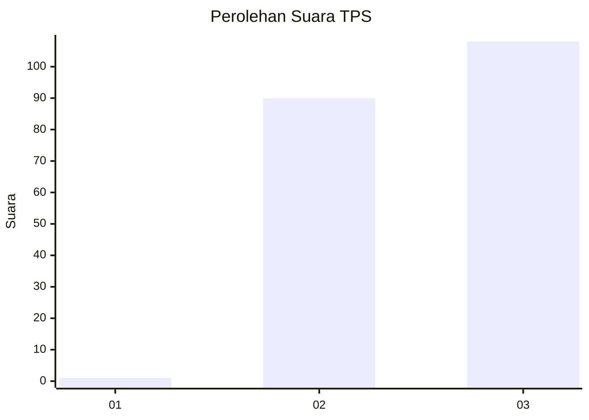
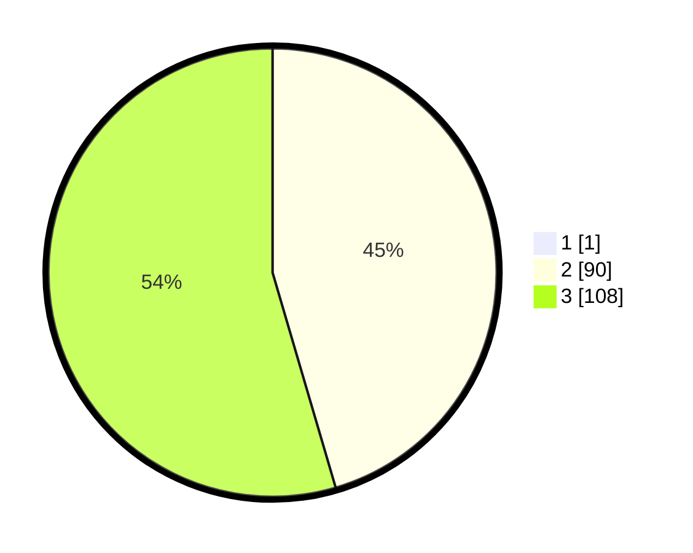

# Hasil

## Grafik

## Tabel

| No. | Nama Paslon    | Suara | Suara (raw) | Persentase |
|:--- |:-------------- | -----:| -----------:| ----------:|
| 1   | ANIES MUHAIMIN | 1     | [1][p-1]    | 0,50       |
| 2   | PRABOWO GIBRAN | 90    | [90][p-2]   | 45,23      |
| 3   | GANJAR MAHFUD  | 108   | [108][p-3]  | 54,27      |

[p-1]: https://github.com/gigit-pemilu/pemilu-2024-51-bali/blob/main/pilpres/hitung-suara/sub/51-bali/sub/01-jembrana/sub/02-mendoyo/sub/2007-penyaringan/sub/018-tps/sub/paslon-1.txt
[p-2]: https://github.com/gigit-pemilu/pemilu-2024-51-bali/blob/main/pilpres/hitung-suara/sub/51-bali/sub/01-jembrana/sub/02-mendoyo/sub/2007-penyaringan/sub/018-tps/sub/paslon-2.txt
[p-3]: https://github.com/gigit-pemilu/pemilu-2024-51-bali/blob/main/pilpres/hitung-suara/sub/51-bali/sub/01-jembrana/sub/02-mendoyo/sub/2007-penyaringan/sub/018-tps/sub/paslon-3.txt

## Foto C Plano

https://sirekap-obj-formc.kpu.go.id/c5ae/pemilu/ppwp/51/01/02/20/07/5101022007018-20240221-204245--a5bc5f77-4191-43ca-a1a9-970f93fc538c.jpg

https://sirekap-obj-formc.kpu.go.id/c5ae/pemilu/ppwp/51/01/02/20/07/5101022007018-20240221-204259--ee382beb-2819-4ce6-96a5-cf1ca8e35a51.jpg

https://sirekap-obj-formc.kpu.go.id/c5ae/pemilu/ppwp/51/01/02/20/07/5101022007018-20240221-204315--ee3b9bc9-0eef-473a-a97a-2c824007084a.jpg

## Metadata

| Key        | Value               |
| ---------- | ------------------- |
| Time Stamp | 2024-02-24 22:31:28 |

