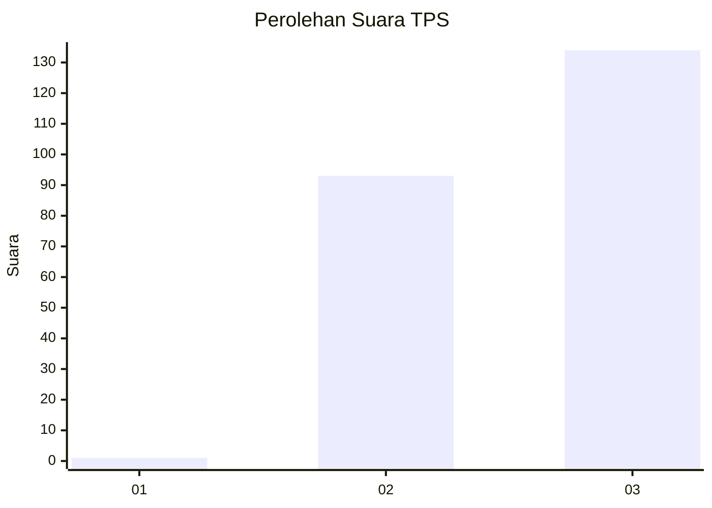
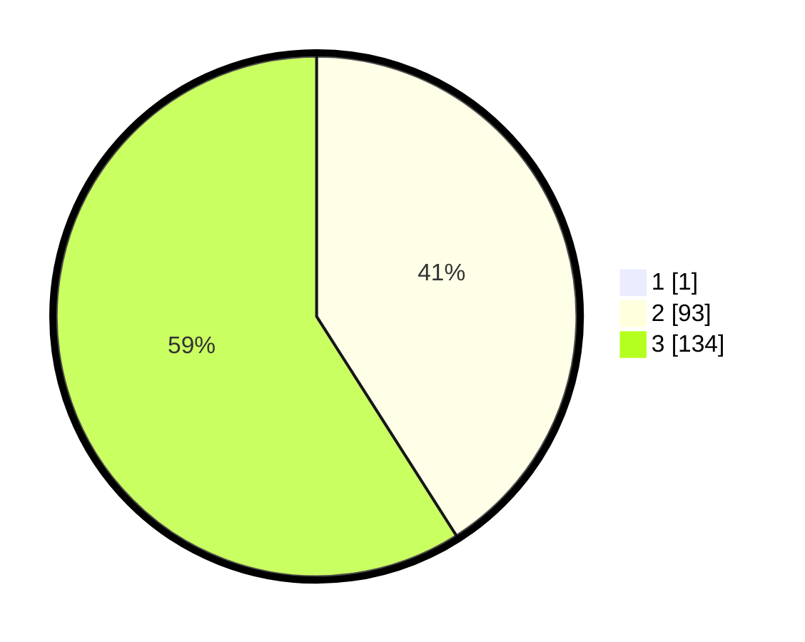

# Hasil

## Grafik

## Tabel

| No. | Nama Paslon    | Suara | Suara (raw) | Persentase |
|:--- |:-------------- | -----:| -----------:| ----------:|
| 1   | ANIES MUHAIMIN | 1     | [1][p-1]    | 0,44       |
| 2   | PRABOWO GIBRAN | 93    | [93][p-2]   | 40,79      |
| 3   | GANJAR MAHFUD  | 134   | [134][p-3]  | 58,77      |

[p-1]: https://github.com/gigit-pemilu/pemilu-2024-51-bali/blob/main/pilpres/hitung-suara/sub/51-bali/sub/01-jembrana/sub/02-mendoyo/sub/2007-penyaringan/sub/024-tps/sub/paslon-1.txt
[p-2]: https://github.com/gigit-pemilu/pemilu-2024-51-bali/blob/main/pilpres/hitung-suara/sub/51-bali/sub/01-jembrana/sub/02-mendoyo/sub/2007-penyaringan/sub/024-tps/sub/paslon-2.txt
[p-3]: https://github.com/gigit-pemilu/pemilu-2024-51-bali/blob/main/pilpres/hitung-suara/sub/51-bali/sub/01-jembrana/sub/02-mendoyo/sub/2007-penyaringan/sub/024-tps/sub/paslon-3.txt

## Foto C Plano

https://sirekap-obj-formc.kpu.go.id/2139/pemilu/ppwp/51/01/02/20/07/5101022007024-20240216-050444--8208bf76-ef5d-42b3-ac08-fea80c01397b.jpg

https://sirekap-obj-formc.kpu.go.id/2139/pemilu/ppwp/51/01/02/20/07/5101022007024-20240216-050445--eb657f49-450e-434f-9ad4-b3416dc975e6.jpg

https://sirekap-obj-formc.kpu.go.id/2139/pemilu/ppwp/51/01/02/20/07/5101022007024-20240216-050444--20d09f2c-4276-4660-886b-13baaf85d181.jpg

## Metadata

| Key        | Value               |
| ---------- | ------------------- |
| Time Stamp | 2024-02-16 08:00:28 |

## DATA PEMILIH TETAP

Jumlah pemilih dalam DPT: **290**.
 * L: **140**.
 * P: **150**.

## DATA PENGGUNA HAK PILIH

Jumlah pengguna hak pilih dalam DPT: **231**.
 * L: **110**.
 * P: **121**.

Jumlah pengguna hak pilih dalam DPTb: **0**.
 * L: **0**.
 * P: **0**.

Jumlah pengguna hak pilih dalam DPK: **0**.
 * L: **0**.
 * P: **0**.

Jumlah pengguna hak pilih: **231**.
 * L: **110**.
 * P: **121**.

## JUMLAH SUARA SAH DAN TIDAK SAH

JUMLAH SELURUH SUARA SAH: **228**.

JUMLAH SUARA TIDAK SAH: **3**.

JUMLAH SELURUH SUARA SAH DAN SUARA TIDAK SAH: **231**.

