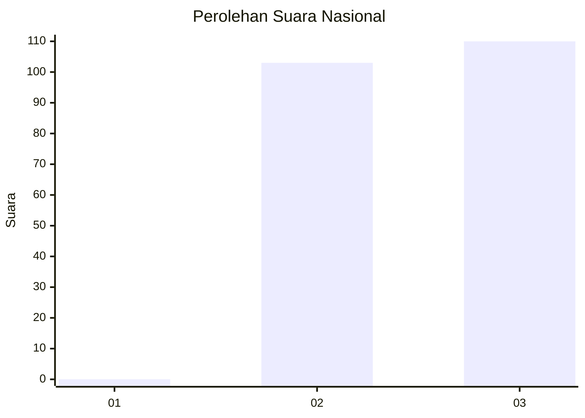
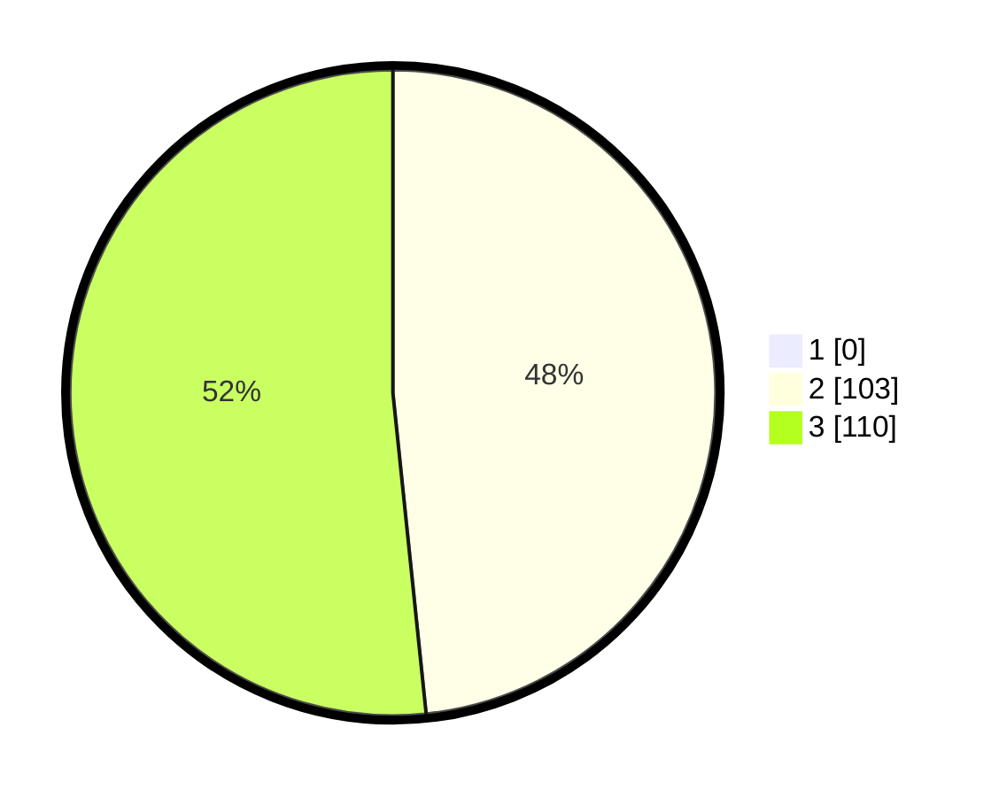

# Hasil

## Grafik

## Tabel

| No. | Nama Paslon    | Suara | Suara (raw) | Persentase |
|:--- |:-------------- | -----:| -----------:| ----------:|
| 1   | ANIES MUHAIMIN | 0     | [0][p-1]    | 0,00       |
| 2   | PRABOWO GIBRAN | 103   | [103][p-2]  | 48,36      |
| 3   | GANJAR MAHFUD  | 110   | [110][p-3]  | 51,64      |

[p-1]: https://github.com/gigit-pemilu/pemilu-2024/blob/main/pilpres/hitung-suara/sub/51-bali/sub/01-jembrana/sub/02-mendoyo/sub/2007-penyaringan/sub/026-tps/sub/paslon-1.txt
[p-2]: https://github.com/gigit-pemilu/pemilu-2024/blob/main/pilpres/hitung-suara/sub/51-bali/sub/01-jembrana/sub/02-mendoyo/sub/2007-penyaringan/sub/026-tps/sub/paslon-2.txt
[p-3]: https://github.com/gigit-pemilu/pemilu-2024/blob/main/pilpres/hitung-suara/sub/51-bali/sub/01-jembrana/sub/02-mendoyo/sub/2007-penyaringan/sub/026-tps/sub/paslon-3.txt

## Foto C Plano

https://sirekap-obj-formc.kpu.go.id/54b5/pemilu/ppwp/51/01/02/20/07/5101022007026-20240215-001235--5d583457-4d91-40e5-b218-c28852f29b79.jpg

https://sirekap-obj-formc.kpu.go.id/54b5/pemilu/ppwp/51/01/02/20/07/5101022007026-20240215-001541--2ac11775-1952-49ef-af4d-7818c46e7a8a.jpg

https://sirekap-obj-formc.kpu.go.id/54b5/pemilu/ppwp/51/01/02/20/07/5101022007026-20240215-001753--64f30374-6273-4029-9732-011ae1642995.jpg

## Metadata

| Key        | Value               |
| ---------- | ------------------- |
| Time Stamp | 2024-02-15 15:00:29 |

## DATA PEMILIH TETAP

Jumlah pemilih dalam DPT: **277**.
 * L: **139**.
 * P: **138**.

## DATA PENGGUNA HAK PILIH

Jumlah pengguna hak pilih dalam DPT: **216**.
 * L: **108**.
 * P: **108**.

Jumlah pengguna hak pilih dalam DPTb: **0**.
 * L: **0**.
 * P: **0**.

Jumlah pengguna hak pilih dalam DPK: **0**.
 * L: **0**.
 * P: **0**.

Jumlah pengguna hak pilih: **216**.
 * L: **108**.
 * P: **108**.

## JUMLAH SUARA SAH DAN TIDAK SAH

JUMLAH SELURUH SUARA SAH: **213**.

JUMLAH SUARA TIDAK SAH: **3**.

JUMLAH SELURUH SUARA SAH DAN SUARA TIDAK SAH: **216**.

