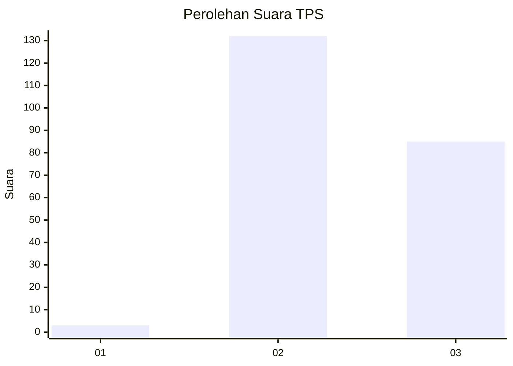
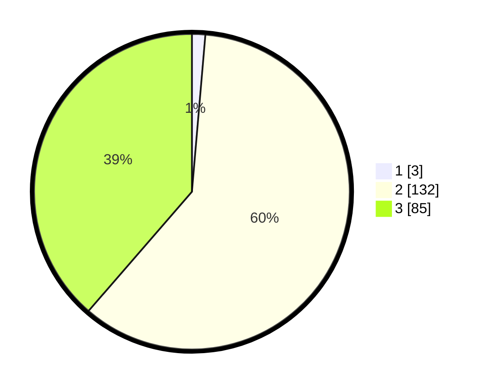

# Hasil

## Grafik

## Tabel

| No. | Nama Paslon    | Suara | Suara (raw) | Persentase |
|:--- |:-------------- | -----:| -----------:| ----------:|
| 1   | ANIES MUHAIMIN | 3     | [3][p-1]    | 1,36       |
| 2   | PRABOWO GIBRAN | 132   | [132][p-2]  | 60,00      |
| 3   | GANJAR MAHFUD  | 85    | [85][p-3]   | 38,64      |

[p-1]: https://github.com/gigit-pemilu/pemilu-2024-51-bali/blob/main/pilpres/hitung-suara/sub/51-bali/sub/01-jembrana/sub/02-mendoyo/sub/2007-penyaringan/sub/028-tps/sub/paslon-1.txt
[p-2]: https://github.com/gigit-pemilu/pemilu-2024-51-bali/blob/main/pilpres/hitung-suara/sub/51-bali/sub/01-jembrana/sub/02-mendoyo/sub/2007-penyaringan/sub/028-tps/sub/paslon-2.txt
[p-3]: https://github.com/gigit-pemilu/pemilu-2024-51-bali/blob/main/pilpres/hitung-suara/sub/51-bali/sub/01-jembrana/sub/02-mendoyo/sub/2007-penyaringan/sub/028-tps/sub/paslon-3.txt

## Foto C Plano

https://sirekap-obj-formc.kpu.go.id/b683/pemilu/ppwp/51/01/02/20/07/5101022007028-20240214-141414--05f46786-f553-4d1e-bb56-98a365bfad2a.jpg

https://sirekap-obj-formc.kpu.go.id/b683/pemilu/ppwp/51/01/02/20/07/5101022007028-20240214-141531--8bbfbaed-716c-4731-b9d4-53cb72164f7f.jpg

https://sirekap-obj-formc.kpu.go.id/b683/pemilu/ppwp/51/01/02/20/07/5101022007028-20240215-222931--037d581c-bbd3-4a70-98e9-15f0fb4583d5.jpg

## Metadata

| Key        | Value               |
| ---------- | ------------------- |
| Time Stamp | 2024-02-15 22:30:27 |

## DATA PEMILIH TETAP

Jumlah pemilih dalam DPT: **278**.
 * L: **136**.
 * P: **142**.

## DATA PENGGUNA HAK PILIH

Jumlah pengguna hak pilih dalam DPT: **224**.
 * L: **116**.
 * P: **108**.

Jumlah pengguna hak pilih dalam DPTb: **0**.
 * L: **0**.
 * P: **0**.

Jumlah pengguna hak pilih dalam DPK: **3**.
 * L: **1**.
 * P: **2**.

Jumlah pengguna hak pilih: **227**.
 * L: **117**.
 * P: **110**.

## JUMLAH SUARA SAH DAN TIDAK SAH

JUMLAH SELURUH SUARA SAH: **220**.

JUMLAH SUARA TIDAK SAH: **7**.

JUMLAH SELURUH SUARA SAH DAN SUARA TIDAK SAH: **227**.

