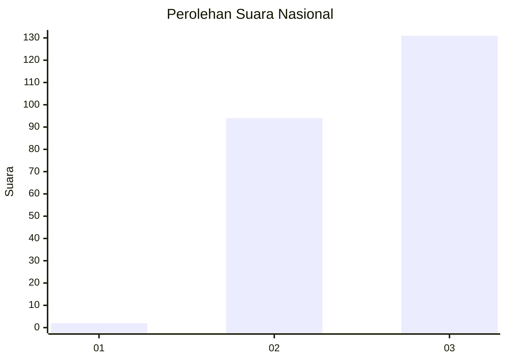
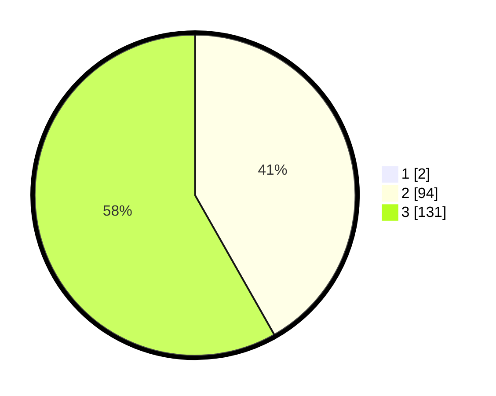

# Hasil

## Grafik

## Tabel

| No. | Nama Paslon    | Suara | Suara (raw) | Persentase |
|:--- |:-------------- | -----:| -----------:| ----------:|
| 1   | ANIES MUHAIMIN | 2     | [2][p-1]    | 0,88       |
| 2   | PRABOWO GIBRAN | 94    | [94][p-2]   | 41,41      |
| 3   | GANJAR MAHFUD  | 131   | [131][p-3]  | 57,71      |

[p-1]: https://github.com/gigit-pemilu/pemilu-2024/blob/main/pilpres/hitung-suara/sub/51-bali/sub/01-jembrana/sub/02-mendoyo/sub/2007-penyaringan/sub/029-tps/sub/paslon-1.txt
[p-2]: https://github.com/gigit-pemilu/pemilu-2024/blob/main/pilpres/hitung-suara/sub/51-bali/sub/01-jembrana/sub/02-mendoyo/sub/2007-penyaringan/sub/029-tps/sub/paslon-2.txt
[p-3]: https://github.com/gigit-pemilu/pemilu-2024/blob/main/pilpres/hitung-suara/sub/51-bali/sub/01-jembrana/sub/02-mendoyo/sub/2007-penyaringan/sub/029-tps/sub/paslon-3.txt

## Foto C Plano

https://sirekap-obj-formc.kpu.go.id/1296/pemilu/ppwp/51/01/02/20/07/5101022007029-20240214-141525--8d1c0964-325f-4c46-a490-b336bc395585.jpg

https://sirekap-obj-formc.kpu.go.id/1296/pemilu/ppwp/51/01/02/20/07/5101022007029-20240214-141830--26f789e4-cb77-4a6f-8aec-92ff926f76aa.jpg

## Metadata

| Key        | Value               |
| ---------- | ------------------- |
| Time Stamp | 2024-02-15 07:00:44 |

