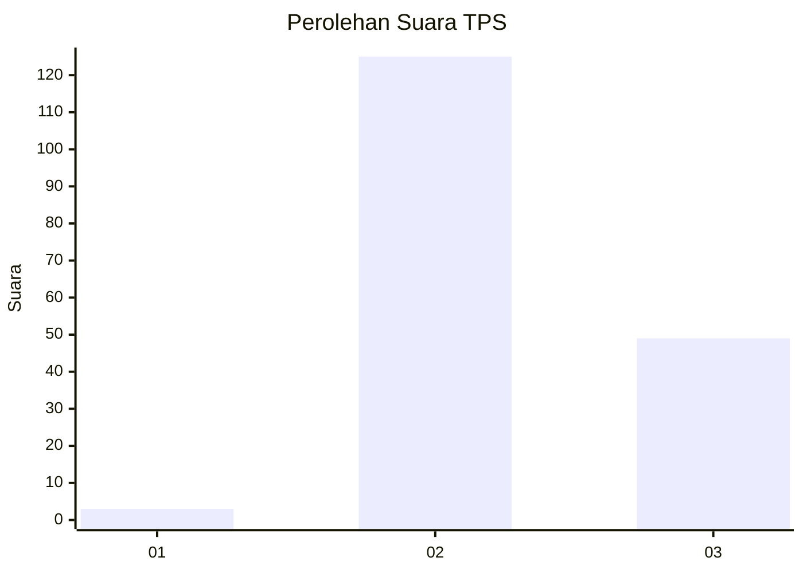
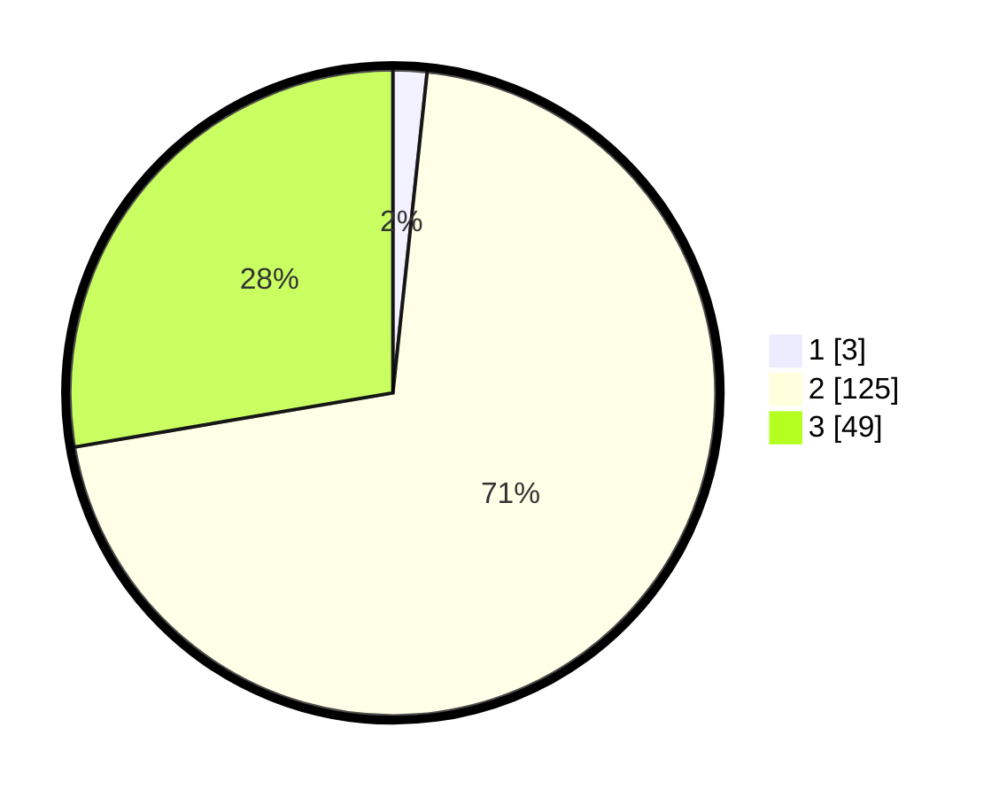

# Hasil

## Grafik

## Tabel

| No. | Nama Paslon    | Suara | Suara (raw) | Persentase |
|:--- |:-------------- | -----:| -----------:| ----------:|
| 1   | ANIES MUHAIMIN | 3     | [3][p-1]    | 1,69       |
| 2   | PRABOWO GIBRAN | 125   | [125][p-2]  | 70,62      |
| 3   | GANJAR MAHFUD  | 49    | [49][p-3]   | 27,68      |

[p-1]: https://github.com/gigit-pemilu/pemilu-2024-51-bali/blob/main/pilpres/hitung-suara/sub/51-bali/sub/01-jembrana/sub/02-mendoyo/sub/2007-penyaringan/sub/031-tps/sub/paslon-1.txt
[p-2]: https://github.com/gigit-pemilu/pemilu-2024-51-bali/blob/main/pilpres/hitung-suara/sub/51-bali/sub/01-jembrana/sub/02-mendoyo/sub/2007-penyaringan/sub/031-tps/sub/paslon-2.txt
[p-3]: https://github.com/gigit-pemilu/pemilu-2024-51-bali/blob/main/pilpres/hitung-suara/sub/51-bali/sub/01-jembrana/sub/02-mendoyo/sub/2007-penyaringan/sub/031-tps/sub/paslon-3.txt

## Foto C Plano

https://sirekap-obj-formc.kpu.go.id/b78d/pemilu/ppwp/51/01/02/20/07/5101022007031-20240214-131434--879975fc-6b8c-4813-a0a3-20250de94934.jpg

https://sirekap-obj-formc.kpu.go.id/b78d/pemilu/ppwp/51/01/02/20/07/5101022007031-20240214-131629--afd1ef0e-8869-442e-a819-660179fa21d4.jpg

https://sirekap-obj-formc.kpu.go.id/b78d/pemilu/ppwp/51/01/02/20/07/5101022007031-20240214-131708--e669bfb4-7478-4db0-90cf-6bbdcb71c025.jpg

## Metadata

| Key        | Value               |
| ---------- | ------------------- |
| Time Stamp | 2024-02-14 21:46:01 |

## DATA PEMILIH TETAP

Jumlah pemilih dalam DPT: **229**.
 * L: **113**.
 * P: **116**.

## DATA PENGGUNA HAK PILIH

Jumlah pengguna hak pilih dalam DPT: **183**.
 * L: **93**.
 * P: **90**.

Jumlah pengguna hak pilih dalam DPTb: **0**.
 * L: **0**.
 * P: **0**.

Jumlah pengguna hak pilih dalam DPK: **0**.
 * L: **0**.
 * P: **0**.

Jumlah pengguna hak pilih: **183**.
 * L: **93**.
 * P: **90**.

## JUMLAH SUARA SAH DAN TIDAK SAH

JUMLAH SELURUH SUARA SAH: **177**.

JUMLAH SUARA TIDAK SAH: **6**.

JUMLAH SELURUH SUARA SAH DAN SUARA TIDAK SAH: **183**.

