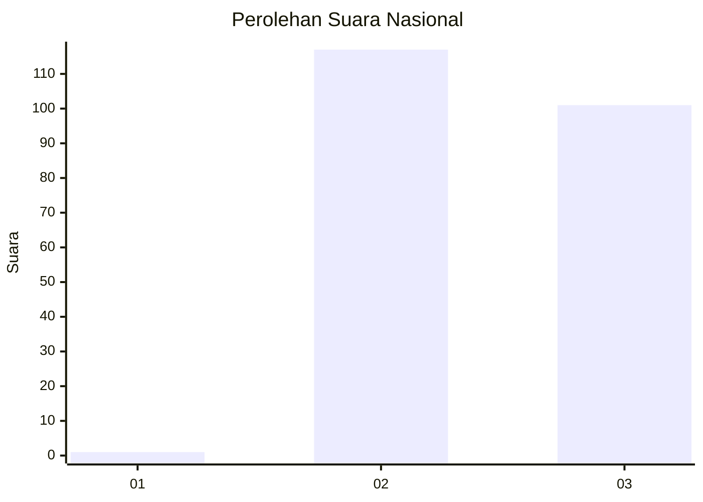
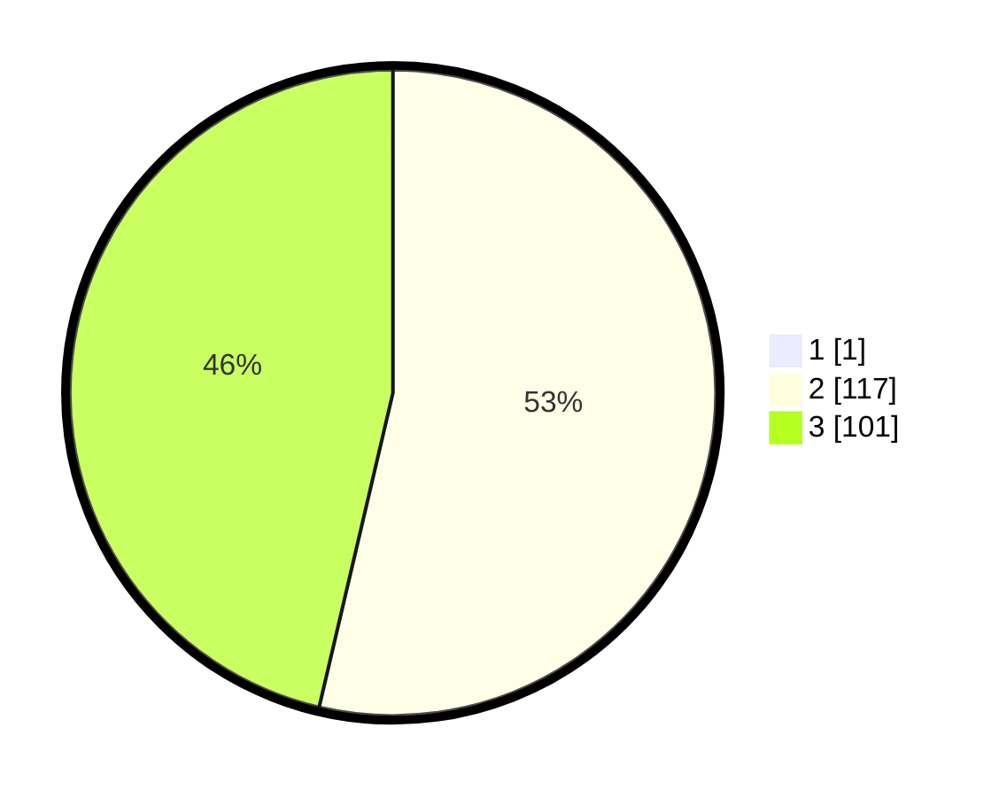

# Hasil

## Grafik

## Tabel

| No. | Nama Paslon    | Suara | Suara (raw) | Persentase |
|:--- |:-------------- | -----:| -----------:| ----------:|
| 1   | ANIES MUHAIMIN | 1     | [1][p-1]    | 0,46       |
| 2   | PRABOWO GIBRAN | 117   | [117][p-2]  | 53,42      |
| 3   | GANJAR MAHFUD  | 101   | [101][p-3]  | 46,12      |

[p-1]: https://github.com/gigit-pemilu/pemilu-2024/blob/main/pilpres/hitung-suara/sub/51-bali/sub/01-jembrana/sub/02-mendoyo/sub/2007-penyaringan/sub/033-tps/sub/paslon-1.txt
[p-2]: https://github.com/gigit-pemilu/pemilu-2024/blob/main/pilpres/hitung-suara/sub/51-bali/sub/01-jembrana/sub/02-mendoyo/sub/2007-penyaringan/sub/033-tps/sub/paslon-2.txt
[p-3]: https://github.com/gigit-pemilu/pemilu-2024/blob/main/pilpres/hitung-suara/sub/51-bali/sub/01-jembrana/sub/02-mendoyo/sub/2007-penyaringan/sub/033-tps/sub/paslon-3.txt

## Foto C Plano

https://sirekap-obj-formc.kpu.go.id/5688/pemilu/ppwp/51/01/02/20/07/5101022007033-20240214-131004--a718665a-da1f-4c3b-a0e9-b3c2929b3730.jpg

https://sirekap-obj-formc.kpu.go.id/5688/pemilu/ppwp/51/01/02/20/07/5101022007033-20240214-131132--adf33c8e-74fb-4914-8fa0-407986cc9e14.jpg

https://sirekap-obj-formc.kpu.go.id/5688/pemilu/ppwp/51/01/02/20/07/5101022007033-20240214-131244--257f959d-0463-4c1a-b26f-77de28123f4e.jpg

## Metadata

| Key        | Value               |
| ---------- | ------------------- |
| Time Stamp | 2024-02-14 21:46:01 |

## DATA PEMILIH TETAP

Jumlah pemilih dalam DPT: **220**.
 * L: **114**.
 * P: **106**.

## DATA PENGGUNA HAK PILIH

Jumlah pengguna hak pilih dalam DPT: **259**.
 * L: **130**.
 * P: **129**.

Jumlah pengguna hak pilih dalam DPTb: **0**.
 * L: **0**.
 * P: **0**.

Jumlah pengguna hak pilih dalam DPK: **0**.
 * L: **0**.
 * P: **0**.

Jumlah pengguna hak pilih: **259**.
 * L: **130**.
 * P: **129**.

## JUMLAH SUARA SAH DAN TIDAK SAH

JUMLAH SELURUH SUARA SAH: **219**.

JUMLAH SUARA TIDAK SAH: **1**.

JUMLAH SELURUH SUARA SAH DAN SUARA TIDAK SAH: **220**.

