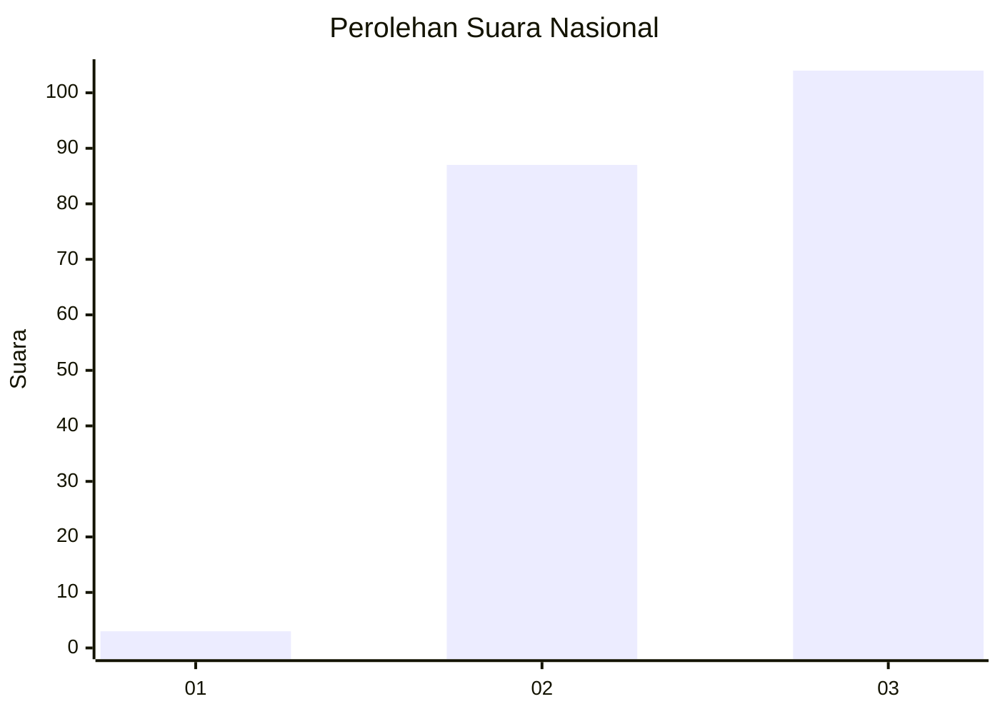
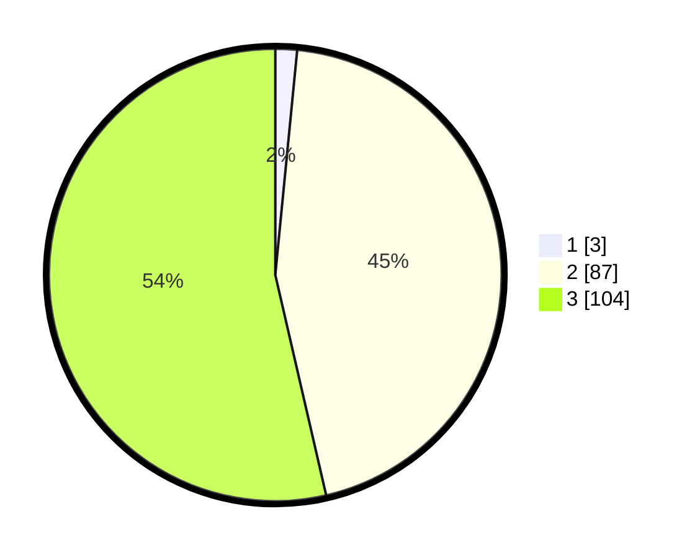

# Hasil

## Grafik

## Tabel

| No. | Nama Paslon    | Suara | Suara (raw) | Persentase |
|:--- |:-------------- | -----:| -----------:| ----------:|
| 1   | ANIES MUHAIMIN | 3     | [3][p-1]    | 1,55       |
| 2   | PRABOWO GIBRAN | 87    | [87][p-2]   | 44,85      |
| 3   | GANJAR MAHFUD  | 104   | [104][p-3]  | 53,61      |

[p-1]: https://github.com/gigit-pemilu/pemilu-2024/blob/main/pilpres/hitung-suara/sub/51-bali/sub/01-jembrana/sub/02-mendoyo/sub/2008-yehembang/sub/002-tps/sub/paslon-1.txt
[p-2]: https://github.com/gigit-pemilu/pemilu-2024/blob/main/pilpres/hitung-suara/sub/51-bali/sub/01-jembrana/sub/02-mendoyo/sub/2008-yehembang/sub/002-tps/sub/paslon-2.txt
[p-3]: https://github.com/gigit-pemilu/pemilu-2024/blob/main/pilpres/hitung-suara/sub/51-bali/sub/01-jembrana/sub/02-mendoyo/sub/2008-yehembang/sub/002-tps/sub/paslon-3.txt

## Foto C Plano

https://sirekap-obj-formc.kpu.go.id/fc5d/pemilu/ppwp/51/01/02/20/08/5101022008002-20240214-195607--deb8d21c-7241-4282-894b-cb6a368b8ac4.jpg

https://sirekap-obj-formc.kpu.go.id/fc5d/pemilu/ppwp/51/01/02/20/08/5101022008002-20240214-195612--e5c97129-4370-4067-9ef9-9a69458765b9.jpg

https://sirekap-obj-formc.kpu.go.id/fc5d/pemilu/ppwp/51/01/02/20/08/5101022008002-20240214-195615--40c7198e-575c-46c1-80a3-ee529c020944.jpg

## Metadata

| Key        | Value               |
| ---------- | ------------------- |
| Time Stamp | 2024-02-24 22:31:28 |

