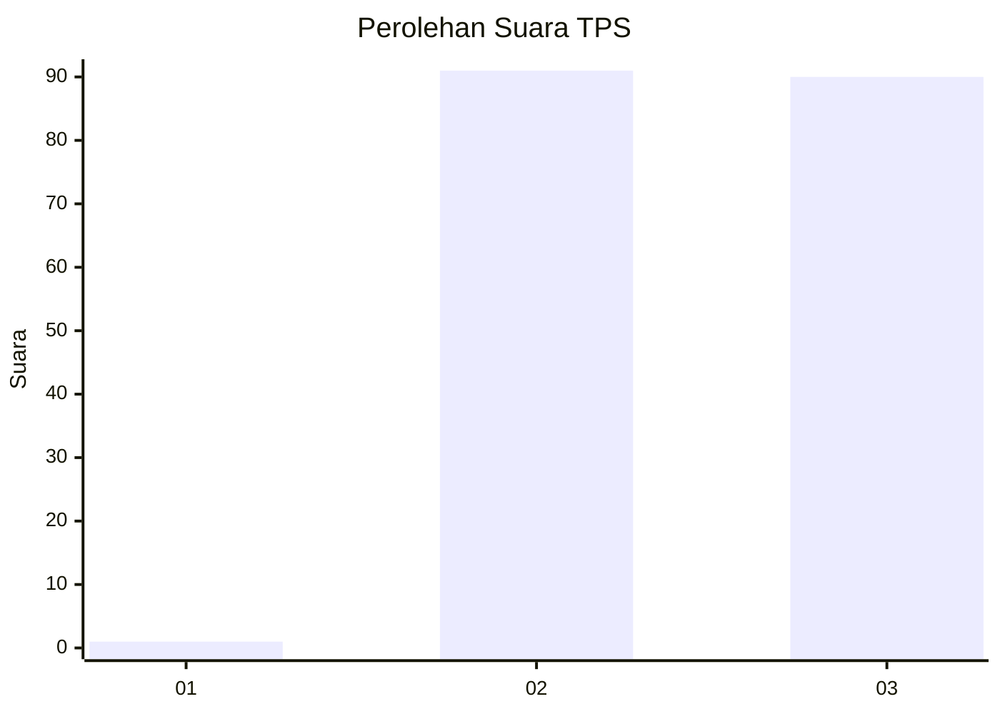
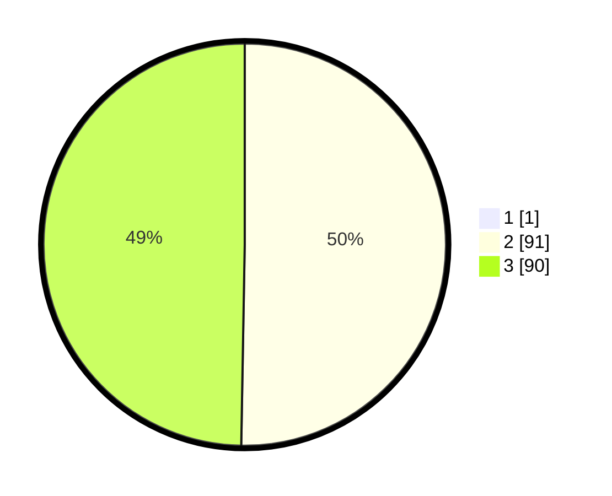

# Hasil

## Grafik

## Tabel

| No. | Nama Paslon    | Suara | Suara (raw) | Persentase |
|:--- |:-------------- | -----:| -----------:| ----------:|
| 1   | ANIES MUHAIMIN | 1     | [1][p-1]    | 0,55       |
| 2   | PRABOWO GIBRAN | 91    | [91][p-2]   | 50,00      |
| 3   | GANJAR MAHFUD  | 90    | [90][p-3]   | 49,45      |

[p-1]: https://github.com/gigit-pemilu/pemilu-2024-51-bali/blob/main/pilpres/hitung-suara/sub/51-bali/sub/01-jembrana/sub/02-mendoyo/sub/2008-yehembang/sub/003-tps/sub/paslon-1.txt
[p-2]: https://github.com/gigit-pemilu/pemilu-2024-51-bali/blob/main/pilpres/hitung-suara/sub/51-bali/sub/01-jembrana/sub/02-mendoyo/sub/2008-yehembang/sub/003-tps/sub/paslon-2.txt
[p-3]: https://github.com/gigit-pemilu/pemilu-2024-51-bali/blob/main/pilpres/hitung-suara/sub/51-bali/sub/01-jembrana/sub/02-mendoyo/sub/2008-yehembang/sub/003-tps/sub/paslon-3.txt

## Foto C Plano

https://sirekap-obj-formc.kpu.go.id/f0cb/pemilu/ppwp/51/01/02/20/08/5101022008003-20240214-132736--d88373f4-ce72-4672-be9f-d576e1d5804e.jpg

https://sirekap-obj-formc.kpu.go.id/f0cb/pemilu/ppwp/51/01/02/20/08/5101022008003-20240214-133408--955b37ee-7050-4636-a888-39da7d292afd.jpg

https://sirekap-obj-formc.kpu.go.id/f0cb/pemilu/ppwp/51/01/02/20/08/5101022008003-20240214-133104--6c8d9e1b-636b-49ab-b485-17e375134a41.jpg

## Metadata

| Key        | Value               |
| ---------- | ------------------- |
| Time Stamp | 2024-02-14 21:46:01 |

## DATA PEMILIH TETAP

Jumlah pemilih dalam DPT: **247**.
 * L: **117**.
 * P: **130**.

## DATA PENGGUNA HAK PILIH

Jumlah pengguna hak pilih dalam DPT: **185**.
 * L: **90**.
 * P: **95**.

Jumlah pengguna hak pilih dalam DPTb: **0**.
 * L: **0**.
 * P: **0**.

Jumlah pengguna hak pilih dalam DPK: **2**.
 * L: **0**.
 * P: **2**.

Jumlah pengguna hak pilih: **187**.
 * L: **90**.
 * P: **97**.

## JUMLAH SUARA SAH DAN TIDAK SAH

JUMLAH SELURUH SUARA SAH: **182**.

JUMLAH SUARA TIDAK SAH: **5**.

JUMLAH SELURUH SUARA SAH DAN SUARA TIDAK SAH: **187**.

