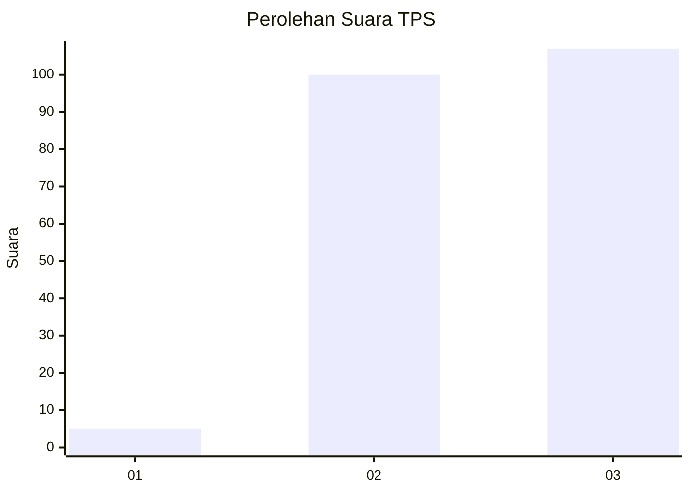
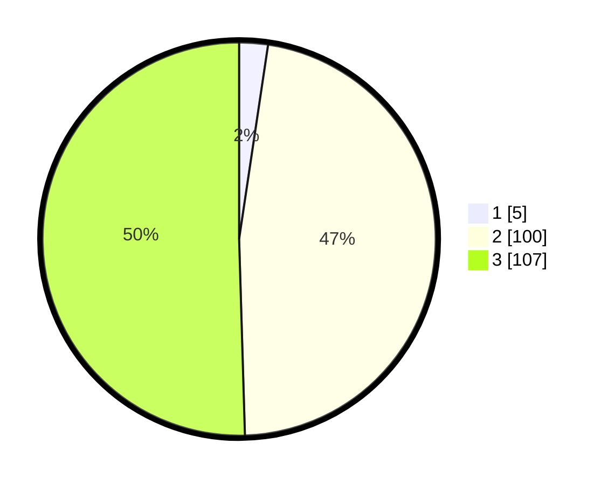

# Hasil

## Grafik

## Tabel

| No. | Nama Paslon    | Suara | Suara (raw) | Persentase |
|:--- |:-------------- | -----:| -----------:| ----------:|
| 1   | ANIES MUHAIMIN | 5     | [5][p-1]    | 2,36       |
| 2   | PRABOWO GIBRAN | 100   | [100][p-2]  | 47,17      |
| 3   | GANJAR MAHFUD  | 107   | [107][p-3]  | 50,47      |

[p-1]: https://github.com/gigit-pemilu/pemilu-2024-51-bali/blob/main/pilpres/hitung-suara/sub/51-bali/sub/01-jembrana/sub/02-mendoyo/sub/2008-yehembang/sub/006-tps/sub/paslon-1.txt
[p-2]: https://github.com/gigit-pemilu/pemilu-2024-51-bali/blob/main/pilpres/hitung-suara/sub/51-bali/sub/01-jembrana/sub/02-mendoyo/sub/2008-yehembang/sub/006-tps/sub/paslon-2.txt
[p-3]: https://github.com/gigit-pemilu/pemilu-2024-51-bali/blob/main/pilpres/hitung-suara/sub/51-bali/sub/01-jembrana/sub/02-mendoyo/sub/2008-yehembang/sub/006-tps/sub/paslon-3.txt

## Foto C Plano

https://sirekap-obj-formc.kpu.go.id/ab8a/pemilu/ppwp/51/01/02/20/08/5101022008006-20240214-223921--c43c97a9-5a10-40d0-847e-76b314589d98.jpg

https://sirekap-obj-formc.kpu.go.id/ab8a/pemilu/ppwp/51/01/02/20/08/5101022008006-20240214-224201--c0eed174-3242-4539-837c-a984efb59544.jpg

https://sirekap-obj-formc.kpu.go.id/ab8a/pemilu/ppwp/51/01/02/20/08/5101022008006-20240214-224251--2db69a4c-eeef-4cc8-87bf-bde9d5568de5.jpg

## Metadata

| Key        | Value               |
| ---------- | ------------------- |
| Time Stamp | 2024-02-15 12:00:28 |

## DATA PEMILIH TETAP

Jumlah pemilih dalam DPT: **269**.
 * L: **137**.
 * P: **132**.

## DATA PENGGUNA HAK PILIH

Jumlah pengguna hak pilih dalam DPT: **212**.
 * L: **106**.
 * P: **106**.

Jumlah pengguna hak pilih dalam DPTb: **0**.
 * L: **0**.
 * P: **0**.

Jumlah pengguna hak pilih dalam DPK: **1**.
 * L: **0**.
 * P: **1**.

Jumlah pengguna hak pilih: **213**.
 * L: **106**.
 * P: **107**.

## JUMLAH SUARA SAH DAN TIDAK SAH

JUMLAH SELURUH SUARA SAH: **212**.

JUMLAH SUARA TIDAK SAH: **1**.

JUMLAH SELURUH SUARA SAH DAN SUARA TIDAK SAH: **213**.

