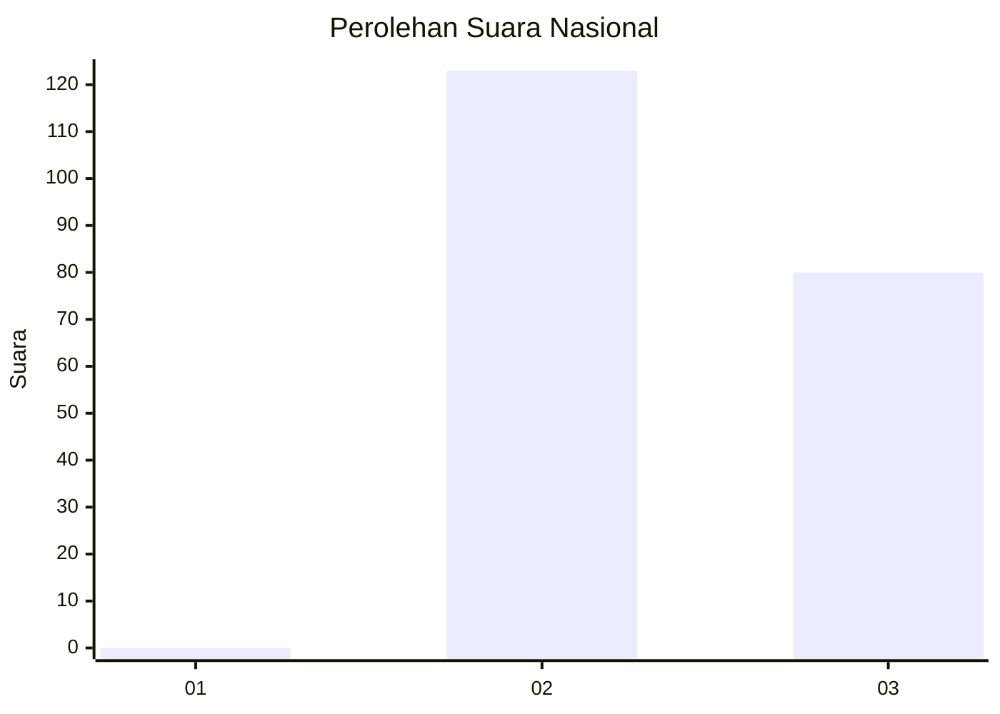
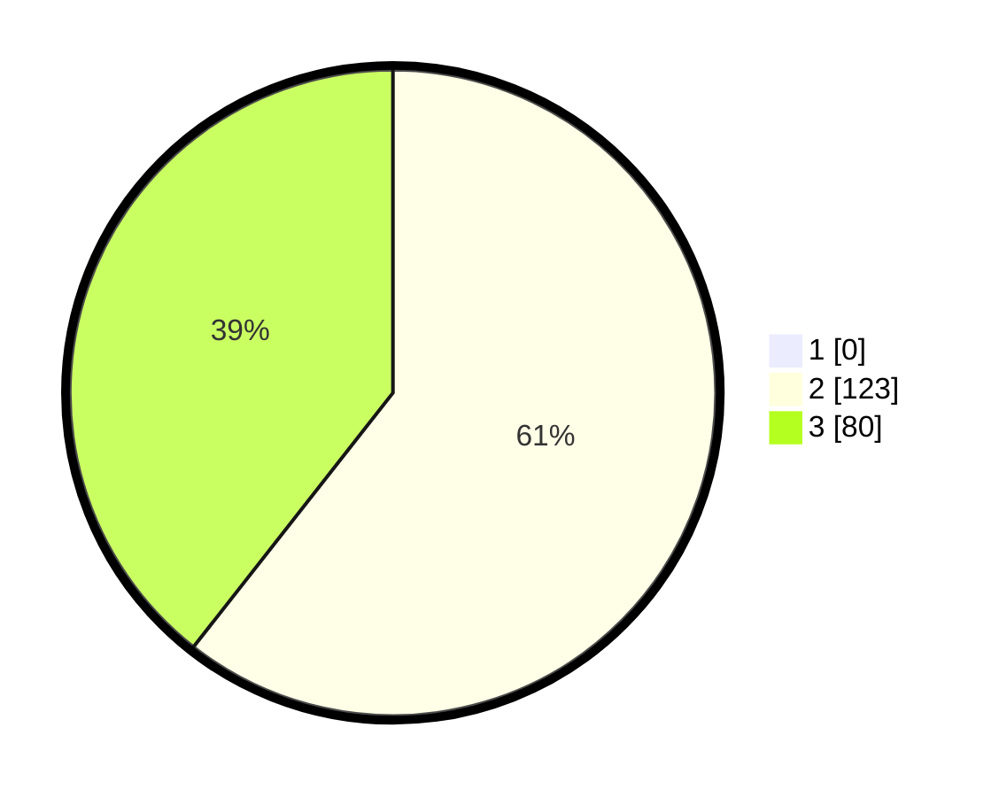

# Hasil

## Grafik

## Tabel

| No. | Nama Paslon    | Suara | Suara (raw) | Persentase |
|:--- |:-------------- | -----:| -----------:| ----------:|
| 1   | ANIES MUHAIMIN | 0     | [0][p-1]    | 0,00       |
| 2   | PRABOWO GIBRAN | 123   | [123][p-2]  | 60,59      |
| 3   | GANJAR MAHFUD  | 80    | [80][p-3]   | 39,41      |

[p-1]: https://github.com/gigit-pemilu/pemilu-2024/blob/main/pilpres/hitung-suara/sub/51-bali/sub/01-jembrana/sub/02-mendoyo/sub/2008-yehembang/sub/009-tps/sub/paslon-1.txt
[p-2]: https://github.com/gigit-pemilu/pemilu-2024/blob/main/pilpres/hitung-suara/sub/51-bali/sub/01-jembrana/sub/02-mendoyo/sub/2008-yehembang/sub/009-tps/sub/paslon-2.txt
[p-3]: https://github.com/gigit-pemilu/pemilu-2024/blob/main/pilpres/hitung-suara/sub/51-bali/sub/01-jembrana/sub/02-mendoyo/sub/2008-yehembang/sub/009-tps/sub/paslon-3.txt

## Foto C Plano

https://sirekap-obj-formc.kpu.go.id/4e7c/pemilu/ppwp/51/01/02/20/08/5101022008009-20240214-132727--163ceb46-0e5c-4523-b872-03a0c30dee85.jpg

https://sirekap-obj-formc.kpu.go.id/4e7c/pemilu/ppwp/51/01/02/20/08/5101022008009-20240214-235456--5df4f8f9-cbd5-426b-9402-feb433424dbd.jpg

https://sirekap-obj-formc.kpu.go.id/4e7c/pemilu/ppwp/51/01/02/20/08/5101022008009-20240214-132951--1b5afa9c-f8e1-4b65-9f93-5fe889139b16.jpg

## Metadata

| Key        | Value               |
| ---------- | ------------------- |
| Time Stamp | 2024-02-15 07:00:44 |

## DATA PEMILIH TETAP

Jumlah pemilih dalam DPT: **266**.
 * L: **131**.
 * P: **135**.

## DATA PENGGUNA HAK PILIH

Jumlah pengguna hak pilih dalam DPT: **203**.
 * L: **97**.
 * P: **106**.

Jumlah pengguna hak pilih dalam DPTb: **0**.
 * L: **0**.
 * P: **0**.

Jumlah pengguna hak pilih dalam DPK: **2**.
 * L: **0**.
 * P: **2**.

Jumlah pengguna hak pilih: **205**.
 * L: **97**.
 * P: **108**.

## JUMLAH SUARA SAH DAN TIDAK SAH

JUMLAH SELURUH SUARA SAH: **203**.

JUMLAH SUARA TIDAK SAH: **2**.

JUMLAH SELURUH SUARA SAH DAN SUARA TIDAK SAH: **205**.

