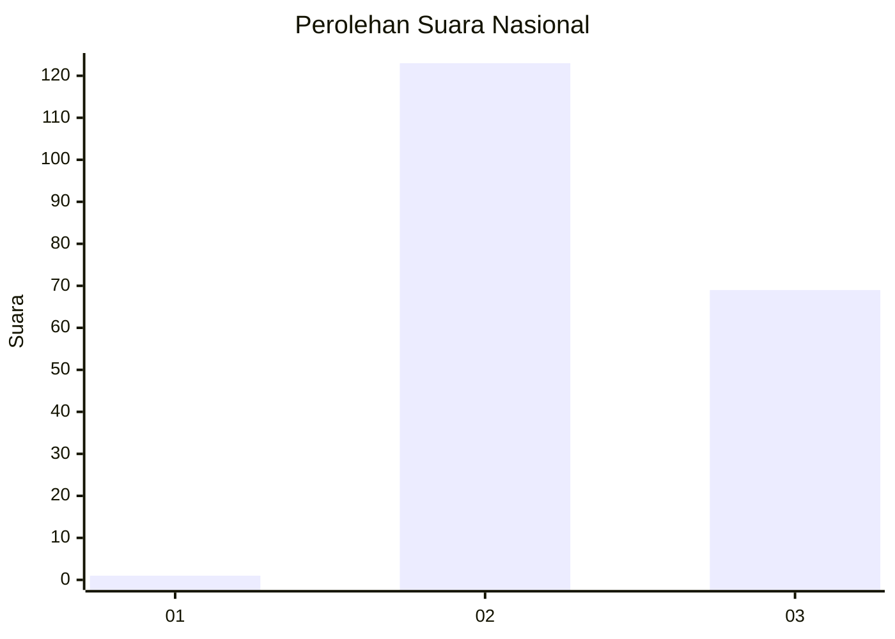
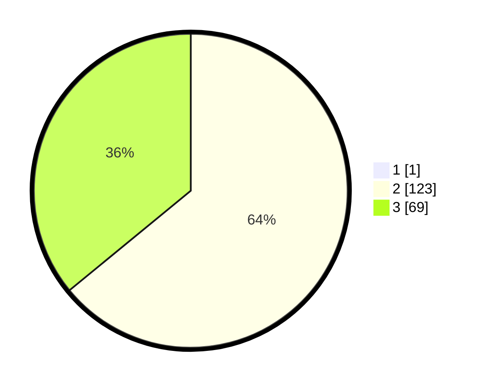

# Hasil

## Grafik

## Tabel

| No. | Nama Paslon    | Suara | Suara (raw) | Persentase |
|:--- |:-------------- | -----:| -----------:| ----------:|
| 1   | ANIES MUHAIMIN | 1     | [1][p-1]    | 0,52       |
| 2   | PRABOWO GIBRAN | 123   | [123][p-2]  | 63,73      |
| 3   | GANJAR MAHFUD  | 69    | [69][p-3]   | 35,75      |

[p-1]: https://github.com/gigit-pemilu/pemilu-2024/blob/main/pilpres/hitung-suara/sub/51-bali/sub/01-jembrana/sub/02-mendoyo/sub/2008-yehembang/sub/013-tps/sub/paslon-1.txt
[p-2]: https://github.com/gigit-pemilu/pemilu-2024/blob/main/pilpres/hitung-suara/sub/51-bali/sub/01-jembrana/sub/02-mendoyo/sub/2008-yehembang/sub/013-tps/sub/paslon-2.txt
[p-3]: https://github.com/gigit-pemilu/pemilu-2024/blob/main/pilpres/hitung-suara/sub/51-bali/sub/01-jembrana/sub/02-mendoyo/sub/2008-yehembang/sub/013-tps/sub/paslon-3.txt

## Foto C Plano

https://sirekap-obj-formc.kpu.go.id/33e6/pemilu/ppwp/51/01/02/20/08/5101022008013-20240214-125641--bd4021b6-f1e3-4a28-9d56-fa57bb7a146a.jpg

https://sirekap-obj-formc.kpu.go.id/33e6/pemilu/ppwp/51/01/02/20/08/5101022008013-20240214-125750--788a1e3f-6e50-480b-a167-7594a969154f.jpg

https://sirekap-obj-formc.kpu.go.id/33e6/pemilu/ppwp/51/01/02/20/08/5101022008013-20240214-130119--b46e97a9-0291-4191-ae29-7a8605401fec.jpg

## Metadata

| Key        | Value               |
| ---------- | ------------------- |
| Time Stamp | 2024-02-14 21:46:01 |

## DATA PEMILIH TETAP

Jumlah pemilih dalam DPT: **271**.
 * L: **131**.
 * P: **140**.

## DATA PENGGUNA HAK PILIH

Jumlah pengguna hak pilih dalam DPT: **194**.
 * L: **95**.
 * P: **99**.

Jumlah pengguna hak pilih dalam DPTb: **0**.
 * L: **0**.
 * P: **0**.

Jumlah pengguna hak pilih dalam DPK: **3**.
 * L: **2**.
 * P: **1**.

Jumlah pengguna hak pilih: **197**.
 * L: **97**.
 * P: **100**.

## JUMLAH SUARA SAH DAN TIDAK SAH

JUMLAH SELURUH SUARA SAH: **193**.

JUMLAH SUARA TIDAK SAH: **4**.

JUMLAH SELURUH SUARA SAH DAN SUARA TIDAK SAH: **197**.

