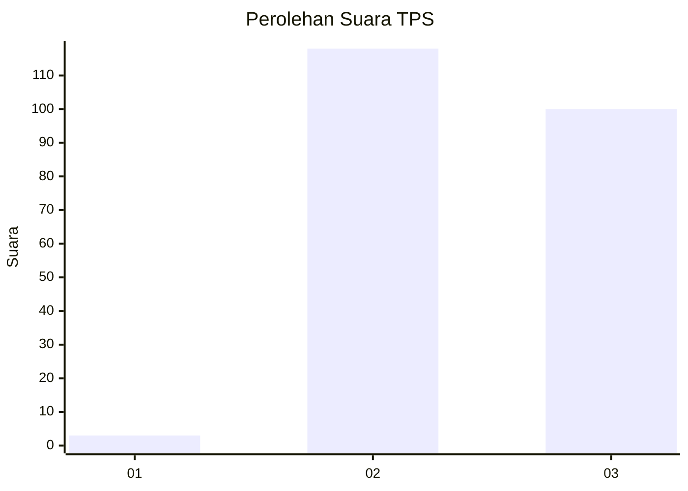
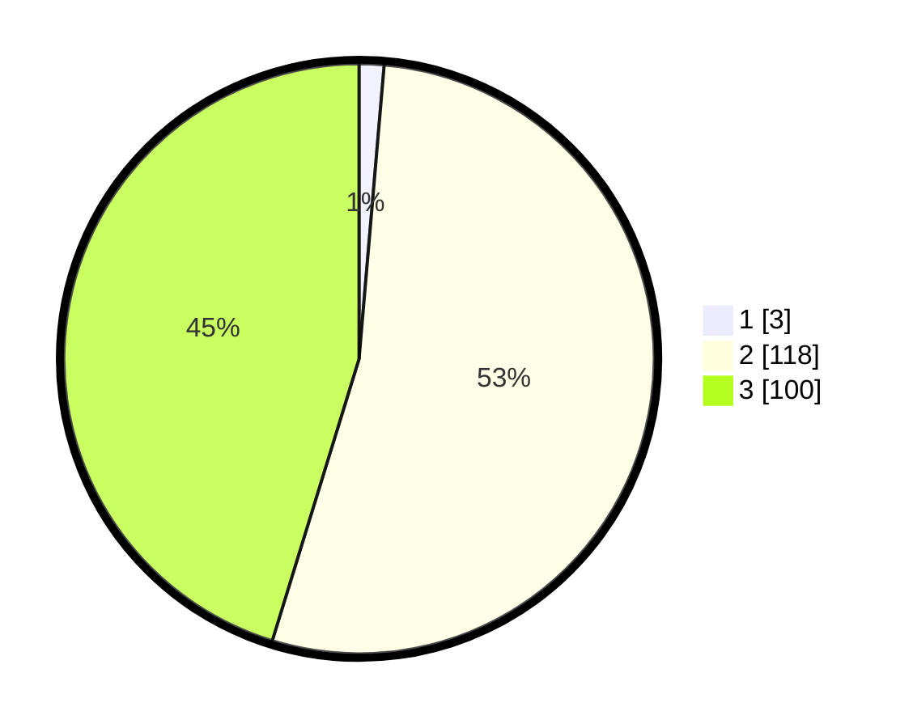

# Hasil

## Grafik

## Tabel

| No. | Nama Paslon    | Suara | Suara (raw) | Persentase |
|:--- |:-------------- | -----:| -----------:| ----------:|
| 1   | ANIES MUHAIMIN | 3     | [3][p-1]    | 1,36       |
| 2   | PRABOWO GIBRAN | 118   | [118][p-2]  | 53,39      |
| 3   | GANJAR MAHFUD  | 100   | [100][p-3]  | 45,25      |

[p-1]: https://github.com/gigit-pemilu/pemilu-2024-51-bali/blob/main/pilpres/hitung-suara/sub/51-bali/sub/01-jembrana/sub/02-mendoyo/sub/2008-yehembang/sub/014-tps/sub/paslon-1.txt
[p-2]: https://github.com/gigit-pemilu/pemilu-2024-51-bali/blob/main/pilpres/hitung-suara/sub/51-bali/sub/01-jembrana/sub/02-mendoyo/sub/2008-yehembang/sub/014-tps/sub/paslon-2.txt
[p-3]: https://github.com/gigit-pemilu/pemilu-2024-51-bali/blob/main/pilpres/hitung-suara/sub/51-bali/sub/01-jembrana/sub/02-mendoyo/sub/2008-yehembang/sub/014-tps/sub/paslon-3.txt

## Foto C Plano

https://sirekap-obj-formc.kpu.go.id/b186/pemilu/ppwp/51/01/02/20/08/5101022008014-20240214-194446--18b9e3e6-ba00-445b-b124-7ce5002f477f.jpg

https://sirekap-obj-formc.kpu.go.id/b186/pemilu/ppwp/51/01/02/20/08/5101022008014-20240214-204205--e0d525eb-be4f-47fc-bea1-171b0850c458.jpg

https://sirekap-obj-formc.kpu.go.id/b186/pemilu/ppwp/51/01/02/20/08/5101022008014-20240214-205506--3692b395-b5c3-42ed-8265-1ddc54bc9c9e.jpg

## Metadata

| Key        | Value               |
| ---------- | ------------------- |
| Time Stamp | 2024-02-15 12:00:28 |

## DATA PEMILIH TETAP

Jumlah pemilih dalam DPT: **260**.
 * L: **133**.
 * P: **127**.

## DATA PENGGUNA HAK PILIH

Jumlah pengguna hak pilih dalam DPT: **219**.
 * L: **113**.
 * P: **106**.

Jumlah pengguna hak pilih dalam DPTb: **0**.
 * L: **0**.
 * P: **0**.

Jumlah pengguna hak pilih dalam DPK: **3**.
 * L: **0**.
 * P: **3**.

Jumlah pengguna hak pilih: **222**.
 * L: **113**.
 * P: **109**.

## JUMLAH SUARA SAH DAN TIDAK SAH

JUMLAH SELURUH SUARA SAH: **221**.

JUMLAH SUARA TIDAK SAH: **1**.

JUMLAH SELURUH SUARA SAH DAN SUARA TIDAK SAH: **222**.

