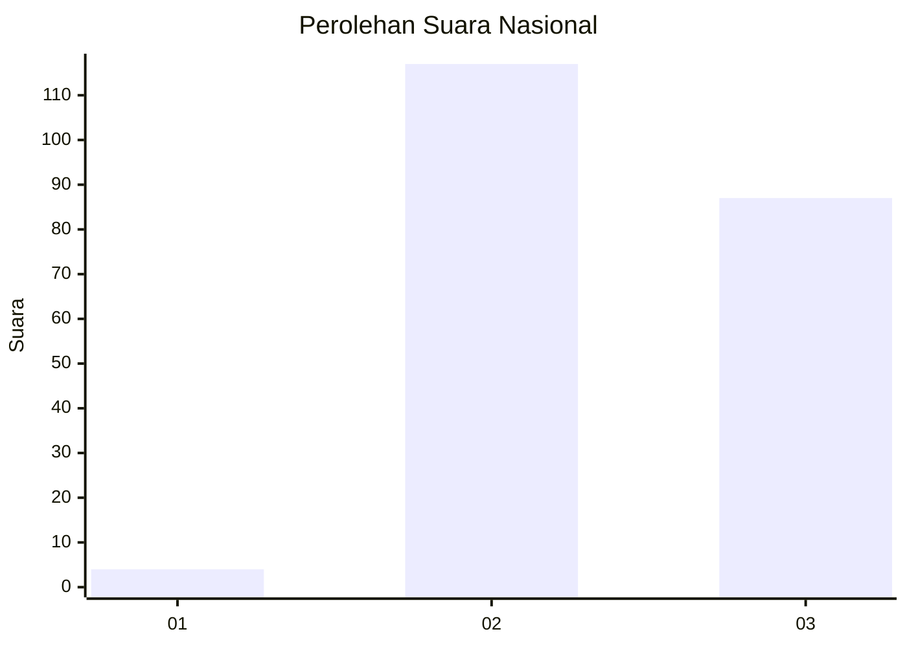
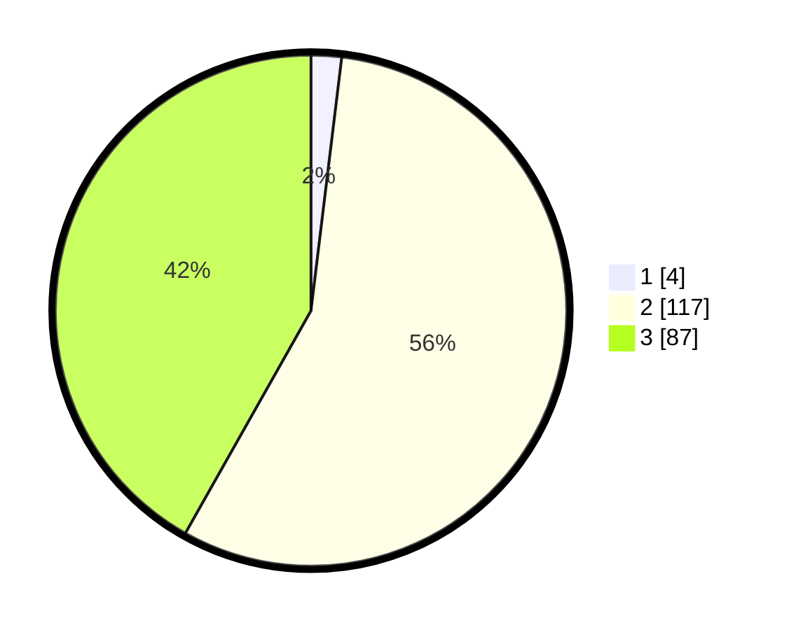

# Hasil

## Grafik

## Tabel

| No. | Nama Paslon    | Suara | Suara (raw) | Persentase |
|:--- |:-------------- | -----:| -----------:| ----------:|
| 1   | ANIES MUHAIMIN | 4     | [4][p-1]    | 1,92       |
| 2   | PRABOWO GIBRAN | 117   | [117][p-2]  | 56,25      |
| 3   | GANJAR MAHFUD  | 87    | [87][p-3]   | 41,83      |

[p-1]: https://github.com/gigit-pemilu/pemilu-2024/blob/main/pilpres/hitung-suara/sub/51-bali/sub/01-jembrana/sub/02-mendoyo/sub/2008-yehembang/sub/015-tps/sub/paslon-1.txt
[p-2]: https://github.com/gigit-pemilu/pemilu-2024/blob/main/pilpres/hitung-suara/sub/51-bali/sub/01-jembrana/sub/02-mendoyo/sub/2008-yehembang/sub/015-tps/sub/paslon-2.txt
[p-3]: https://github.com/gigit-pemilu/pemilu-2024/blob/main/pilpres/hitung-suara/sub/51-bali/sub/01-jembrana/sub/02-mendoyo/sub/2008-yehembang/sub/015-tps/sub/paslon-3.txt

## Foto C Plano

https://sirekap-obj-formc.kpu.go.id/57f4/pemilu/ppwp/51/01/02/20/08/5101022008015-20240214-160140--7f7c628b-5cb4-429c-91ca-b89d5ceb18ed.jpg

https://sirekap-obj-formc.kpu.go.id/57f4/pemilu/ppwp/51/01/02/20/08/5101022008015-20240214-160158--a94b5a3d-6a8b-4b72-8c0e-f83d912a084d.jpg

https://sirekap-obj-formc.kpu.go.id/57f4/pemilu/ppwp/51/01/02/20/08/5101022008015-20240214-162213--8827d64a-8bf0-40dd-a704-a0fde58b9553.jpg

## Metadata

| Key        | Value               |
| ---------- | ------------------- |
| Time Stamp | 2024-02-14 21:46:01 |

## DATA PEMILIH TETAP

Jumlah pemilih dalam DPT: **280**.
 * L: **141**.
 * P: **139**.

## DATA PENGGUNA HAK PILIH

Jumlah pengguna hak pilih dalam DPT: **210**.
 * L: **109**.
 * P: **101**.

Jumlah pengguna hak pilih dalam DPTb: **0**.
 * L: **0**.
 * P: **0**.

Jumlah pengguna hak pilih dalam DPK: **0**.
 * L: **0**.
 * P: **0**.

Jumlah pengguna hak pilih: **210**.
 * L: **109**.
 * P: **101**.

## JUMLAH SUARA SAH DAN TIDAK SAH

JUMLAH SELURUH SUARA SAH: **208**.

JUMLAH SUARA TIDAK SAH: **2**.

JUMLAH SELURUH SUARA SAH DAN SUARA TIDAK SAH: **210**.

