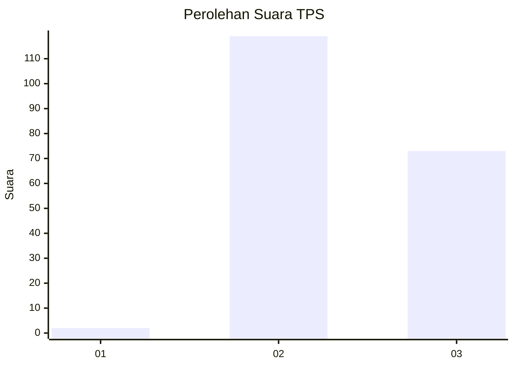
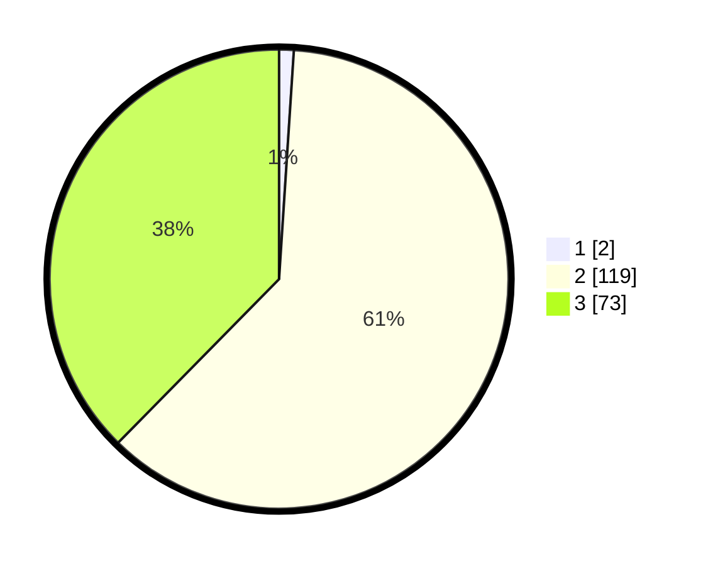

# Hasil

## Grafik

## Tabel

| No. | Nama Paslon    | Suara | Suara (raw) | Persentase |
|:--- |:-------------- | -----:| -----------:| ----------:|
| 1   | ANIES MUHAIMIN | 2     | [2][p-1]    | 1,03       |
| 2   | PRABOWO GIBRAN | 119   | [119][p-2]  | 61,34      |
| 3   | GANJAR MAHFUD  | 73    | [73][p-3]   | 37,63      |

[p-1]: https://github.com/gigit-pemilu/pemilu-2024-51-bali/blob/main/pilpres/hitung-suara/sub/51-bali/sub/01-jembrana/sub/02-mendoyo/sub/2008-yehembang/sub/017-tps/sub/paslon-1.txt
[p-2]: https://github.com/gigit-pemilu/pemilu-2024-51-bali/blob/main/pilpres/hitung-suara/sub/51-bali/sub/01-jembrana/sub/02-mendoyo/sub/2008-yehembang/sub/017-tps/sub/paslon-2.txt
[p-3]: https://github.com/gigit-pemilu/pemilu-2024-51-bali/blob/main/pilpres/hitung-suara/sub/51-bali/sub/01-jembrana/sub/02-mendoyo/sub/2008-yehembang/sub/017-tps/sub/paslon-3.txt

## Foto C Plano

https://sirekap-obj-formc.kpu.go.id/ebb9/pemilu/ppwp/51/01/02/20/08/5101022008017-20240214-141710--8789f78f-9007-4579-b491-2fdaade427dc.jpg

https://sirekap-obj-formc.kpu.go.id/ebb9/pemilu/ppwp/51/01/02/20/08/5101022008017-20240214-141859--c0acbee7-bc6c-477f-a9ae-e334d0865bfe.jpg

https://sirekap-obj-formc.kpu.go.id/ebb9/pemilu/ppwp/51/01/02/20/08/5101022008017-20240214-155417--d2e02aeb-eca6-4eba-b271-901b4e5e6b0e.jpg

## Metadata

| Key        | Value               |
| ---------- | ------------------- |
| Time Stamp | 2024-02-14 21:46:01 |

## DATA PEMILIH TETAP

Jumlah pemilih dalam DPT: **258**.
 * L: **131**.
 * P: **127**.

## DATA PENGGUNA HAK PILIH

Jumlah pengguna hak pilih dalam DPT: **197**.
 * L: **97**.
 * P: **100**.

Jumlah pengguna hak pilih dalam DPTb: **0**.
 * L: **0**.
 * P: **0**.

Jumlah pengguna hak pilih dalam DPK: **1**.
 * L: **0**.
 * P: **1**.

Jumlah pengguna hak pilih: **198**.
 * L: **97**.
 * P: **101**.

## JUMLAH SUARA SAH DAN TIDAK SAH

JUMLAH SELURUH SUARA SAH: **194**.

JUMLAH SUARA TIDAK SAH: **4**.

JUMLAH SELURUH SUARA SAH DAN SUARA TIDAK SAH: **198**.

