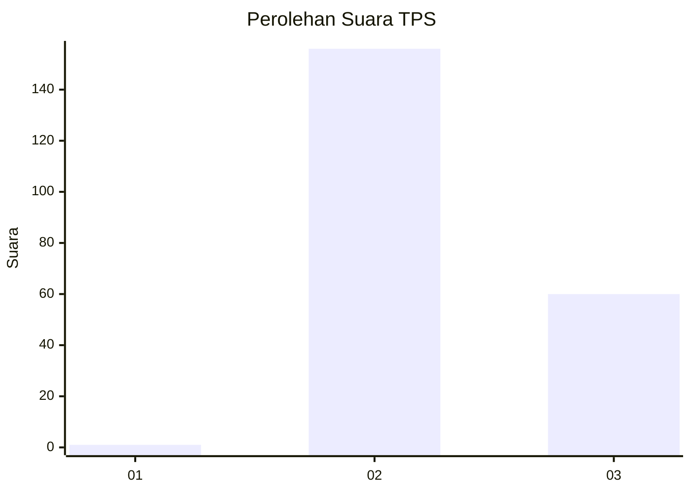
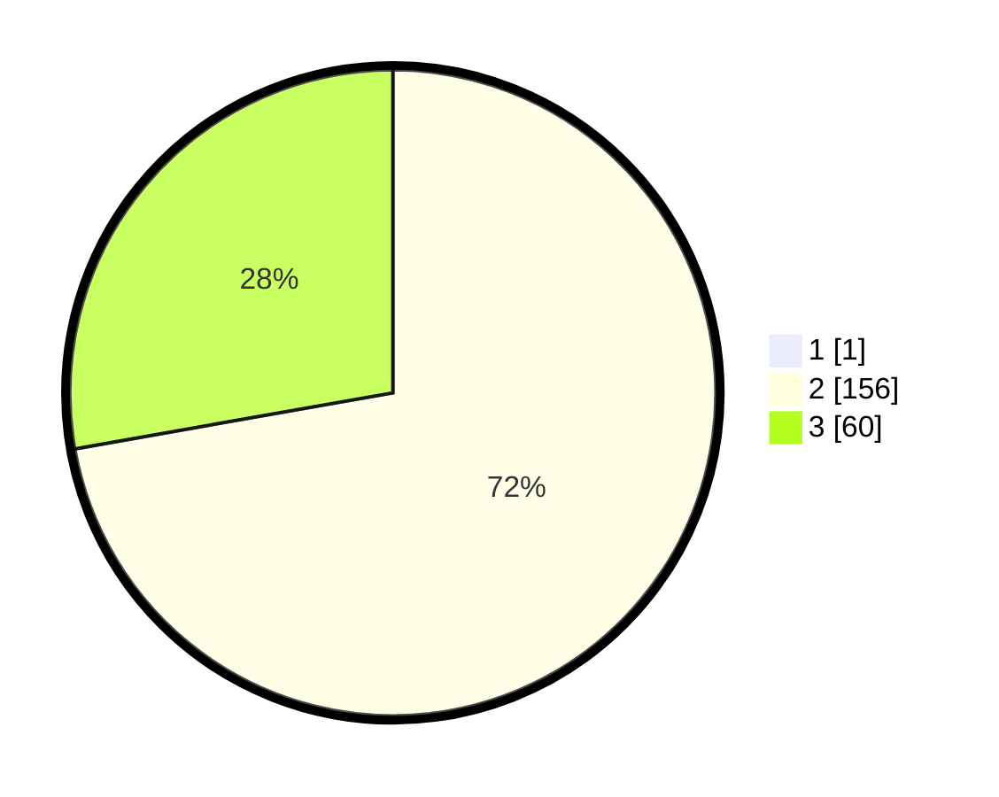

# Hasil

## Grafik

## Tabel

| No. | Nama Paslon    | Suara | Suara (raw) | Persentase |
|:--- |:-------------- | -----:| -----------:| ----------:|
| 1   | ANIES MUHAIMIN | 1     | [1][p-1]    | 0,46       |
| 2   | PRABOWO GIBRAN | 156   | [156][p-2]  | 71,89      |
| 3   | GANJAR MAHFUD  | 60    | [60][p-3]   | 27,65      |

[p-1]: https://github.com/gigit-pemilu/pemilu-2024-51-bali/blob/main/pilpres/hitung-suara/sub/51-bali/sub/01-jembrana/sub/02-mendoyo/sub/2008-yehembang/sub/019-tps/sub/paslon-1.txt
[p-2]: https://github.com/gigit-pemilu/pemilu-2024-51-bali/blob/main/pilpres/hitung-suara/sub/51-bali/sub/01-jembrana/sub/02-mendoyo/sub/2008-yehembang/sub/019-tps/sub/paslon-2.txt
[p-3]: https://github.com/gigit-pemilu/pemilu-2024-51-bali/blob/main/pilpres/hitung-suara/sub/51-bali/sub/01-jembrana/sub/02-mendoyo/sub/2008-yehembang/sub/019-tps/sub/paslon-3.txt

## Foto C Plano

https://sirekap-obj-formc.kpu.go.id/a14a/pemilu/ppwp/51/01/02/20/08/5101022008019-20240214-141448--87ed04aa-9244-44f4-977e-1a6165950c5e.jpg

https://sirekap-obj-formc.kpu.go.id/a14a/pemilu/ppwp/51/01/02/20/08/5101022008019-20240214-141609--8ed4f79c-bf76-46e4-bb80-39f19ac96818.jpg

https://sirekap-obj-formc.kpu.go.id/a14a/pemilu/ppwp/51/01/02/20/08/5101022008019-20240214-141708--085cc039-7c21-4797-939b-ea7e5ca20407.jpg

## Metadata

| Key        | Value               |
| ---------- | ------------------- |
| Time Stamp | 2024-02-15 12:00:28 |

## DATA PEMILIH TETAP

Jumlah pemilih dalam DPT: **272**.
 * L: **132**.
 * P: **140**.

## DATA PENGGUNA HAK PILIH

Jumlah pengguna hak pilih dalam DPT: **215**.
 * L: **100**.
 * P: **115**.

Jumlah pengguna hak pilih dalam DPTb: **0**.
 * L: **0**.
 * P: **0**.

Jumlah pengguna hak pilih dalam DPK: **3**.
 * L: **1**.
 * P: **2**.

Jumlah pengguna hak pilih: **218**.
 * L: **101**.
 * P: **117**.

## JUMLAH SUARA SAH DAN TIDAK SAH

JUMLAH SELURUH SUARA SAH: **217**.

JUMLAH SUARA TIDAK SAH: **1**.

JUMLAH SELURUH SUARA SAH DAN SUARA TIDAK SAH: **218**.

