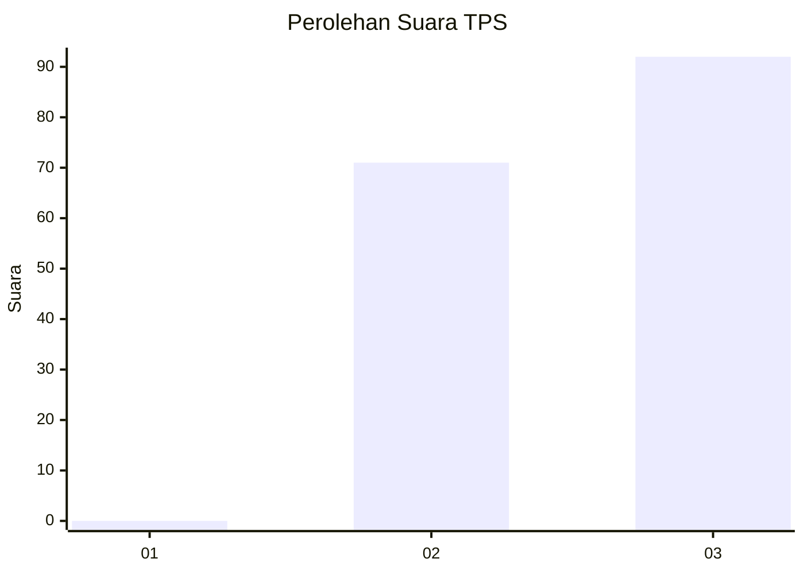
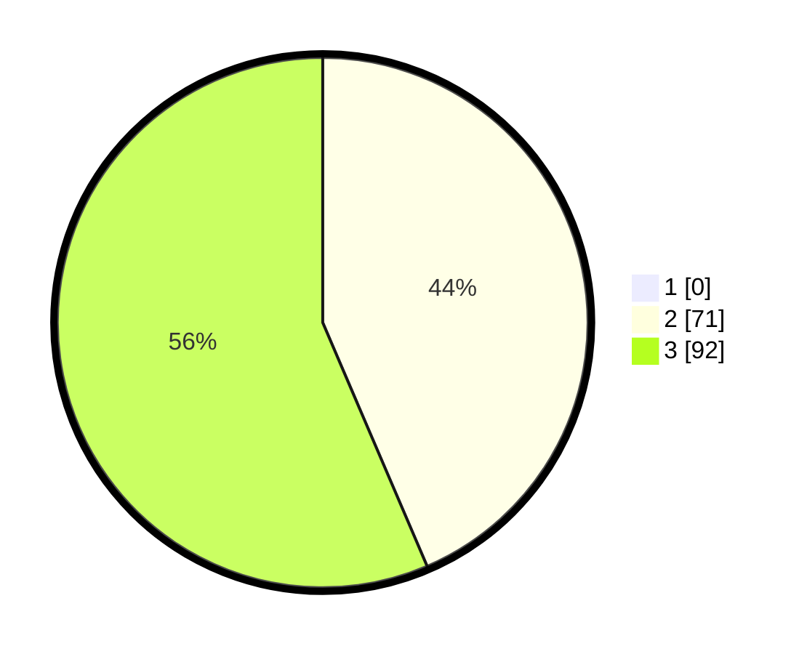

# Hasil

## Grafik

## Tabel

| No. | Nama Paslon    | Suara | Suara (raw) | Persentase |
|:--- |:-------------- | -----:| -----------:| ----------:|
| 1   | ANIES MUHAIMIN | 0     | [0][p-1]    | 0,00       |
| 2   | PRABOWO GIBRAN | 71    | [71][p-2]   | 43,56      |
| 3   | GANJAR MAHFUD  | 92    | [92][p-3]   | 56,44      |

[p-1]: https://github.com/gigit-pemilu/pemilu-2024-51-bali/blob/main/pilpres/hitung-suara/sub/51-bali/sub/01-jembrana/sub/02-mendoyo/sub/2008-yehembang/sub/026-tps/sub/paslon-1.txt
[p-2]: https://github.com/gigit-pemilu/pemilu-2024-51-bali/blob/main/pilpres/hitung-suara/sub/51-bali/sub/01-jembrana/sub/02-mendoyo/sub/2008-yehembang/sub/026-tps/sub/paslon-2.txt
[p-3]: https://github.com/gigit-pemilu/pemilu-2024-51-bali/blob/main/pilpres/hitung-suara/sub/51-bali/sub/01-jembrana/sub/02-mendoyo/sub/2008-yehembang/sub/026-tps/sub/paslon-3.txt

## Foto C Plano

https://sirekap-obj-formc.kpu.go.id/1674/pemilu/ppwp/51/01/02/20/08/5101022008026-20240214-141824--010bf72d-aa90-448f-b667-d53ed27c6d07.jpg

https://sirekap-obj-formc.kpu.go.id/1674/pemilu/ppwp/51/01/02/20/08/5101022008026-20240214-141833--88455309-aad4-4762-878c-e8ea803e6071.jpg

https://sirekap-obj-formc.kpu.go.id/1674/pemilu/ppwp/51/01/02/20/08/5101022008026-20240214-141838--8eb382c0-2870-480c-8290-1b5dcad805ee.jpg

## Metadata

| Key        | Value               |
| ---------- | ------------------- |
| Time Stamp | 2024-02-14 21:46:01 |

## DATA PEMILIH TETAP

Jumlah pemilih dalam DPT: **213**.
 * L: **103**.
 * P: **110**.

## DATA PENGGUNA HAK PILIH

Jumlah pengguna hak pilih dalam DPT: **162**.
 * L: **79**.
 * P: **83**.

Jumlah pengguna hak pilih dalam DPTb: **0**.
 * L: **0**.
 * P: **0**.

Jumlah pengguna hak pilih dalam DPK: **1**.
 * L: **1**.
 * P: **0**.

Jumlah pengguna hak pilih: **163**.
 * L: **80**.
 * P: **83**.

## JUMLAH SUARA SAH DAN TIDAK SAH

JUMLAH SELURUH SUARA SAH: **163**.

JUMLAH SUARA TIDAK SAH: **0**.

JUMLAH SELURUH SUARA SAH DAN SUARA TIDAK SAH: **163**.

