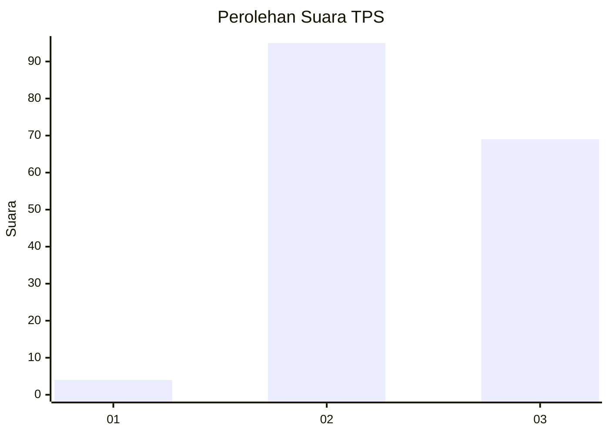
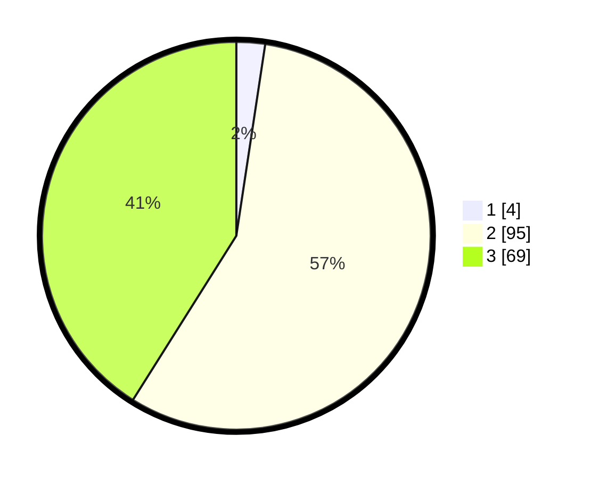

# Hasil

## Grafik

## Tabel

| No. | Nama Paslon    | Suara | Suara (raw) | Persentase |
|:--- |:-------------- | -----:| -----------:| ----------:|
| 1   | ANIES MUHAIMIN | 4     | [4][p-1]    | 2,38       |
| 2   | PRABOWO GIBRAN | 95    | [95][p-2]   | 56,55      |
| 3   | GANJAR MAHFUD  | 69    | [69][p-3]   | 41,07      |

[p-1]: https://github.com/gigit-pemilu/pemilu-2024-51-bali/blob/main/pilpres/hitung-suara/sub/51-bali/sub/01-jembrana/sub/02-mendoyo/sub/2008-yehembang/sub/027-tps/sub/paslon-1.txt
[p-2]: https://github.com/gigit-pemilu/pemilu-2024-51-bali/blob/main/pilpres/hitung-suara/sub/51-bali/sub/01-jembrana/sub/02-mendoyo/sub/2008-yehembang/sub/027-tps/sub/paslon-2.txt
[p-3]: https://github.com/gigit-pemilu/pemilu-2024-51-bali/blob/main/pilpres/hitung-suara/sub/51-bali/sub/01-jembrana/sub/02-mendoyo/sub/2008-yehembang/sub/027-tps/sub/paslon-3.txt

## Foto C Plano

https://sirekap-obj-formc.kpu.go.id/efa8/pemilu/ppwp/51/01/02/20/08/5101022008027-20240214-130400--4a8319ce-90dc-479a-9f42-7166d20dfba7.jpg

https://sirekap-obj-formc.kpu.go.id/efa8/pemilu/ppwp/51/01/02/20/08/5101022008027-20240214-130011--e6a8d9a4-27b7-44bb-8e3e-23cd942d6b50.jpg

https://sirekap-obj-formc.kpu.go.id/efa8/pemilu/ppwp/51/01/02/20/08/5101022008027-20240214-130148--567a40ba-90ce-484d-8cf3-3720c09dda9f.jpg

## Metadata

| Key        | Value               |
| ---------- | ------------------- |
| Time Stamp | 2024-02-14 21:46:01 |

## DATA PEMILIH TETAP

Jumlah pemilih dalam DPT: **228**.
 * L: **117**.
 * P: **111**.

## DATA PENGGUNA HAK PILIH

Jumlah pengguna hak pilih dalam DPT: **170**.
 * L: **89**.
 * P: **81**.

Jumlah pengguna hak pilih dalam DPTb: **0**.
 * L: **0**.
 * P: **0**.

Jumlah pengguna hak pilih dalam DPK: **0**.
 * L: **0**.
 * P: **0**.

Jumlah pengguna hak pilih: **170**.
 * L: **89**.
 * P: **81**.

## JUMLAH SUARA SAH DAN TIDAK SAH

JUMLAH SELURUH SUARA SAH: **168**.

JUMLAH SUARA TIDAK SAH: **2**.

JUMLAH SELURUH SUARA SAH DAN SUARA TIDAK SAH: **170**.

