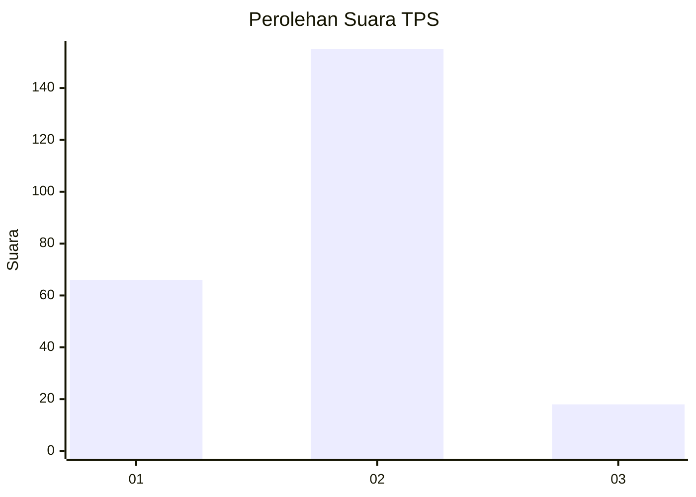
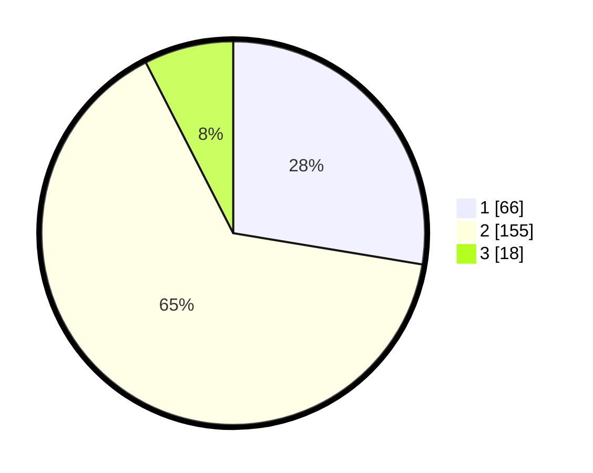

# Hasil

## Grafik

## Tabel

| No. | Nama Paslon    | Suara | Suara (raw) | Persentase |
|:--- |:-------------- | -----:| -----------:| ----------:|
| 1   | ANIES MUHAIMIN | 66    | [66][p-1]   | 27,62      |
| 2   | PRABOWO GIBRAN | 155   | [155][p-2]  | 64,85      |
| 3   | GANJAR MAHFUD  | 18    | [18][p-3]   | 7,53       |

[p-1]: https://github.com/gigit-pemilu/pemilu-2024-51-bali/blob/main/pilpres/hitung-suara/sub/51-bali/sub/01-jembrana/sub/02-mendoyo/sub/2009-yeh-sumbul/sub/005-tps/sub/paslon-1.txt
[p-2]: https://github.com/gigit-pemilu/pemilu-2024-51-bali/blob/main/pilpres/hitung-suara/sub/51-bali/sub/01-jembrana/sub/02-mendoyo/sub/2009-yeh-sumbul/sub/005-tps/sub/paslon-2.txt
[p-3]: https://github.com/gigit-pemilu/pemilu-2024-51-bali/blob/main/pilpres/hitung-suara/sub/51-bali/sub/01-jembrana/sub/02-mendoyo/sub/2009-yeh-sumbul/sub/005-tps/sub/paslon-3.txt

## Foto C Plano

https://sirekap-obj-formc.kpu.go.id/3c37/pemilu/ppwp/51/01/02/20/09/5101022009005-20240214-221450--f1fd439c-4d02-42fb-916d-6664db90ffa3.jpg

https://sirekap-obj-formc.kpu.go.id/3c37/pemilu/ppwp/51/01/02/20/09/5101022009005-20240214-221453--217752fd-227a-4f21-bf51-789218b90390.jpg

https://sirekap-obj-formc.kpu.go.id/3c37/pemilu/ppwp/51/01/02/20/09/5101022009005-20240214-221459--43a76131-64f4-4579-9756-ef0a764ce067.jpg

## Metadata

| Key        | Value               |
| ---------- | ------------------- |
| Time Stamp | 2024-02-15 16:00:26 |

## DATA PEMILIH TETAP

Jumlah pemilih dalam DPT: **294**.
 * L: **137**.
 * P: **157**.

## DATA PENGGUNA HAK PILIH

Jumlah pengguna hak pilih dalam DPT: **246**.
 * L: **114**.
 * P: **132**.

Jumlah pengguna hak pilih dalam DPTb: **0**.
 * L: **0**.
 * P: **0**.

Jumlah pengguna hak pilih dalam DPK: **0**.
 * L: **0**.
 * P: **0**.

Jumlah pengguna hak pilih: **246**.
 * L: **114**.
 * P: **132**.

## JUMLAH SUARA SAH DAN TIDAK SAH

JUMLAH SELURUH SUARA SAH: **239**.

JUMLAH SUARA TIDAK SAH: **7**.

JUMLAH SELURUH SUARA SAH DAN SUARA TIDAK SAH: **246**.

