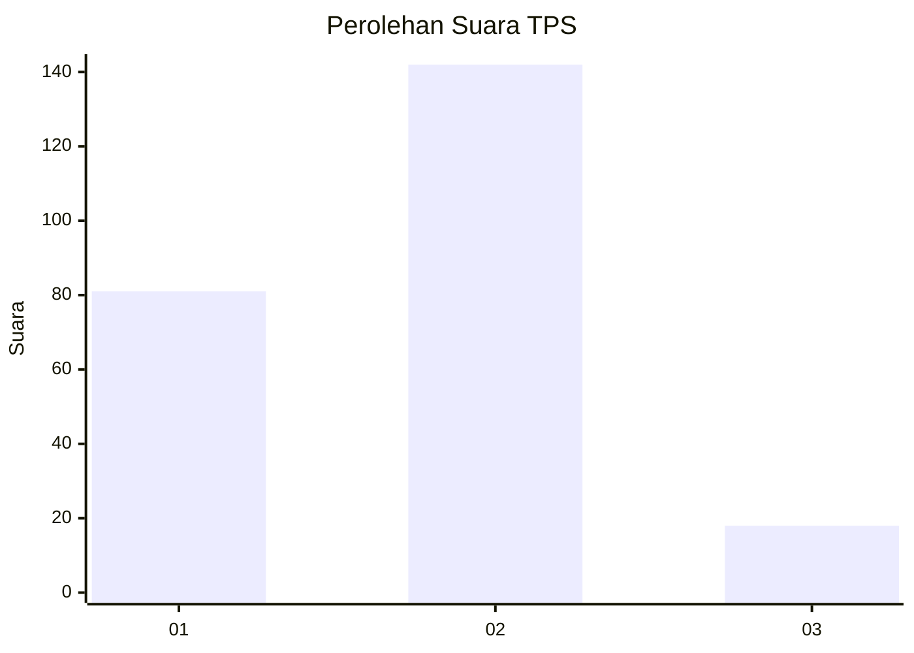
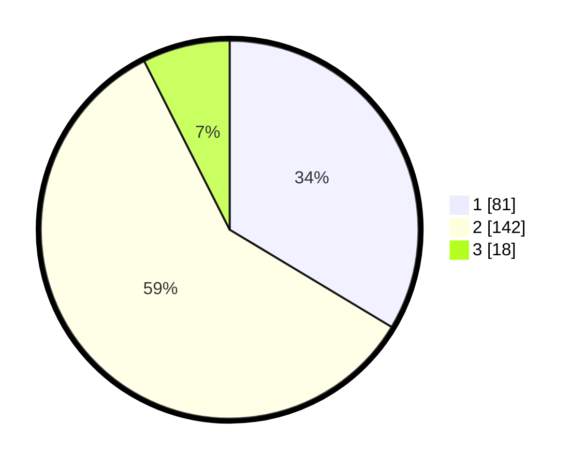

# Hasil

## Grafik

## Tabel

| No. | Nama Paslon    | Suara | Suara (raw) | Persentase |
|:--- |:-------------- | -----:| -----------:| ----------:|
| 1   | ANIES MUHAIMIN | 81    | [81][p-1]   | 33,61      |
| 2   | PRABOWO GIBRAN | 142   | [142][p-2]  | 58,92      |
| 3   | GANJAR MAHFUD  | 18    | [18][p-3]   | 7,47       |

[p-1]: https://github.com/gigit-pemilu/pemilu-2024-51-bali/blob/main/pilpres/hitung-suara/sub/51-bali/sub/01-jembrana/sub/02-mendoyo/sub/2009-yeh-sumbul/sub/006-tps/sub/paslon-1.txt
[p-2]: https://github.com/gigit-pemilu/pemilu-2024-51-bali/blob/main/pilpres/hitung-suara/sub/51-bali/sub/01-jembrana/sub/02-mendoyo/sub/2009-yeh-sumbul/sub/006-tps/sub/paslon-2.txt
[p-3]: https://github.com/gigit-pemilu/pemilu-2024-51-bali/blob/main/pilpres/hitung-suara/sub/51-bali/sub/01-jembrana/sub/02-mendoyo/sub/2009-yeh-sumbul/sub/006-tps/sub/paslon-3.txt

## Foto C Plano

https://sirekap-obj-formc.kpu.go.id/a61e/pemilu/ppwp/51/01/02/20/09/5101022009006-20240215-032150--c7cfba87-8971-4cf7-9c6b-9e784114e65b.jpg

https://sirekap-obj-formc.kpu.go.id/a61e/pemilu/ppwp/51/01/02/20/09/5101022009006-20240215-032153--6ca773cd-4b59-4b17-858d-90c0cc266573.jpg

https://sirekap-obj-formc.kpu.go.id/a61e/pemilu/ppwp/51/01/02/20/09/5101022009006-20240215-032156--7d27ef1f-fd0f-4fc4-9073-00a641420094.jpg

## Metadata

| Key        | Value               |
| ---------- | ------------------- |
| Time Stamp | 2024-02-15 16:00:26 |

## DATA PEMILIH TETAP

Jumlah pemilih dalam DPT: **292**.
 * L: **146**.
 * P: **146**.

## DATA PENGGUNA HAK PILIH

Jumlah pengguna hak pilih dalam DPT: **245**.
 * L: **119**.
 * P: **126**.

Jumlah pengguna hak pilih dalam DPTb: **0**.
 * L: **0**.
 * P: **0**.

Jumlah pengguna hak pilih dalam DPK: **0**.
 * L: **0**.
 * P: **0**.

Jumlah pengguna hak pilih: **245**.
 * L: **119**.
 * P: **126**.

## JUMLAH SUARA SAH DAN TIDAK SAH

JUMLAH SELURUH SUARA SAH: **241**.

JUMLAH SUARA TIDAK SAH: **4**.

JUMLAH SELURUH SUARA SAH DAN SUARA TIDAK SAH: **245**.

