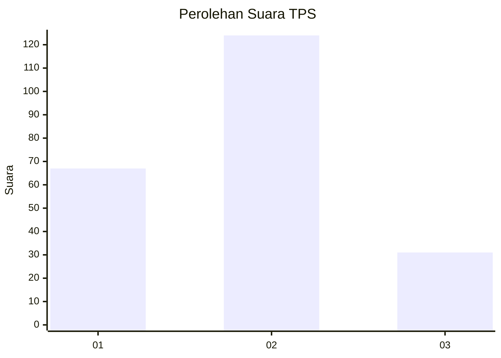
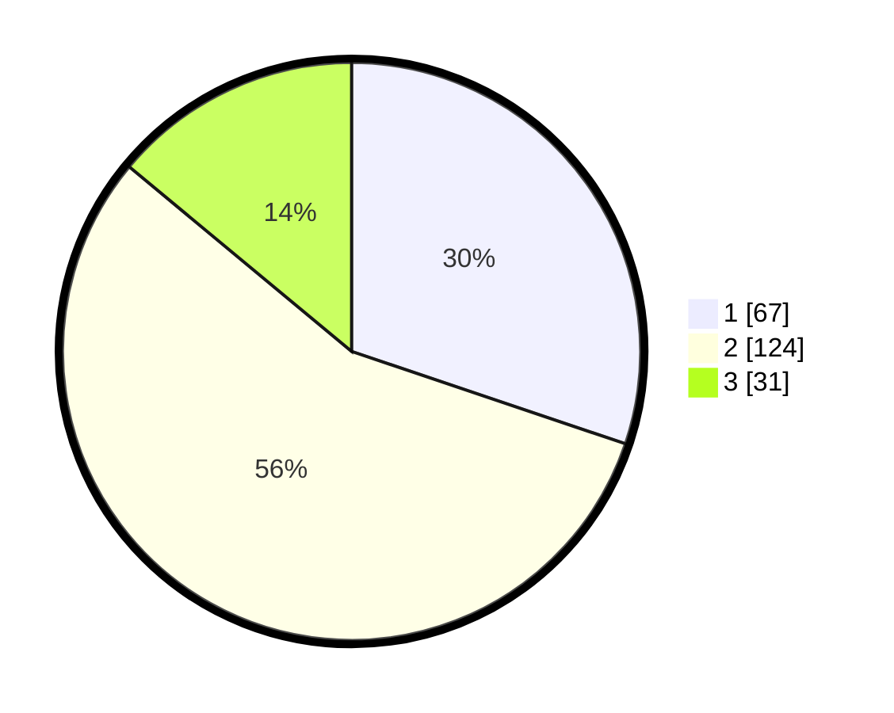

# Hasil

## Grafik

## Tabel

| No. | Nama Paslon    | Suara | Suara (raw) | Persentase |
|:--- |:-------------- | -----:| -----------:| ----------:|
| 1   | ANIES MUHAIMIN | 67    | [67][p-1]   | 30,18      |
| 2   | PRABOWO GIBRAN | 124   | [124][p-2]  | 55,86      |
| 3   | GANJAR MAHFUD  | 31    | [31][p-3]   | 13,96      |

[p-1]: https://github.com/gigit-pemilu/pemilu-2024-51-bali/blob/main/pilpres/hitung-suara/sub/51-bali/sub/01-jembrana/sub/02-mendoyo/sub/2009-yeh-sumbul/sub/009-tps/sub/paslon-1.txt
[p-2]: https://github.com/gigit-pemilu/pemilu-2024-51-bali/blob/main/pilpres/hitung-suara/sub/51-bali/sub/01-jembrana/sub/02-mendoyo/sub/2009-yeh-sumbul/sub/009-tps/sub/paslon-2.txt
[p-3]: https://github.com/gigit-pemilu/pemilu-2024-51-bali/blob/main/pilpres/hitung-suara/sub/51-bali/sub/01-jembrana/sub/02-mendoyo/sub/2009-yeh-sumbul/sub/009-tps/sub/paslon-3.txt

## Foto C Plano

https://sirekap-obj-formc.kpu.go.id/ad92/pemilu/ppwp/51/01/02/20/09/5101022009009-20240215-015441--f22abdad-eb87-488f-942a-5a841347502d.jpg

https://sirekap-obj-formc.kpu.go.id/ad92/pemilu/ppwp/51/01/02/20/09/5101022009009-20240215-015607--b0c8d9f8-cffe-47f4-a85d-2cad2875dd1f.jpg

https://sirekap-obj-formc.kpu.go.id/ad92/pemilu/ppwp/51/01/02/20/09/5101022009009-20240215-015716--f548ee66-9271-4695-9473-0f031b204f11.jpg

## Metadata

| Key        | Value               |
| ---------- | ------------------- |
| Time Stamp | 2024-02-15 15:00:29 |

## DATA PEMILIH TETAP

Jumlah pemilih dalam DPT: **282**.
 * L: **136**.
 * P: **146**.

## DATA PENGGUNA HAK PILIH

Jumlah pengguna hak pilih dalam DPT: **224**.
 * L: **110**.
 * P: **114**.

Jumlah pengguna hak pilih dalam DPTb: **0**.
 * L: **0**.
 * P: **0**.

Jumlah pengguna hak pilih dalam DPK: **1**.
 * L: **1**.
 * P: **0**.

Jumlah pengguna hak pilih: **225**.
 * L: **111**.
 * P: **114**.

## JUMLAH SUARA SAH DAN TIDAK SAH

JUMLAH SELURUH SUARA SAH: **222**.

JUMLAH SUARA TIDAK SAH: **3**.

JUMLAH SELURUH SUARA SAH DAN SUARA TIDAK SAH: **225**.

