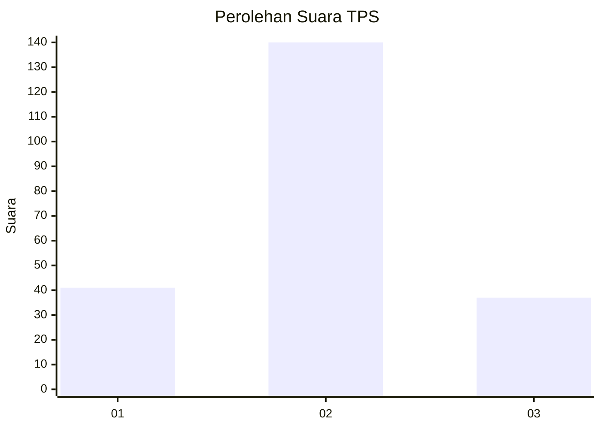
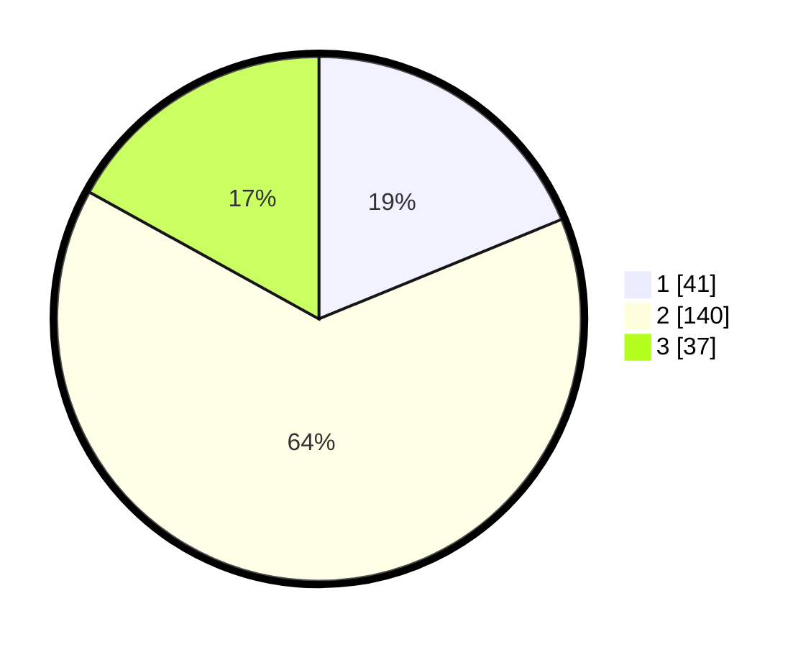

# Hasil

## Grafik

## Tabel

| No. | Nama Paslon    | Suara | Suara (raw) | Persentase |
|:--- |:-------------- | -----:| -----------:| ----------:|
| 1   | ANIES MUHAIMIN | 41    | [41][p-1]   | 18,81      |
| 2   | PRABOWO GIBRAN | 140   | [140][p-2]  | 64,22      |
| 3   | GANJAR MAHFUD  | 37    | [37][p-3]   | 16,97      |

[p-1]: https://github.com/gigit-pemilu/pemilu-2024-51-bali/blob/main/pilpres/hitung-suara/sub/51-bali/sub/01-jembrana/sub/02-mendoyo/sub/2009-yeh-sumbul/sub/013-tps/sub/paslon-1.txt
[p-2]: https://github.com/gigit-pemilu/pemilu-2024-51-bali/blob/main/pilpres/hitung-suara/sub/51-bali/sub/01-jembrana/sub/02-mendoyo/sub/2009-yeh-sumbul/sub/013-tps/sub/paslon-2.txt
[p-3]: https://github.com/gigit-pemilu/pemilu-2024-51-bali/blob/main/pilpres/hitung-suara/sub/51-bali/sub/01-jembrana/sub/02-mendoyo/sub/2009-yeh-sumbul/sub/013-tps/sub/paslon-3.txt

## Foto C Plano

https://sirekap-obj-formc.kpu.go.id/144f/pemilu/ppwp/51/01/02/20/09/5101022009013-20240214-225553--a1bf4927-d6c9-4acc-805c-c720e5ee8ee1.jpg

https://sirekap-obj-formc.kpu.go.id/144f/pemilu/ppwp/51/01/02/20/09/5101022009013-20240214-225612--502a841e-1d11-4eac-9378-c358fdc50801.jpg

https://sirekap-obj-formc.kpu.go.id/144f/pemilu/ppwp/51/01/02/20/09/5101022009013-20240214-225636--deba6647-1500-4632-b8f9-a94541569406.jpg

## Metadata

| Key        | Value               |
| ---------- | ------------------- |
| Time Stamp | 2024-02-15 16:00:26 |

## DATA PEMILIH TETAP

Jumlah pemilih dalam DPT: **280**.
 * L: **146**.
 * P: **134**.

## DATA PENGGUNA HAK PILIH

Jumlah pengguna hak pilih dalam DPT: **222**.
 * L: **116**.
 * P: **106**.

Jumlah pengguna hak pilih dalam DPTb: **3**.
 * L: **2**.
 * P: **1**.

Jumlah pengguna hak pilih dalam DPK: **0**.
 * L: **0**.
 * P: **0**.

Jumlah pengguna hak pilih: **225**.
 * L: **118**.
 * P: **107**.

## JUMLAH SUARA SAH DAN TIDAK SAH

JUMLAH SELURUH SUARA SAH: **218**.

JUMLAH SUARA TIDAK SAH: **7**.

JUMLAH SELURUH SUARA SAH DAN SUARA TIDAK SAH: **225**.

