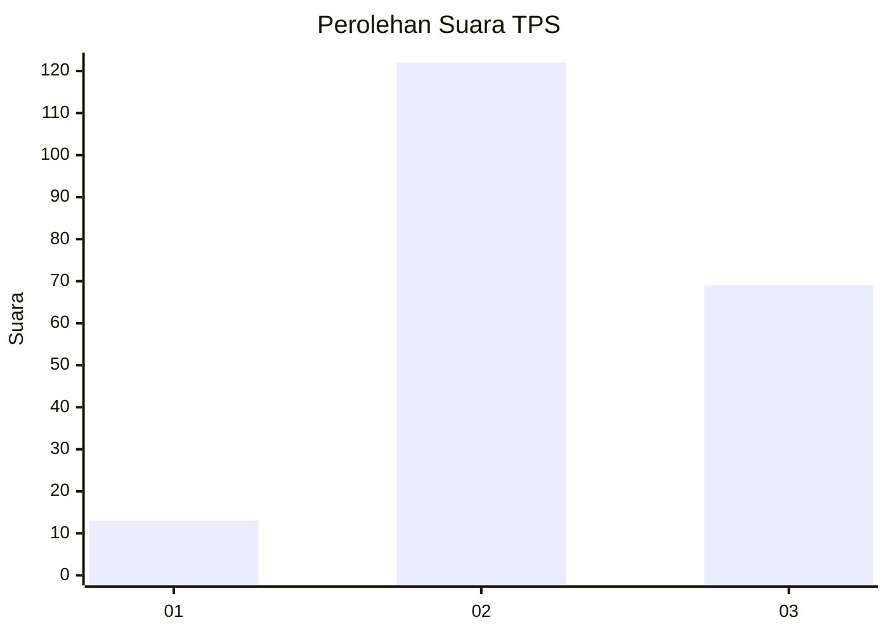
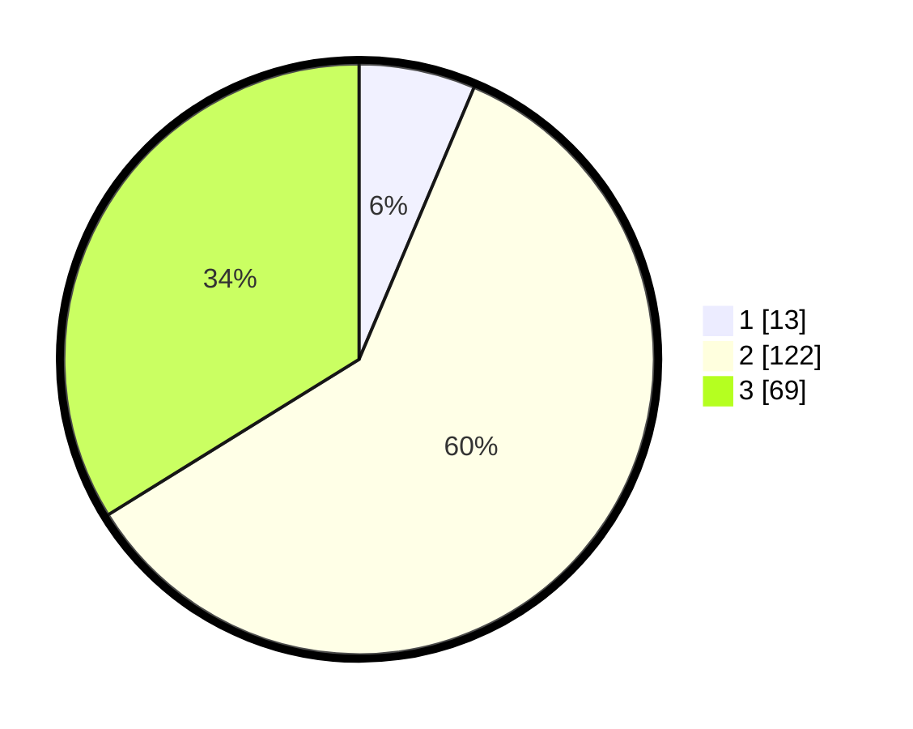

# Hasil

## Grafik

## Tabel

| No. | Nama Paslon    | Suara | Suara (raw) | Persentase |
|:--- |:-------------- | -----:| -----------:| ----------:|
| 1   | ANIES MUHAIMIN | 13    | [13][p-1]   | 6,37       |
| 2   | PRABOWO GIBRAN | 122   | [122][p-2]  | 59,80      |
| 3   | GANJAR MAHFUD  | 69    | [69][p-3]   | 33,82      |

[p-1]: https://github.com/gigit-pemilu/pemilu-2024-51-bali/blob/main/pilpres/hitung-suara/sub/51-bali/sub/01-jembrana/sub/02-mendoyo/sub/2009-yeh-sumbul/sub/014-tps/sub/paslon-1.txt
[p-2]: https://github.com/gigit-pemilu/pemilu-2024-51-bali/blob/main/pilpres/hitung-suara/sub/51-bali/sub/01-jembrana/sub/02-mendoyo/sub/2009-yeh-sumbul/sub/014-tps/sub/paslon-2.txt
[p-3]: https://github.com/gigit-pemilu/pemilu-2024-51-bali/blob/main/pilpres/hitung-suara/sub/51-bali/sub/01-jembrana/sub/02-mendoyo/sub/2009-yeh-sumbul/sub/014-tps/sub/paslon-3.txt

## Foto C Plano

https://sirekap-obj-formc.kpu.go.id/d9cb/pemilu/ppwp/51/01/02/20/09/5101022009014-20240214-133002--44c90393-4a52-4b03-b31f-8f1ffebc5640.jpg

https://sirekap-obj-formc.kpu.go.id/d9cb/pemilu/ppwp/51/01/02/20/09/5101022009014-20240214-194501--8d527476-c699-419f-abac-8bebda15a026.jpg

https://sirekap-obj-formc.kpu.go.id/d9cb/pemilu/ppwp/51/01/02/20/09/5101022009014-20240214-194536--3e76aad6-d103-40ac-a28d-9d9acb91c538.jpg

## Metadata

| Key        | Value               |
| ---------- | ------------------- |
| Time Stamp | 2024-02-15 12:00:28 |

## DATA PEMILIH TETAP

Jumlah pemilih dalam DPT: **270**.
 * L: **138**.
 * P: **132**.

## DATA PENGGUNA HAK PILIH

Jumlah pengguna hak pilih dalam DPT: **207**.
 * L: **106**.
 * P: **101**.

Jumlah pengguna hak pilih dalam DPTb: **0**.
 * L: **0**.
 * P: **0**.

Jumlah pengguna hak pilih dalam DPK: **2**.
 * L: **1**.
 * P: **1**.

Jumlah pengguna hak pilih: **209**.
 * L: **107**.
 * P: **102**.

## JUMLAH SUARA SAH DAN TIDAK SAH

JUMLAH SELURUH SUARA SAH: **204**.

JUMLAH SUARA TIDAK SAH: **5**.

JUMLAH SELURUH SUARA SAH DAN SUARA TIDAK SAH: **209**.

