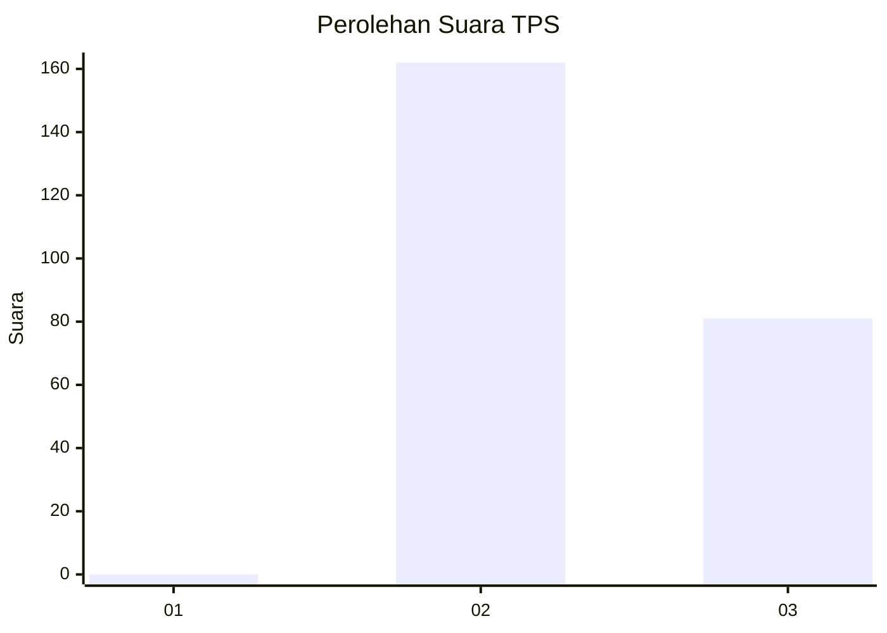
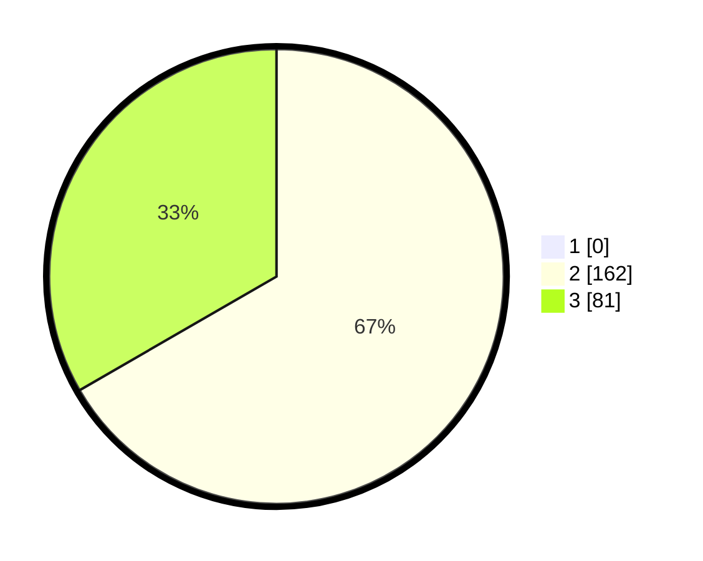

# Hasil

## Grafik

## Tabel

| No. | Nama Paslon    | Suara | Suara (raw) | Persentase |
|:--- |:-------------- | -----:| -----------:| ----------:|
| 1   | ANIES MUHAIMIN | 0     | [0][p-1]    | 0,00       |
| 2   | PRABOWO GIBRAN | 162   | [162][p-2]  | 66,67      |
| 3   | GANJAR MAHFUD  | 81    | [81][p-3]   | 33,33      |

[p-1]: https://github.com/gigit-pemilu/pemilu-2024-51-bali/blob/main/pilpres/hitung-suara/sub/51-bali/sub/01-jembrana/sub/02-mendoyo/sub/2009-yeh-sumbul/sub/019-tps/sub/paslon-1.txt
[p-2]: https://github.com/gigit-pemilu/pemilu-2024-51-bali/blob/main/pilpres/hitung-suara/sub/51-bali/sub/01-jembrana/sub/02-mendoyo/sub/2009-yeh-sumbul/sub/019-tps/sub/paslon-2.txt
[p-3]: https://github.com/gigit-pemilu/pemilu-2024-51-bali/blob/main/pilpres/hitung-suara/sub/51-bali/sub/01-jembrana/sub/02-mendoyo/sub/2009-yeh-sumbul/sub/019-tps/sub/paslon-3.txt

## Foto C Plano

https://sirekap-obj-formc.kpu.go.id/d506/pemilu/ppwp/51/01/02/20/09/5101022009019-20240214-224824--60d1bae9-3325-40b2-ba53-5d9e29039b61.jpg

https://sirekap-obj-formc.kpu.go.id/d506/pemilu/ppwp/51/01/02/20/09/5101022009019-20240214-224926--ce0599d6-85f3-4948-ae11-cb3d31e30859.jpg

https://sirekap-obj-formc.kpu.go.id/d506/pemilu/ppwp/51/01/02/20/09/5101022009019-20240214-225044--8266f646-1778-41f2-8ae7-4718d465c6fe.jpg

## Metadata

| Key        | Value               |
| ---------- | ------------------- |
| Time Stamp | 2024-02-15 15:00:29 |

## DATA PEMILIH TETAP

Jumlah pemilih dalam DPT: **282**.
 * L: **142**.
 * P: **140**.

## DATA PENGGUNA HAK PILIH

Jumlah pengguna hak pilih dalam DPT: **246**.
 * L: **126**.
 * P: **120**.

Jumlah pengguna hak pilih dalam DPTb: **0**.
 * L: **0**.
 * P: **0**.

Jumlah pengguna hak pilih dalam DPK: **0**.
 * L: **0**.
 * P: **0**.

Jumlah pengguna hak pilih: **246**.
 * L: **126**.
 * P: **120**.

## JUMLAH SUARA SAH DAN TIDAK SAH

JUMLAH SELURUH SUARA SAH: **243**.

JUMLAH SUARA TIDAK SAH: **3**.

JUMLAH SELURUH SUARA SAH DAN SUARA TIDAK SAH: **246**.

