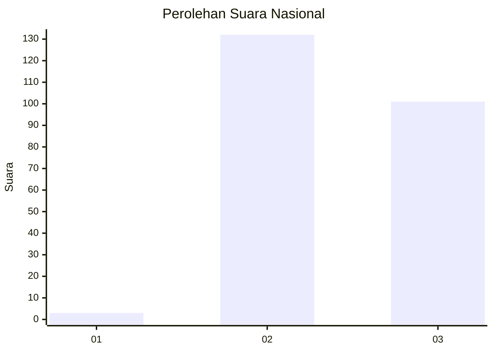
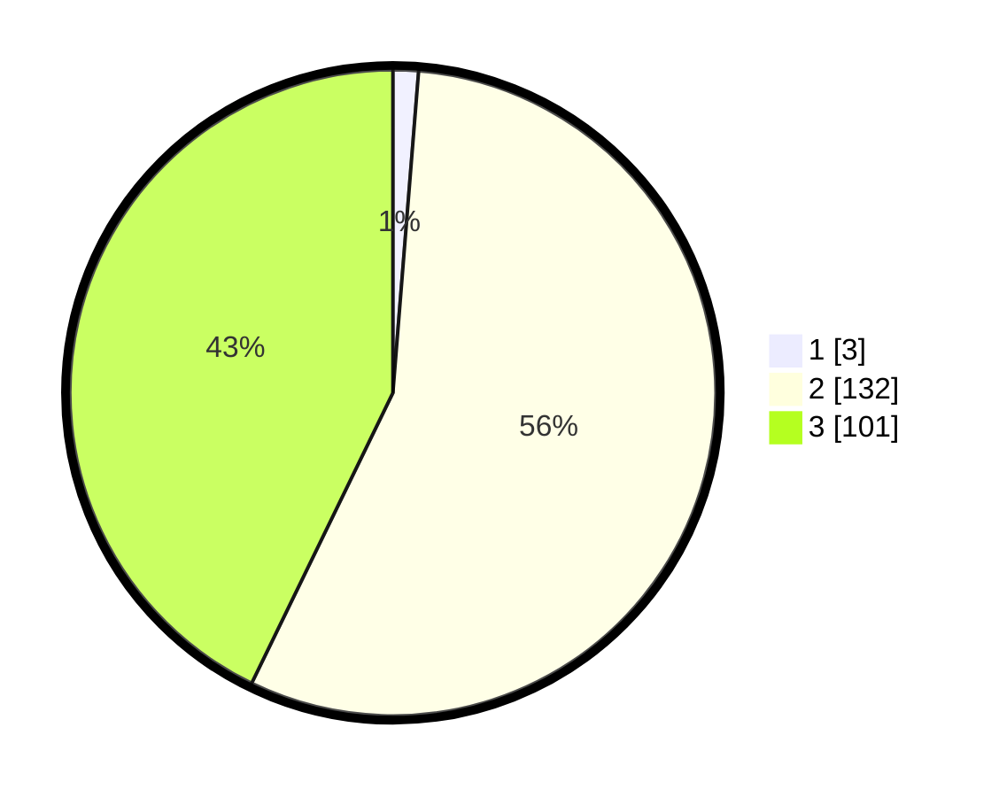

# Hasil

## Grafik

## Tabel

| No. | Nama Paslon    | Suara | Suara (raw) | Persentase |
|:--- |:-------------- | -----:| -----------:| ----------:|
| 1   | ANIES MUHAIMIN | 3     | [3][p-1]    | 1,27       |
| 2   | PRABOWO GIBRAN | 132   | [132][p-2]  | 55,93      |
| 3   | GANJAR MAHFUD  | 101   | [101][p-3]  | 42,80      |

[p-1]: https://github.com/gigit-pemilu/pemilu-2024/blob/main/pilpres/hitung-suara/sub/51-bali/sub/01-jembrana/sub/02-mendoyo/sub/2009-yeh-sumbul/sub/021-tps/sub/paslon-1.txt
[p-2]: https://github.com/gigit-pemilu/pemilu-2024/blob/main/pilpres/hitung-suara/sub/51-bali/sub/01-jembrana/sub/02-mendoyo/sub/2009-yeh-sumbul/sub/021-tps/sub/paslon-2.txt
[p-3]: https://github.com/gigit-pemilu/pemilu-2024/blob/main/pilpres/hitung-suara/sub/51-bali/sub/01-jembrana/sub/02-mendoyo/sub/2009-yeh-sumbul/sub/021-tps/sub/paslon-3.txt

## Foto C Plano

https://sirekap-obj-formc.kpu.go.id/9afb/pemilu/ppwp/51/01/02/20/09/5101022009021-20240214-205236--c0451aaf-a7a9-4fb2-baa2-5406bcf5abc3.jpg

https://sirekap-obj-formc.kpu.go.id/9afb/pemilu/ppwp/51/01/02/20/09/5101022009021-20240214-205424--6a7de4ce-b039-4e3a-9146-3b276edaa899.jpg

https://sirekap-obj-formc.kpu.go.id/9afb/pemilu/ppwp/51/01/02/20/09/5101022009021-20240214-205549--565e50e5-94d5-40e8-aca7-41c51fe66a63.jpg

## Metadata

| Key        | Value               |
| ---------- | ------------------- |
| Time Stamp | 2024-02-15 15:00:29 |

## DATA PEMILIH TETAP

Jumlah pemilih dalam DPT: **281**.
 * L: **139**.
 * P: **142**.

## DATA PENGGUNA HAK PILIH

Jumlah pengguna hak pilih dalam DPT: **239**.
 * L: **115**.
 * P: **124**.

Jumlah pengguna hak pilih dalam DPTb: **0**.
 * L: **0**.
 * P: **0**.

Jumlah pengguna hak pilih dalam DPK: **0**.
 * L: **0**.
 * P: **0**.

Jumlah pengguna hak pilih: **239**.
 * L: **115**.
 * P: **124**.

## JUMLAH SUARA SAH DAN TIDAK SAH

JUMLAH SELURUH SUARA SAH: **236**.

JUMLAH SUARA TIDAK SAH: **3**.

JUMLAH SELURUH SUARA SAH DAN SUARA TIDAK SAH: **239**.

