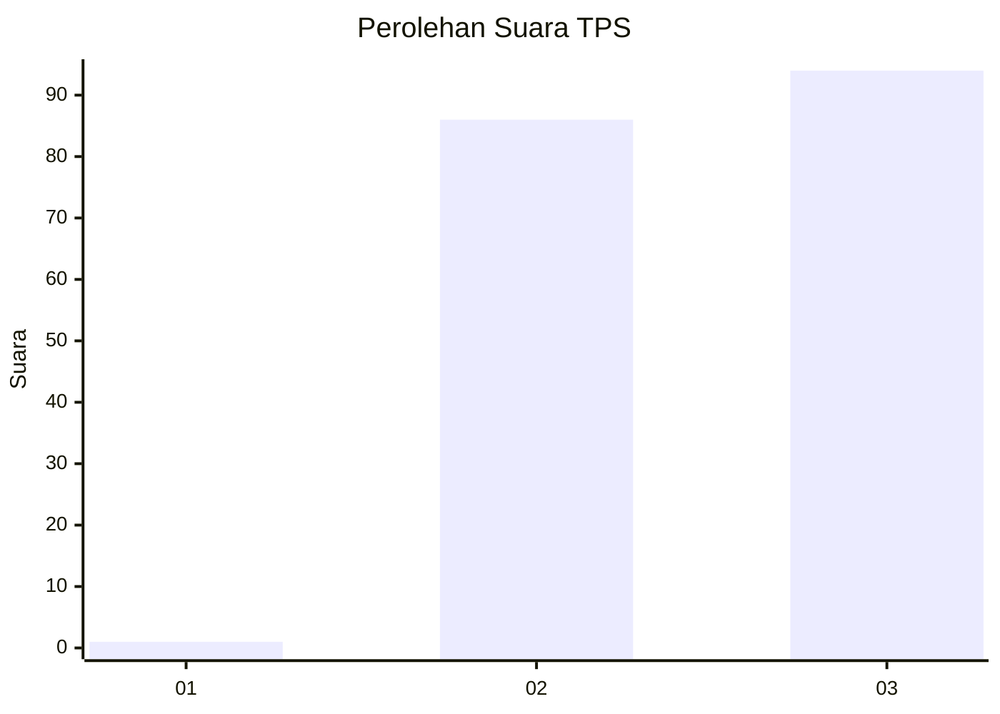
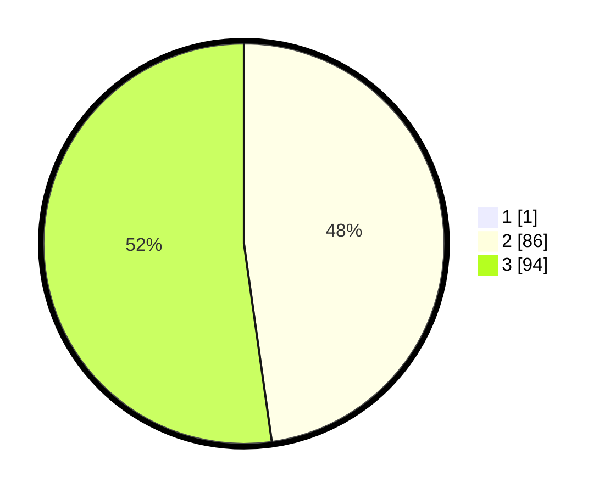

# Hasil

## Grafik

## Tabel

| No. | Nama Paslon    | Suara | Suara (raw) | Persentase |
|:--- |:-------------- | -----:| -----------:| ----------:|
| 1   | ANIES MUHAIMIN | 1     | [1][p-1]    | 0,55       |
| 2   | PRABOWO GIBRAN | 86    | [86][p-2]   | 47,51      |
| 3   | GANJAR MAHFUD  | 94    | [94][p-3]   | 51,93      |

[p-1]: https://github.com/gigit-pemilu/pemilu-2024-51-bali/blob/main/pilpres/hitung-suara/sub/51-bali/sub/01-jembrana/sub/02-mendoyo/sub/2010-yehembang-kauh/sub/001-tps/sub/paslon-1.txt
[p-2]: https://github.com/gigit-pemilu/pemilu-2024-51-bali/blob/main/pilpres/hitung-suara/sub/51-bali/sub/01-jembrana/sub/02-mendoyo/sub/2010-yehembang-kauh/sub/001-tps/sub/paslon-2.txt
[p-3]: https://github.com/gigit-pemilu/pemilu-2024-51-bali/blob/main/pilpres/hitung-suara/sub/51-bali/sub/01-jembrana/sub/02-mendoyo/sub/2010-yehembang-kauh/sub/001-tps/sub/paslon-3.txt

## Foto C Plano

https://sirekap-obj-formc.kpu.go.id/63b0/pemilu/ppwp/51/01/02/20/10/5101022010001-20240215-234215--046ca69f-e3b4-4ba6-abe3-5af1416faa98.jpg

https://sirekap-obj-formc.kpu.go.id/63b0/pemilu/ppwp/51/01/02/20/10/5101022010001-20240215-234219--3647e997-64f5-41ca-aed5-d98128b2f82f.jpg

https://sirekap-obj-formc.kpu.go.id/63b0/pemilu/ppwp/51/01/02/20/10/5101022010001-20240215-234217--788953a1-f0bd-4b54-b35f-07730385d0ad.jpg

## Metadata

| Key        | Value               |
| ---------- | ------------------- |
| Time Stamp | 2024-02-16 08:00:28 |

## DATA PEMILIH TETAP

Jumlah pemilih dalam DPT: **249**.
 * L: **127**.
 * P: **122**.

## DATA PENGGUNA HAK PILIH

Jumlah pengguna hak pilih dalam DPT: **182**.
 * L: **94**.
 * P: **88**.

Jumlah pengguna hak pilih dalam DPTb: **0**.
 * L: **0**.
 * P: **0**.

Jumlah pengguna hak pilih dalam DPK: **0**.
 * L: **0**.
 * P: **0**.

Jumlah pengguna hak pilih: **182**.
 * L: **94**.
 * P: **88**.

## JUMLAH SUARA SAH DAN TIDAK SAH

JUMLAH SELURUH SUARA SAH: **181**.

JUMLAH SUARA TIDAK SAH: **1**.

JUMLAH SELURUH SUARA SAH DAN SUARA TIDAK SAH: **182**.

