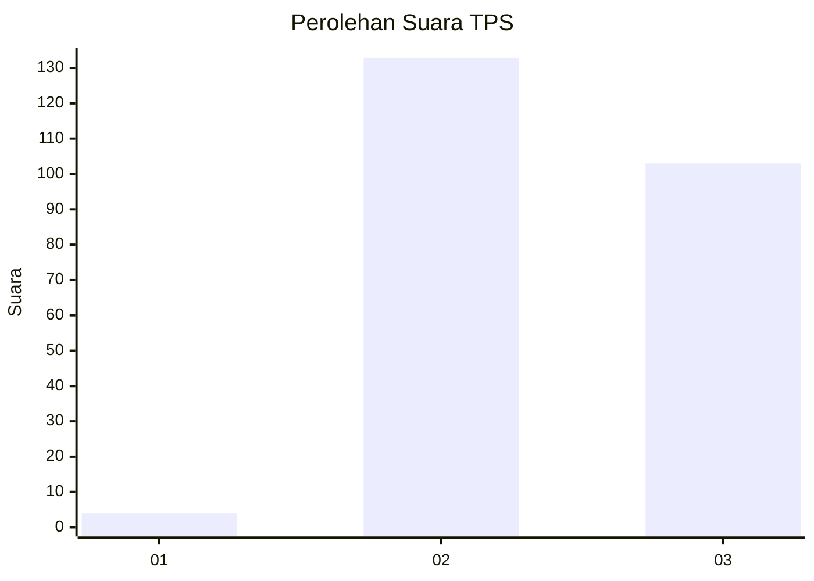
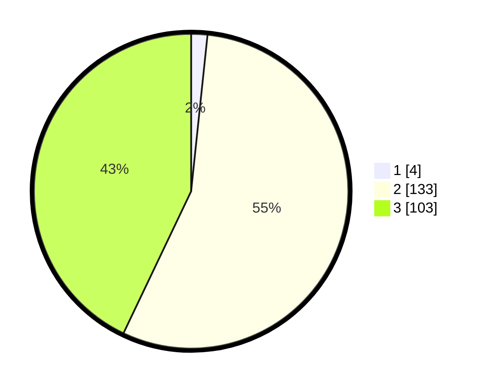

# Hasil

## Grafik

## Tabel

| No. | Nama Paslon    | Suara | Suara (raw) | Persentase |
|:--- |:-------------- | -----:| -----------:| ----------:|
| 1   | ANIES MUHAIMIN | 4     | [4][p-1]    | 1,67       |
| 2   | PRABOWO GIBRAN | 133   | [133][p-2]  | 55,42      |
| 3   | GANJAR MAHFUD  | 103   | [103][p-3]  | 42,92      |

[p-1]: https://github.com/gigit-pemilu/pemilu-2024-51-bali/blob/main/pilpres/hitung-suara/sub/51-bali/sub/01-jembrana/sub/02-mendoyo/sub/2010-yehembang-kauh/sub/003-tps/sub/paslon-1.txt
[p-2]: https://github.com/gigit-pemilu/pemilu-2024-51-bali/blob/main/pilpres/hitung-suara/sub/51-bali/sub/01-jembrana/sub/02-mendoyo/sub/2010-yehembang-kauh/sub/003-tps/sub/paslon-2.txt
[p-3]: https://github.com/gigit-pemilu/pemilu-2024-51-bali/blob/main/pilpres/hitung-suara/sub/51-bali/sub/01-jembrana/sub/02-mendoyo/sub/2010-yehembang-kauh/sub/003-tps/sub/paslon-3.txt

## Foto C Plano

https://sirekap-obj-formc.kpu.go.id/ccd6/pemilu/ppwp/51/01/02/20/10/5101022010003-20240215-021525--adddd2d1-98be-4870-831e-30c4712071fa.jpg

https://sirekap-obj-formc.kpu.go.id/ccd6/pemilu/ppwp/51/01/02/20/10/5101022010003-20240214-184638--66e36c62-4b19-43b3-8d60-44deb2c523f8.jpg

https://sirekap-obj-formc.kpu.go.id/ccd6/pemilu/ppwp/51/01/02/20/10/5101022010003-20240215-021628--d1452bc8-bfb2-4da1-aa6f-9a1278988f1b.jpg

## Metadata

| Key        | Value               |
| ---------- | ------------------- |
| Time Stamp | 2024-02-15 12:00:28 |

## DATA PEMILIH TETAP

Jumlah pemilih dalam DPT: **292**.
 * L: **141**.
 * P: **151**.

## DATA PENGGUNA HAK PILIH

Jumlah pengguna hak pilih dalam DPT: **239**.
 * L: **115**.
 * P: **124**.

Jumlah pengguna hak pilih dalam DPTb: **1**.
 * L: **0**.
 * P: **1**.

Jumlah pengguna hak pilih dalam DPK: **0**.
 * L: **0**.
 * P: **0**.

Jumlah pengguna hak pilih: **240**.
 * L: **115**.
 * P: **125**.

## JUMLAH SUARA SAH DAN TIDAK SAH

JUMLAH SELURUH SUARA SAH: **240**.

JUMLAH SUARA TIDAK SAH: **0**.

JUMLAH SELURUH SUARA SAH DAN SUARA TIDAK SAH: **240**.

