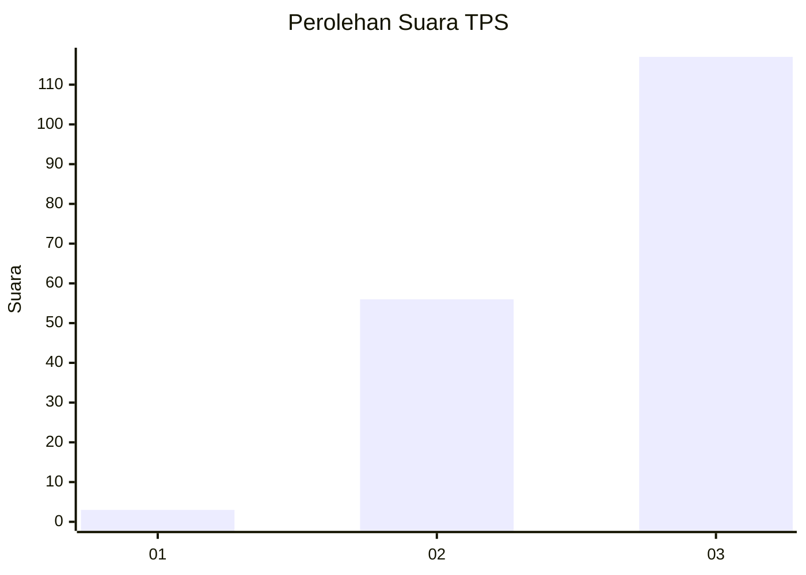
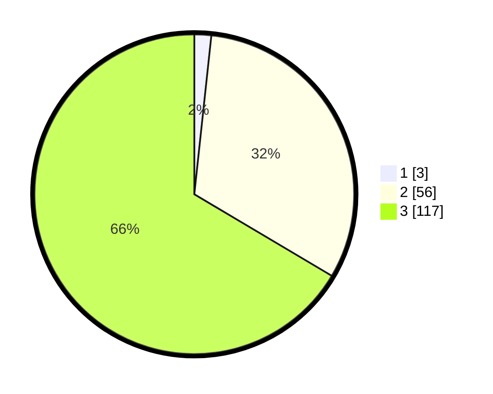

# Hasil

## Grafik

## Tabel

| No. | Nama Paslon    | Suara | Suara (raw) | Persentase |
|:--- |:-------------- | -----:| -----------:| ----------:|
| 1   | ANIES MUHAIMIN | 3     | [3][p-1]    | 1,70       |
| 2   | PRABOWO GIBRAN | 56    | [56][p-2]   | 31,82      |
| 3   | GANJAR MAHFUD  | 117   | [117][p-3]  | 66,48      |

[p-1]: https://github.com/gigit-pemilu/pemilu-2024-51-bali/blob/main/pilpres/hitung-suara/sub/51-bali/sub/01-jembrana/sub/02-mendoyo/sub/2010-yehembang-kauh/sub/007-tps/sub/paslon-1.txt
[p-2]: https://github.com/gigit-pemilu/pemilu-2024-51-bali/blob/main/pilpres/hitung-suara/sub/51-bali/sub/01-jembrana/sub/02-mendoyo/sub/2010-yehembang-kauh/sub/007-tps/sub/paslon-2.txt
[p-3]: https://github.com/gigit-pemilu/pemilu-2024-51-bali/blob/main/pilpres/hitung-suara/sub/51-bali/sub/01-jembrana/sub/02-mendoyo/sub/2010-yehembang-kauh/sub/007-tps/sub/paslon-3.txt

## Foto C Plano

https://sirekap-obj-formc.kpu.go.id/6aa8/pemilu/ppwp/51/01/02/20/10/5101022010007-20240214-215543--c182c263-e9a2-4aa1-9216-f1ff1cce5566.jpg

https://sirekap-obj-formc.kpu.go.id/6aa8/pemilu/ppwp/51/01/02/20/10/5101022010007-20240214-215605--0f8c358d-1e28-4a07-991c-473e3ae769f3.jpg

https://sirekap-obj-formc.kpu.go.id/6aa8/pemilu/ppwp/51/01/02/20/10/5101022010007-20240214-215614--e48a41bb-d99b-4a17-9ba1-50d4a157ef54.jpg

## Metadata

| Key        | Value               |
| ---------- | ------------------- |
| Time Stamp | 2024-02-16 06:00:27 |

## DATA PEMILIH TETAP

Jumlah pemilih dalam DPT: **220**.
 * L: **110**.
 * P: **110**.

## DATA PENGGUNA HAK PILIH

Jumlah pengguna hak pilih dalam DPT: **176**.
 * L: **90**.
 * P: **86**.

Jumlah pengguna hak pilih dalam DPTb: **1**.
 * L: **0**.
 * P: **1**.

Jumlah pengguna hak pilih dalam DPK: **0**.
 * L: **0**.
 * P: **0**.

Jumlah pengguna hak pilih: **177**.
 * L: **90**.
 * P: **87**.

## JUMLAH SUARA SAH DAN TIDAK SAH

JUMLAH SELURUH SUARA SAH: **176**.

JUMLAH SUARA TIDAK SAH: **1**.

JUMLAH SELURUH SUARA SAH DAN SUARA TIDAK SAH: **177**.

