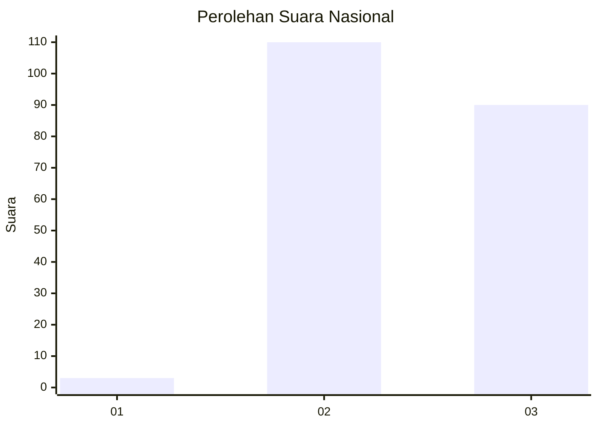
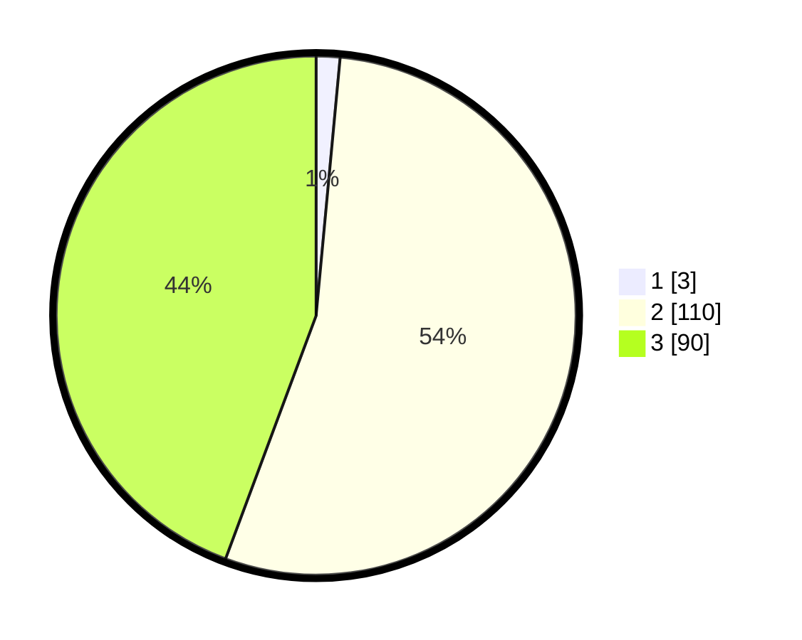

# Hasil

## Grafik

## Tabel

| No. | Nama Paslon    | Suara | Suara (raw) | Persentase |
|:--- |:-------------- | -----:| -----------:| ----------:|
| 1   | ANIES MUHAIMIN | 3     | [3][p-1]    | 1,48       |
| 2   | PRABOWO GIBRAN | 110   | [110][p-2]  | 54,19      |
| 3   | GANJAR MAHFUD  | 90    | [90][p-3]   | 44,33      |

[p-1]: https://github.com/gigit-pemilu/pemilu-2024/blob/main/pilpres/hitung-suara/sub/51-bali/sub/01-jembrana/sub/02-mendoyo/sub/2010-yehembang-kauh/sub/008-tps/sub/paslon-1.txt
[p-2]: https://github.com/gigit-pemilu/pemilu-2024/blob/main/pilpres/hitung-suara/sub/51-bali/sub/01-jembrana/sub/02-mendoyo/sub/2010-yehembang-kauh/sub/008-tps/sub/paslon-2.txt
[p-3]: https://github.com/gigit-pemilu/pemilu-2024/blob/main/pilpres/hitung-suara/sub/51-bali/sub/01-jembrana/sub/02-mendoyo/sub/2010-yehembang-kauh/sub/008-tps/sub/paslon-3.txt

## Foto C Plano

https://sirekap-obj-formc.kpu.go.id/884e/pemilu/ppwp/51/01/02/20/10/5101022010008-20240214-141420--40ebfad0-bf36-4ad5-99ce-779dc50fb985.jpg

https://sirekap-obj-formc.kpu.go.id/884e/pemilu/ppwp/51/01/02/20/10/5101022010008-20240214-141856--3b55107b-4c8d-4615-887a-cf8968c4176c.jpg

## Metadata

| Key        | Value               |
| ---------- | ------------------- |
| Time Stamp | 2024-02-15 07:00:44 |

