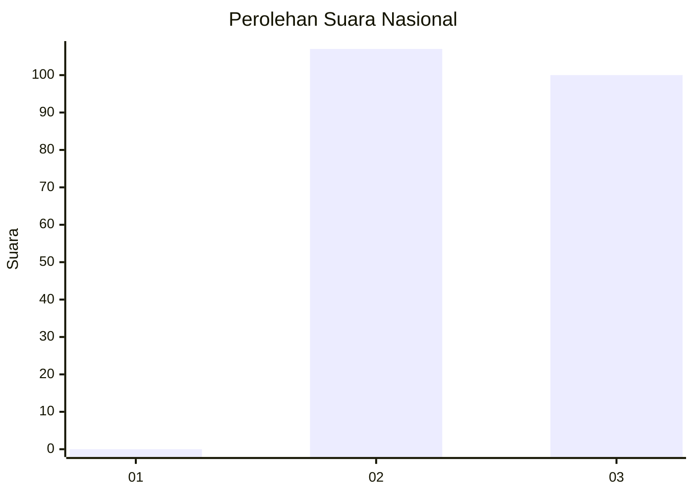
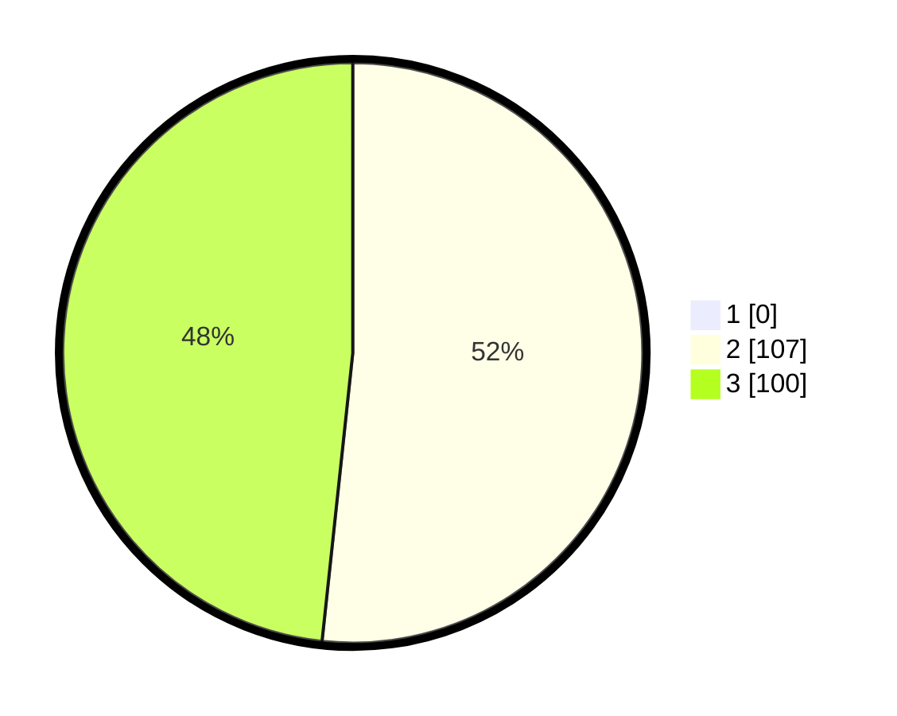

# Hasil

## Grafik

## Tabel

| No. | Nama Paslon    | Suara | Suara (raw) | Persentase |
|:--- |:-------------- | -----:| -----------:| ----------:|
| 1   | ANIES MUHAIMIN | 0     | [0][p-1]    | 0,00       |
| 2   | PRABOWO GIBRAN | 107   | [107][p-2]  | 51,69      |
| 3   | GANJAR MAHFUD  | 100   | [100][p-3]  | 48,31      |

[p-1]: https://github.com/gigit-pemilu/pemilu-2024/blob/main/pilpres/hitung-suara/sub/51-bali/sub/01-jembrana/sub/02-mendoyo/sub/2010-yehembang-kauh/sub/009-tps/sub/paslon-1.txt
[p-2]: https://github.com/gigit-pemilu/pemilu-2024/blob/main/pilpres/hitung-suara/sub/51-bali/sub/01-jembrana/sub/02-mendoyo/sub/2010-yehembang-kauh/sub/009-tps/sub/paslon-2.txt
[p-3]: https://github.com/gigit-pemilu/pemilu-2024/blob/main/pilpres/hitung-suara/sub/51-bali/sub/01-jembrana/sub/02-mendoyo/sub/2010-yehembang-kauh/sub/009-tps/sub/paslon-3.txt

## Foto C Plano

https://sirekap-obj-formc.kpu.go.id/d2fe/pemilu/ppwp/51/01/02/20/10/5101022010009-20240214-132643--d20eef10-e947-40ef-927e-d030b1fa31b4.jpg

https://sirekap-obj-formc.kpu.go.id/d2fe/pemilu/ppwp/51/01/02/20/10/5101022010009-20240216-164916--c78312e4-45da-46d1-8f03-3a720ac1ba9e.jpg

https://sirekap-obj-formc.kpu.go.id/d2fe/pemilu/ppwp/51/01/02/20/10/5101022010009-20240216-164915--3a633f37-e650-4e2a-846b-8c08a811201d.jpg

## Metadata

| Key        | Value               |
| ---------- | ------------------- |
| Time Stamp | 2024-02-16 17:00:00 |

## DATA PEMILIH TETAP

Jumlah pemilih dalam DPT: **270**.
 * L: **121**.
 * P: **149**.

## DATA PENGGUNA HAK PILIH

Jumlah pengguna hak pilih dalam DPT: **205**.
 * L: **96**.
 * P: **109**.

Jumlah pengguna hak pilih dalam DPTb: **1**.
 * L: **0**.
 * P: **1**.

Jumlah pengguna hak pilih dalam DPK: **1**.
 * L: **1**.
 * P: **0**.

Jumlah pengguna hak pilih: **207**.
 * L: **97**.
 * P: **110**.

## JUMLAH SUARA SAH DAN TIDAK SAH

JUMLAH SELURUH SUARA SAH: **207**.

JUMLAH SUARA TIDAK SAH: **0**.

JUMLAH SELURUH SUARA SAH DAN SUARA TIDAK SAH: **207**.

