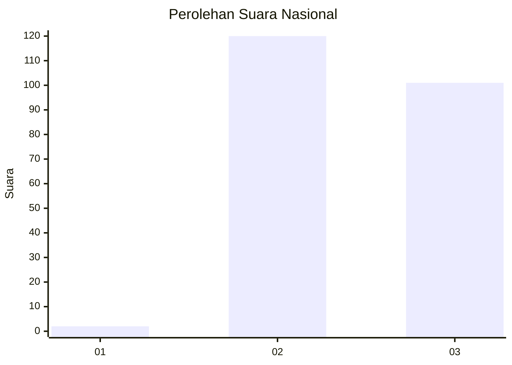
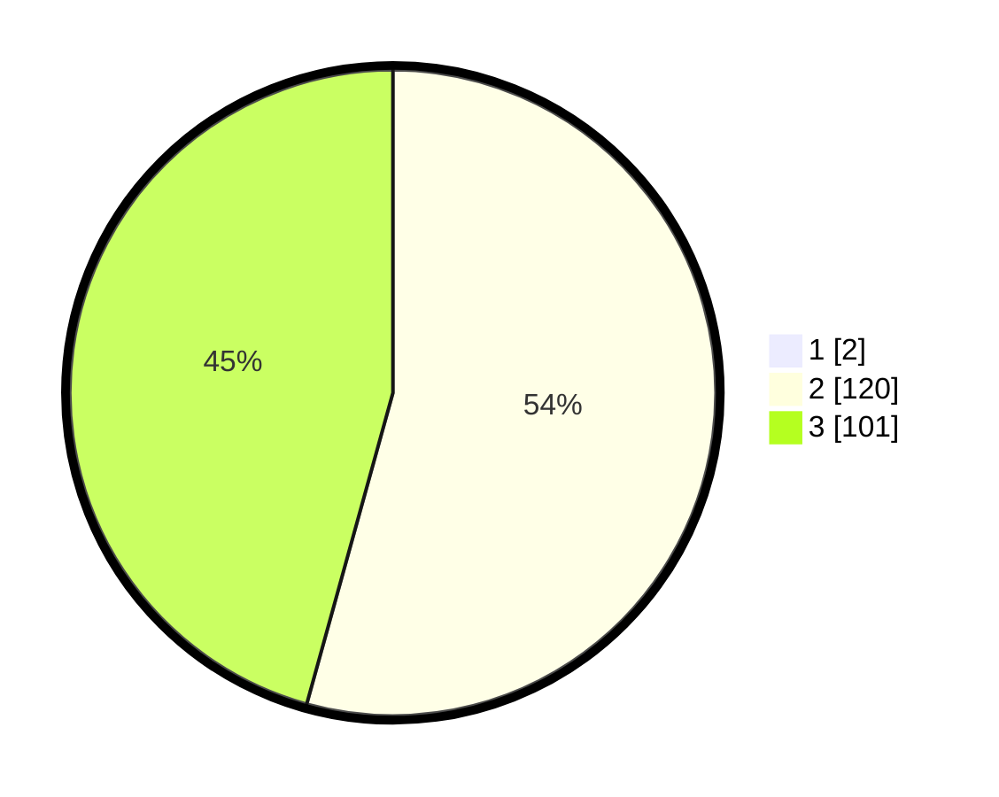

# Hasil

## Grafik

## Tabel

| No. | Nama Paslon    | Suara | Suara (raw) | Persentase |
|:--- |:-------------- | -----:| -----------:| ----------:|
| 1   | ANIES MUHAIMIN | 2     | [2][p-1]    | 0,90       |
| 2   | PRABOWO GIBRAN | 120   | [120][p-2]  | 53,81      |
| 3   | GANJAR MAHFUD  | 101   | [101][p-3]  | 45,29      |

[p-1]: https://github.com/gigit-pemilu/pemilu-2024/blob/main/pilpres/hitung-suara/sub/51-bali/sub/01-jembrana/sub/02-mendoyo/sub/2010-yehembang-kauh/sub/012-tps/sub/paslon-1.txt
[p-2]: https://github.com/gigit-pemilu/pemilu-2024/blob/main/pilpres/hitung-suara/sub/51-bali/sub/01-jembrana/sub/02-mendoyo/sub/2010-yehembang-kauh/sub/012-tps/sub/paslon-2.txt
[p-3]: https://github.com/gigit-pemilu/pemilu-2024/blob/main/pilpres/hitung-suara/sub/51-bali/sub/01-jembrana/sub/02-mendoyo/sub/2010-yehembang-kauh/sub/012-tps/sub/paslon-3.txt

## Foto C Plano

https://sirekap-obj-formc.kpu.go.id/b241/pemilu/ppwp/51/01/02/20/10/5101022010012-20240216-131209--58fa3131-ae81-4b69-b1d6-1790890d1e4e.jpg

https://sirekap-obj-formc.kpu.go.id/b241/pemilu/ppwp/51/01/02/20/10/5101022010012-20240216-131211--54cee4ef-4fc5-4b83-b304-0335a8801821.jpg

https://sirekap-obj-formc.kpu.go.id/b241/pemilu/ppwp/51/01/02/20/10/5101022010012-20240216-131210--f41d9fa2-a592-49c0-a71d-8b76d886824b.jpg

## Metadata

| Key        | Value               |
| ---------- | ------------------- |
| Time Stamp | 2024-02-16 16:25:10 |

## DATA PEMILIH TETAP

Jumlah pemilih dalam DPT: **288**.
 * L: **145**.
 * P: **143**.

## DATA PENGGUNA HAK PILIH

Jumlah pengguna hak pilih dalam DPT: **222**.
 * L: **114**.
 * P: **108**.

Jumlah pengguna hak pilih dalam DPTb: **0**.
 * L: **0**.
 * P: **0**.

Jumlah pengguna hak pilih dalam DPK: **3**.
 * L: **1**.
 * P: **2**.

Jumlah pengguna hak pilih: **225**.
 * L: **115**.
 * P: **110**.

## JUMLAH SUARA SAH DAN TIDAK SAH

JUMLAH SELURUH SUARA SAH: **223**.

JUMLAH SUARA TIDAK SAH: **2**.

JUMLAH SELURUH SUARA SAH DAN SUARA TIDAK SAH: **225**.

