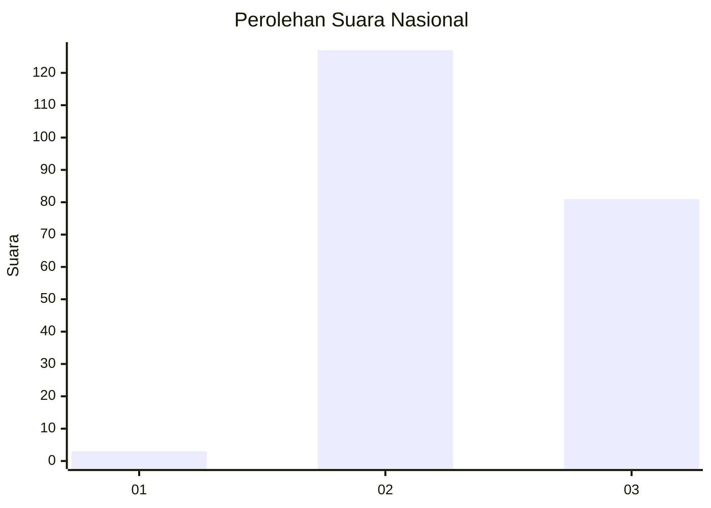
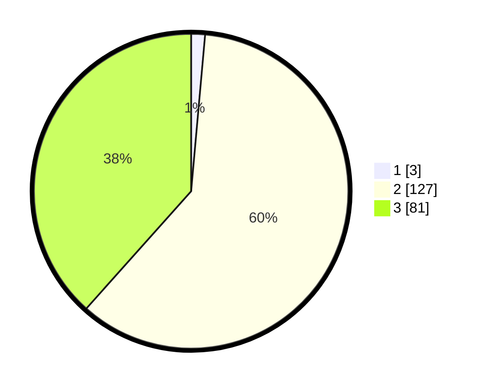

# Hasil

## Grafik

## Tabel

| No. | Nama Paslon    | Suara | Suara (raw) | Persentase |
|:--- |:-------------- | -----:| -----------:| ----------:|
| 1   | ANIES MUHAIMIN | 3     | [3][p-1]    | 1,42       |
| 2   | PRABOWO GIBRAN | 127   | [127][p-2]  | 60,19      |
| 3   | GANJAR MAHFUD  | 81    | [81][p-3]   | 38,39      |

[p-1]: https://github.com/gigit-pemilu/pemilu-2024/blob/main/pilpres/hitung-suara/sub/51-bali/sub/01-jembrana/sub/02-mendoyo/sub/2011-yehembang-kangin/sub/001-tps/sub/paslon-1.txt
[p-2]: https://github.com/gigit-pemilu/pemilu-2024/blob/main/pilpres/hitung-suara/sub/51-bali/sub/01-jembrana/sub/02-mendoyo/sub/2011-yehembang-kangin/sub/001-tps/sub/paslon-2.txt
[p-3]: https://github.com/gigit-pemilu/pemilu-2024/blob/main/pilpres/hitung-suara/sub/51-bali/sub/01-jembrana/sub/02-mendoyo/sub/2011-yehembang-kangin/sub/001-tps/sub/paslon-3.txt

## Foto C Plano

https://sirekap-obj-formc.kpu.go.id/5041/pemilu/ppwp/51/01/02/20/11/5101022011001-20240215-034820--5d15bd46-8b1e-4f57-9981-8c9bb99f3300.jpg

https://sirekap-obj-formc.kpu.go.id/5041/pemilu/ppwp/51/01/02/20/11/5101022011001-20240215-034826--ffbc21d8-7cf4-4c9a-aad1-c7d892756ab6.jpg

https://sirekap-obj-formc.kpu.go.id/5041/pemilu/ppwp/51/01/02/20/11/5101022011001-20240215-034838--e1ccb2fc-6991-4445-bd67-783b3eb2bd25.jpg

## Metadata

| Key        | Value               |
| ---------- | ------------------- |
| Time Stamp | 2024-02-15 15:00:29 |

## DATA PEMILIH TETAP

Jumlah pemilih dalam DPT: **259**.
 * L: **124**.
 * P: **135**.

## DATA PENGGUNA HAK PILIH

Jumlah pengguna hak pilih dalam DPT: **213**.
 * L: **103**.
 * P: **110**.

Jumlah pengguna hak pilih dalam DPTb: **0**.
 * L: **0**.
 * P: **0**.

Jumlah pengguna hak pilih dalam DPK: **0**.
 * L: **0**.
 * P: **0**.

Jumlah pengguna hak pilih: **213**.
 * L: **103**.
 * P: **110**.

## JUMLAH SUARA SAH DAN TIDAK SAH

JUMLAH SELURUH SUARA SAH: **211**.

JUMLAH SUARA TIDAK SAH: **2**.

JUMLAH SELURUH SUARA SAH DAN SUARA TIDAK SAH: **213**.

