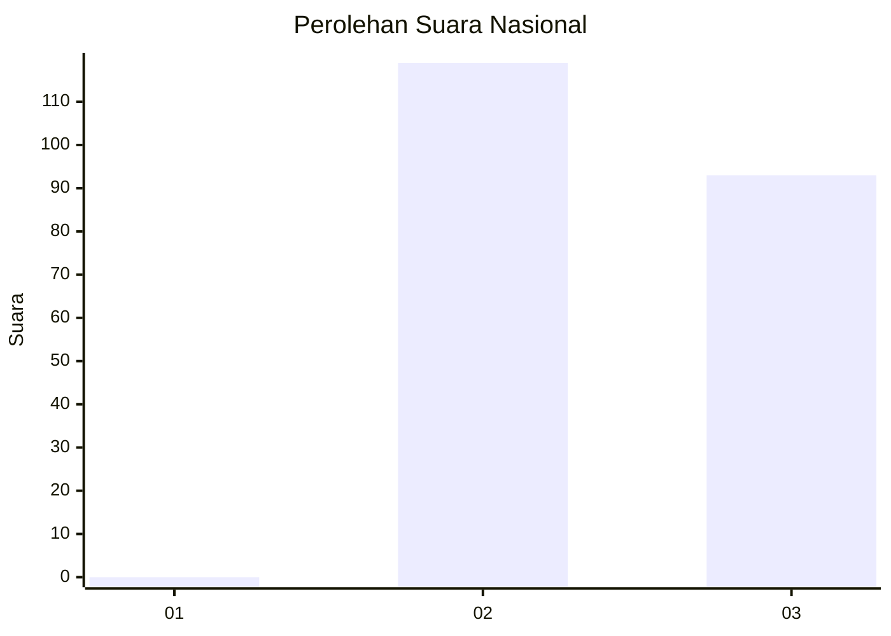
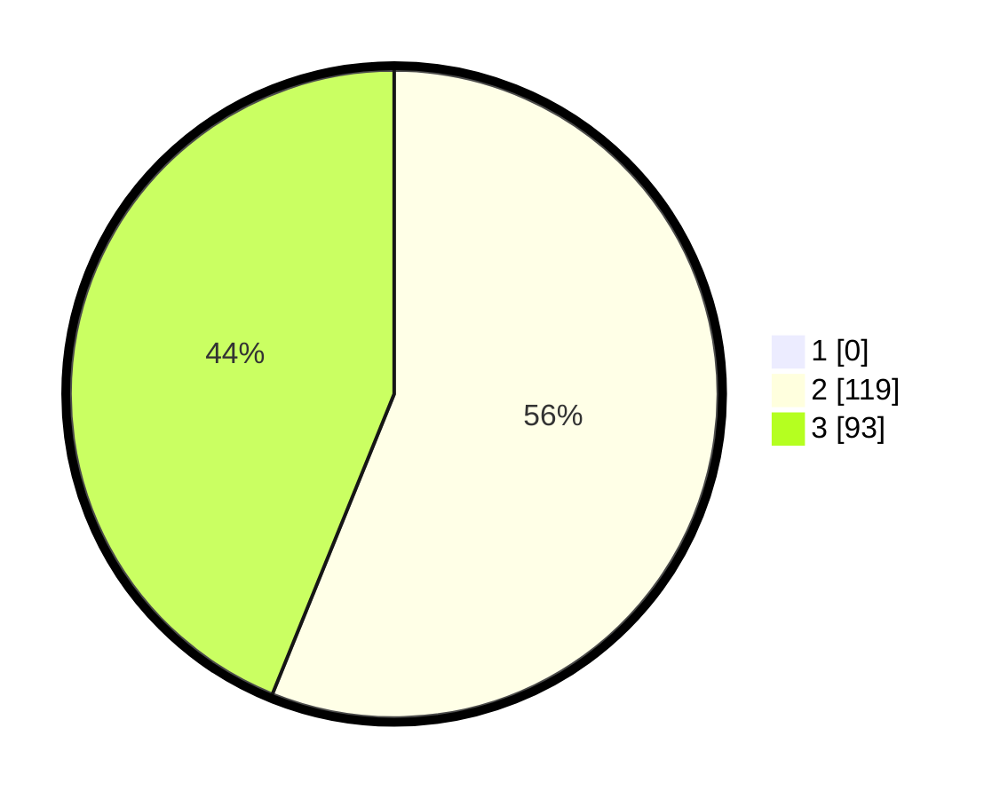

# Hasil

## Grafik

## Tabel

| No. | Nama Paslon    | Suara | Suara (raw) | Persentase |
|:--- |:-------------- | -----:| -----------:| ----------:|
| 1   | ANIES MUHAIMIN | 0     | [0][p-1]    | 0,00       |
| 2   | PRABOWO GIBRAN | 119   | [119][p-2]  | 56,13      |
| 3   | GANJAR MAHFUD  | 93    | [93][p-3]   | 43,87      |

[p-1]: https://github.com/gigit-pemilu/pemilu-2024/blob/main/pilpres/hitung-suara/sub/51-bali/sub/01-jembrana/sub/02-mendoyo/sub/2011-yehembang-kangin/sub/002-tps/sub/paslon-1.txt
[p-2]: https://github.com/gigit-pemilu/pemilu-2024/blob/main/pilpres/hitung-suara/sub/51-bali/sub/01-jembrana/sub/02-mendoyo/sub/2011-yehembang-kangin/sub/002-tps/sub/paslon-2.txt
[p-3]: https://github.com/gigit-pemilu/pemilu-2024/blob/main/pilpres/hitung-suara/sub/51-bali/sub/01-jembrana/sub/02-mendoyo/sub/2011-yehembang-kangin/sub/002-tps/sub/paslon-3.txt

## Foto C Plano

https://sirekap-obj-formc.kpu.go.id/afcb/pemilu/ppwp/51/01/02/20/11/5101022011002-20240214-141400--d7b76f24-8552-44f7-ae84-cd13e2fa77f4.jpg

https://sirekap-obj-formc.kpu.go.id/afcb/pemilu/ppwp/51/01/02/20/11/5101022011002-20240216-010153--db74d7a4-9960-4f71-9575-7adeb2c6fea5.jpg

https://sirekap-obj-formc.kpu.go.id/afcb/pemilu/ppwp/51/01/02/20/11/5101022011002-20240214-175314--28b1c149-802e-4b63-9c26-658b5b2b9d19.jpg

## Metadata

| Key        | Value               |
| ---------- | ------------------- |
| Time Stamp | 2024-02-16 08:00:28 |

## DATA PEMILIH TETAP

Jumlah pemilih dalam DPT: **267**.
 * L: **130**.
 * P: **137**.

## DATA PENGGUNA HAK PILIH

Jumlah pengguna hak pilih dalam DPT: **218**.
 * L: **106**.
 * P: **112**.

Jumlah pengguna hak pilih dalam DPTb: **0**.
 * L: **0**.
 * P: **0**.

Jumlah pengguna hak pilih dalam DPK: **0**.
 * L: **0**.
 * P: **0**.

Jumlah pengguna hak pilih: **218**.
 * L: **106**.
 * P: **112**.

## JUMLAH SUARA SAH DAN TIDAK SAH

JUMLAH SELURUH SUARA SAH: **212**.

JUMLAH SUARA TIDAK SAH: **6**.

JUMLAH SELURUH SUARA SAH DAN SUARA TIDAK SAH: **218**.

