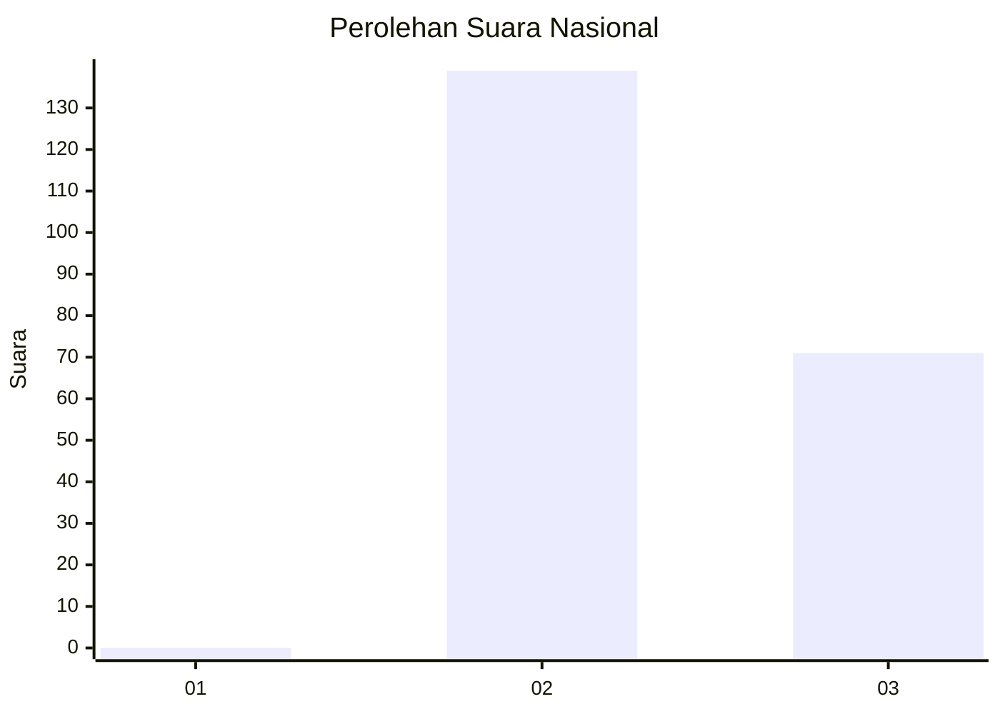
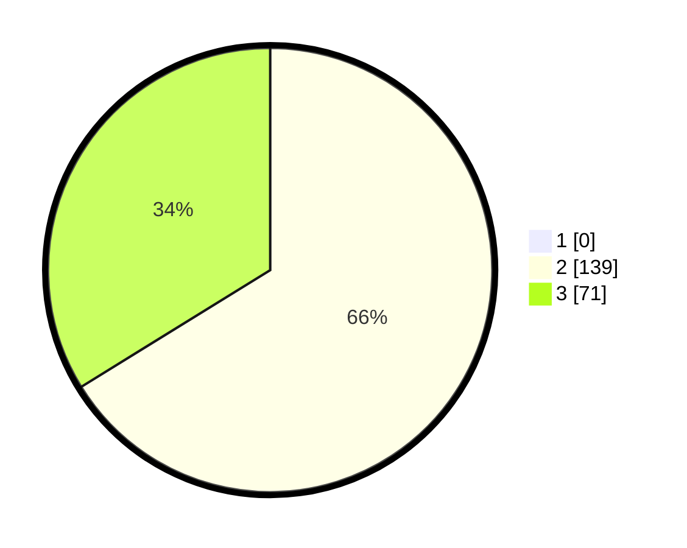

# Hasil

## Grafik

## Tabel

| No. | Nama Paslon    | Suara | Suara (raw) | Persentase |
|:--- |:-------------- | -----:| -----------:| ----------:|
| 1   | ANIES MUHAIMIN | 0     | [0][p-1]    | 0,00       |
| 2   | PRABOWO GIBRAN | 139   | [139][p-2]  | 66,19      |
| 3   | GANJAR MAHFUD  | 71    | [71][p-3]   | 33,81      |

[p-1]: https://github.com/gigit-pemilu/pemilu-2024/blob/main/pilpres/hitung-suara/sub/51-bali/sub/01-jembrana/sub/02-mendoyo/sub/2011-yehembang-kangin/sub/004-tps/sub/paslon-1.txt
[p-2]: https://github.com/gigit-pemilu/pemilu-2024/blob/main/pilpres/hitung-suara/sub/51-bali/sub/01-jembrana/sub/02-mendoyo/sub/2011-yehembang-kangin/sub/004-tps/sub/paslon-2.txt
[p-3]: https://github.com/gigit-pemilu/pemilu-2024/blob/main/pilpres/hitung-suara/sub/51-bali/sub/01-jembrana/sub/02-mendoyo/sub/2011-yehembang-kangin/sub/004-tps/sub/paslon-3.txt

## Foto C Plano

https://sirekap-obj-formc.kpu.go.id/d91c/pemilu/ppwp/51/01/02/20/11/5101022011004-20240214-141753--da81f9b1-b076-468e-b617-062baaa5d8e5.jpg

https://sirekap-obj-formc.kpu.go.id/d91c/pemilu/ppwp/51/01/02/20/11/5101022011004-20240215-015942--395f7bd1-916d-484d-a88b-a6e297234a52.jpg

https://sirekap-obj-formc.kpu.go.id/d91c/pemilu/ppwp/51/01/02/20/11/5101022011004-20240215-020058--6f48c629-ee0e-4d6d-a750-90d4df0fb5fb.jpg

## Metadata

| Key        | Value               |
| ---------- | ------------------- |
| Time Stamp | 2024-02-15 12:00:28 |

