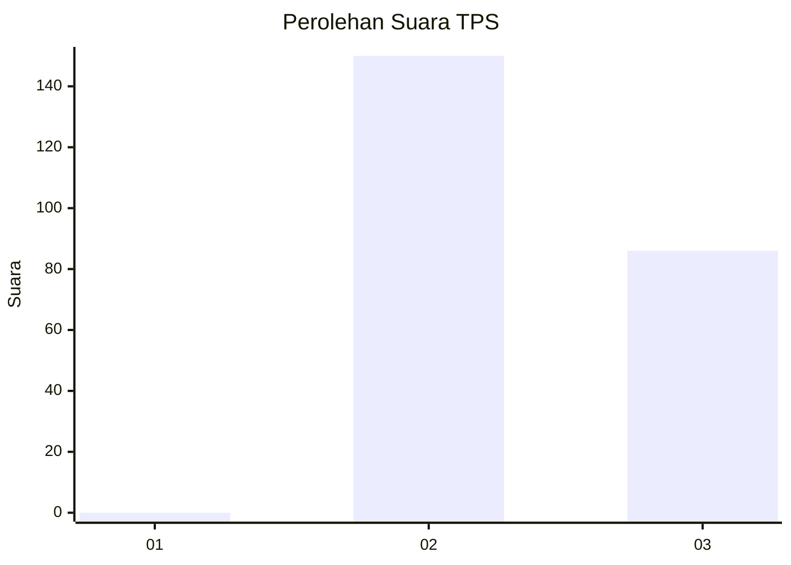
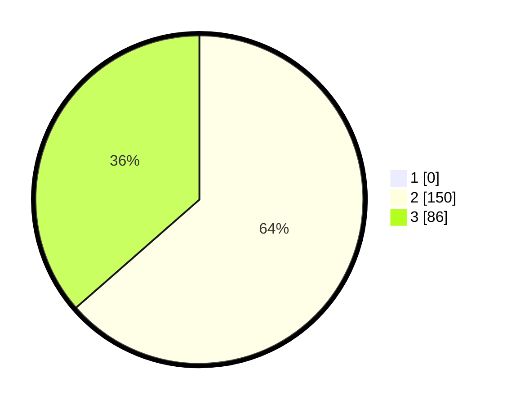

# Hasil

## Grafik

## Tabel

| No. | Nama Paslon    | Suara | Suara (raw) | Persentase |
|:--- |:-------------- | -----:| -----------:| ----------:|
| 1   | ANIES MUHAIMIN | 0     | [0][p-1]    | 0,00       |
| 2   | PRABOWO GIBRAN | 150   | [150][p-2]  | 63,56      |
| 3   | GANJAR MAHFUD  | 86    | [86][p-3]   | 36,44      |

[p-1]: https://github.com/gigit-pemilu/pemilu-2024-51-bali/blob/main/pilpres/hitung-suara/sub/51-bali/sub/01-jembrana/sub/02-mendoyo/sub/2011-yehembang-kangin/sub/008-tps/sub/paslon-1.txt
[p-2]: https://github.com/gigit-pemilu/pemilu-2024-51-bali/blob/main/pilpres/hitung-suara/sub/51-bali/sub/01-jembrana/sub/02-mendoyo/sub/2011-yehembang-kangin/sub/008-tps/sub/paslon-2.txt
[p-3]: https://github.com/gigit-pemilu/pemilu-2024-51-bali/blob/main/pilpres/hitung-suara/sub/51-bali/sub/01-jembrana/sub/02-mendoyo/sub/2011-yehembang-kangin/sub/008-tps/sub/paslon-3.txt

## Foto C Plano

https://sirekap-obj-formc.kpu.go.id/d5d4/pemilu/ppwp/51/01/02/20/11/5101022011008-20240214-233521--969ac918-4ca5-4fa7-af01-aa067b45c667.jpg

https://sirekap-obj-formc.kpu.go.id/d5d4/pemilu/ppwp/51/01/02/20/11/5101022011008-20240214-233950--d5dc7e26-25c7-4251-b113-daf260556108.jpg

https://sirekap-obj-formc.kpu.go.id/d5d4/pemilu/ppwp/51/01/02/20/11/5101022011008-20240214-233244--e3fd5bd5-0ab3-48a0-9e71-46b80fbc86bc.jpg

## Metadata

| Key        | Value               |
| ---------- | ------------------- |
| Time Stamp | 2024-02-15 16:00:26 |

