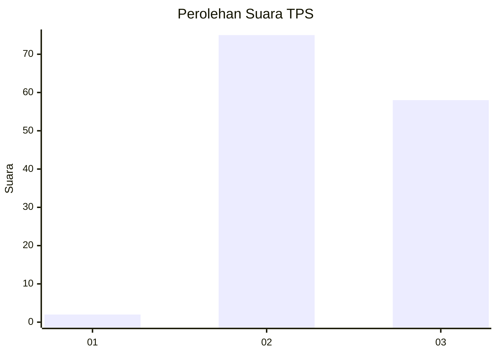
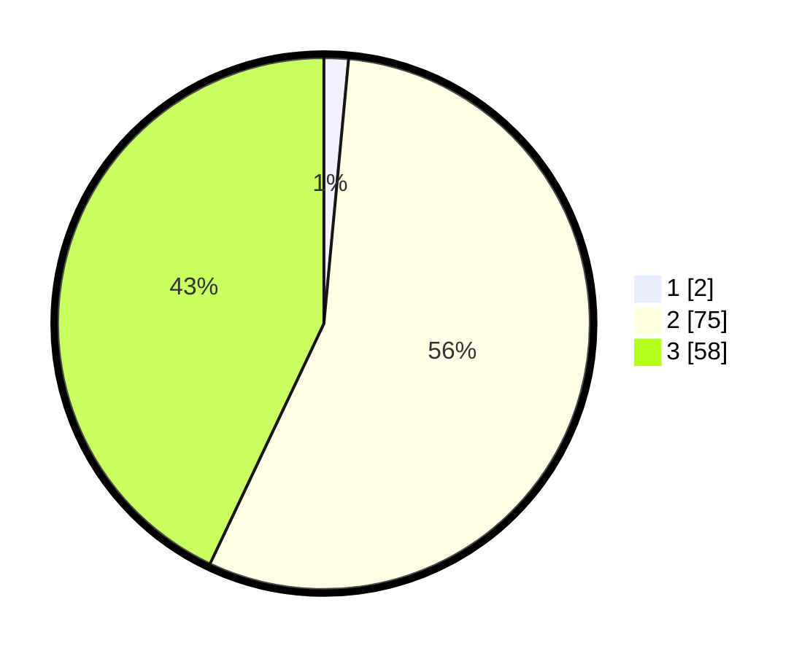

# Hasil

## Grafik

## Tabel

| No. | Nama Paslon    | Suara | Suara (raw) | Persentase |
|:--- |:-------------- | -----:| -----------:| ----------:|
| 1   | ANIES MUHAIMIN | 2     | [2][p-1]    | 1,48       |
| 2   | PRABOWO GIBRAN | 75    | [75][p-2]   | 55,56      |
| 3   | GANJAR MAHFUD  | 58    | [58][p-3]   | 42,96      |

[p-1]: https://github.com/gigit-pemilu/pemilu-2024-51-bali/blob/main/pilpres/hitung-suara/sub/51-bali/sub/01-jembrana/sub/02-mendoyo/sub/2011-yehembang-kangin/sub/013-tps/sub/paslon-1.txt
[p-2]: https://github.com/gigit-pemilu/pemilu-2024-51-bali/blob/main/pilpres/hitung-suara/sub/51-bali/sub/01-jembrana/sub/02-mendoyo/sub/2011-yehembang-kangin/sub/013-tps/sub/paslon-2.txt
[p-3]: https://github.com/gigit-pemilu/pemilu-2024-51-bali/blob/main/pilpres/hitung-suara/sub/51-bali/sub/01-jembrana/sub/02-mendoyo/sub/2011-yehembang-kangin/sub/013-tps/sub/paslon-3.txt

## Foto C Plano

https://sirekap-obj-formc.kpu.go.id/c715/pemilu/ppwp/51/01/02/20/11/5101022011013-20240214-132034--d4d65116-82eb-4081-bc8c-8a8853dcc1db.jpg

https://sirekap-obj-formc.kpu.go.id/c715/pemilu/ppwp/51/01/02/20/11/5101022011013-20240214-132112--cdc01f44-b389-4dc0-9d91-694660c8f095.jpg

https://sirekap-obj-formc.kpu.go.id/c715/pemilu/ppwp/51/01/02/20/11/5101022011013-20240214-132146--9a8809cc-1550-4083-a166-0035e8bea39a.jpg

## Metadata

| Key        | Value               |
| ---------- | ------------------- |
| Time Stamp | 2024-02-14 21:46:01 |

## DATA PEMILIH TETAP

Jumlah pemilih dalam DPT: **174**.
 * L: **91**.
 * P: **83**.

## DATA PENGGUNA HAK PILIH

Jumlah pengguna hak pilih dalam DPT: **136**.
 * L: **71**.
 * P: **65**.

Jumlah pengguna hak pilih dalam DPTb: **0**.
 * L: **0**.
 * P: **0**.

Jumlah pengguna hak pilih dalam DPK: **0**.
 * L: **0**.
 * P: **0**.

Jumlah pengguna hak pilih: **136**.
 * L: **71**.
 * P: **65**.

## JUMLAH SUARA SAH DAN TIDAK SAH

JUMLAH SELURUH SUARA SAH: **135**.

JUMLAH SUARA TIDAK SAH: **1**.

JUMLAH SELURUH SUARA SAH DAN SUARA TIDAK SAH: **136**.

