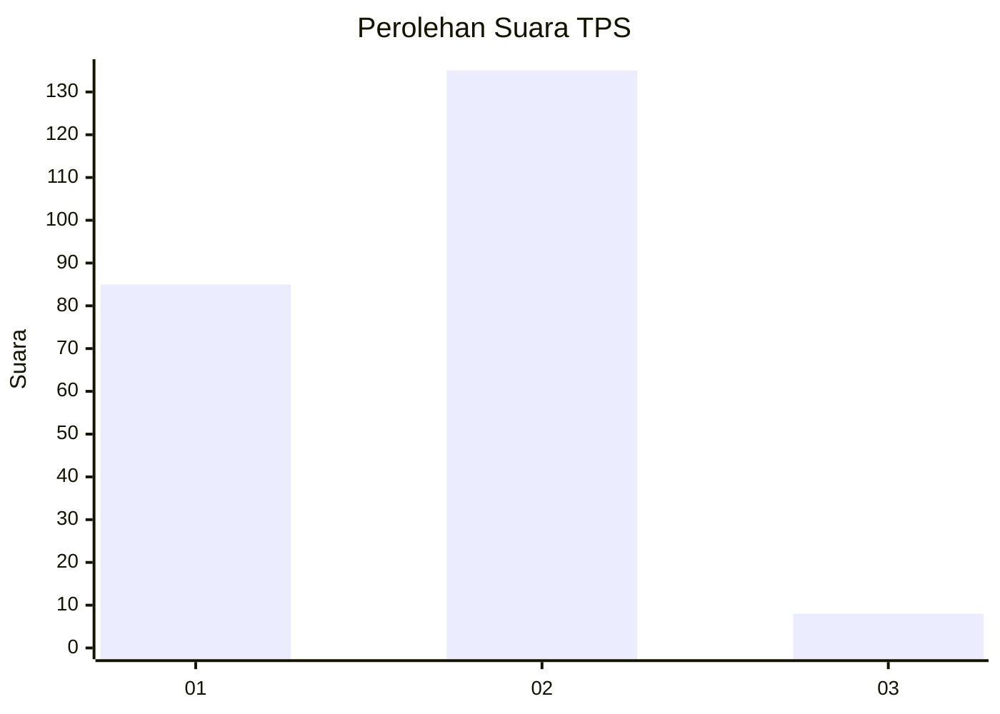
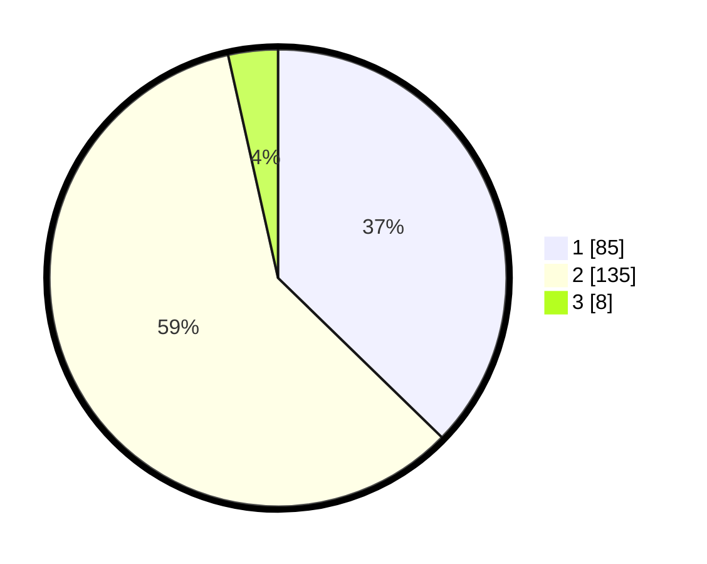

# Hasil

## Grafik

## Tabel

| No. | Nama Paslon    | Suara | Suara (raw) | Persentase |
|:--- |:-------------- | -----:| -----------:| ----------:|
| 1   | ANIES MUHAIMIN | 85    | [85][p-1]   | 37,28      |
| 2   | PRABOWO GIBRAN | 135   | [135][p-2]  | 59,21      |
| 3   | GANJAR MAHFUD  | 8     | [8][p-3]    | 3,51       |

[p-1]: https://github.com/gigit-pemilu/pemilu-2024-51-bali/blob/main/pilpres/hitung-suara/sub/51-bali/sub/01-jembrana/sub/03-pekutatan/sub/2001-medewi/sub/001-tps/sub/paslon-1.txt
[p-2]: https://github.com/gigit-pemilu/pemilu-2024-51-bali/blob/main/pilpres/hitung-suara/sub/51-bali/sub/01-jembrana/sub/03-pekutatan/sub/2001-medewi/sub/001-tps/sub/paslon-2.txt
[p-3]: https://github.com/gigit-pemilu/pemilu-2024-51-bali/blob/main/pilpres/hitung-suara/sub/51-bali/sub/01-jembrana/sub/03-pekutatan/sub/2001-medewi/sub/001-tps/sub/paslon-3.txt

## Foto C Plano

https://sirekap-obj-formc.kpu.go.id/3467/pemilu/ppwp/51/01/03/20/01/5101032001001-20240217-091345--c861ffa8-eb24-4d44-8871-a3d2e1845b69.jpg

https://sirekap-obj-formc.kpu.go.id/3467/pemilu/ppwp/51/01/03/20/01/5101032001001-20240217-091236--0a78cc6a-be87-4b9f-a83c-4bef29f60eff.jpg

https://sirekap-obj-formc.kpu.go.id/3467/pemilu/ppwp/51/01/03/20/01/5101032001001-20240217-091309--2f4c85b5-76c4-4eb7-9d02-6338dc593295.jpg

## Metadata

| Key        | Value               |
| ---------- | ------------------- |
| Time Stamp | 2024-02-19 06:16:00 |

## DATA PEMILIH TETAP

Jumlah pemilih dalam DPT: **275**.
 * L: **134**.
 * P: **141**.

## DATA PENGGUNA HAK PILIH

Jumlah pengguna hak pilih dalam DPT: **229**.
 * L: **109**.
 * P: **120**.

Jumlah pengguna hak pilih dalam DPTb: **2**.
 * L: **0**.
 * P: **2**.

Jumlah pengguna hak pilih dalam DPK: **1**.
 * L: **1**.
 * P: **0**.

Jumlah pengguna hak pilih: **232**.
 * L: **110**.
 * P: **122**.

## JUMLAH SUARA SAH DAN TIDAK SAH

JUMLAH SELURUH SUARA SAH: **228**.

JUMLAH SUARA TIDAK SAH: **4**.

JUMLAH SELURUH SUARA SAH DAN SUARA TIDAK SAH: **232**.

