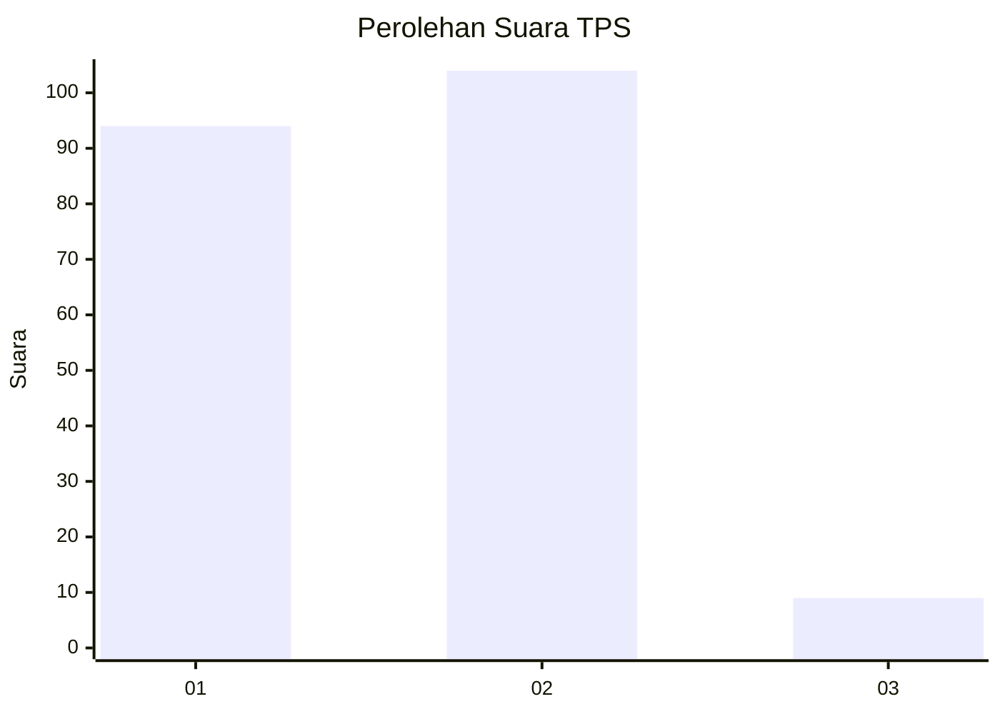
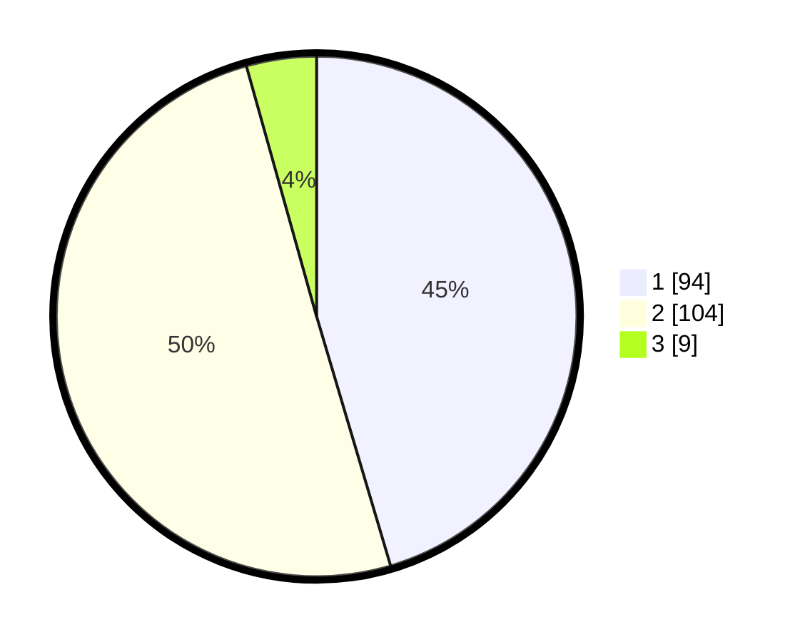

# Hasil

## Grafik

## Tabel

| No. | Nama Paslon    | Suara | Suara (raw) | Persentase |
|:--- |:-------------- | -----:| -----------:| ----------:|
| 1   | ANIES MUHAIMIN | 94    | [94][p-1]   | 45,41      |
| 2   | PRABOWO GIBRAN | 104   | [104][p-2]  | 50,24      |
| 3   | GANJAR MAHFUD  | 9     | [9][p-3]    | 4,35       |

[p-1]: https://github.com/gigit-pemilu/pemilu-2024-51-bali/blob/main/pilpres/hitung-suara/sub/51-bali/sub/01-jembrana/sub/03-pekutatan/sub/2001-medewi/sub/003-tps/sub/paslon-1.txt
[p-2]: https://github.com/gigit-pemilu/pemilu-2024-51-bali/blob/main/pilpres/hitung-suara/sub/51-bali/sub/01-jembrana/sub/03-pekutatan/sub/2001-medewi/sub/003-tps/sub/paslon-2.txt
[p-3]: https://github.com/gigit-pemilu/pemilu-2024-51-bali/blob/main/pilpres/hitung-suara/sub/51-bali/sub/01-jembrana/sub/03-pekutatan/sub/2001-medewi/sub/003-tps/sub/paslon-3.txt

## Foto C Plano

https://sirekap-obj-formc.kpu.go.id/a79a/pemilu/ppwp/51/01/03/20/01/5101032001003-20240214-141020--a8e8bc80-a95e-40d5-b528-82a072737864.jpg

https://sirekap-obj-formc.kpu.go.id/a79a/pemilu/ppwp/51/01/03/20/01/5101032001003-20240214-141042--28b42932-3306-4add-b59f-164f241fb766.jpg

https://sirekap-obj-formc.kpu.go.id/a79a/pemilu/ppwp/51/01/03/20/01/5101032001003-20240214-141157--b92000ed-f493-471a-b5fa-f9a995e74183.jpg

## Metadata

| Key        | Value               |
| ---------- | ------------------- |
| Time Stamp | 2024-02-16 08:00:28 |

## DATA PEMILIH TETAP

Jumlah pemilih dalam DPT: **266**.
 * L: **127**.
 * P: **139**.

## DATA PENGGUNA HAK PILIH

Jumlah pengguna hak pilih dalam DPT: **212**.
 * L: **101**.
 * P: **111**.

Jumlah pengguna hak pilih dalam DPTb: **2**.
 * L: **1**.
 * P: **1**.

Jumlah pengguna hak pilih dalam DPK: **0**.
 * L: **0**.
 * P: **0**.

Jumlah pengguna hak pilih: **214**.
 * L: **102**.
 * P: **112**.

## JUMLAH SUARA SAH DAN TIDAK SAH

JUMLAH SELURUH SUARA SAH: **207**.

JUMLAH SUARA TIDAK SAH: **7**.

JUMLAH SELURUH SUARA SAH DAN SUARA TIDAK SAH: **214**.

