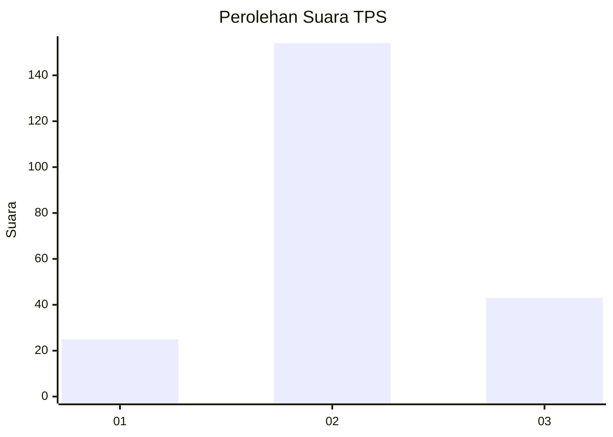
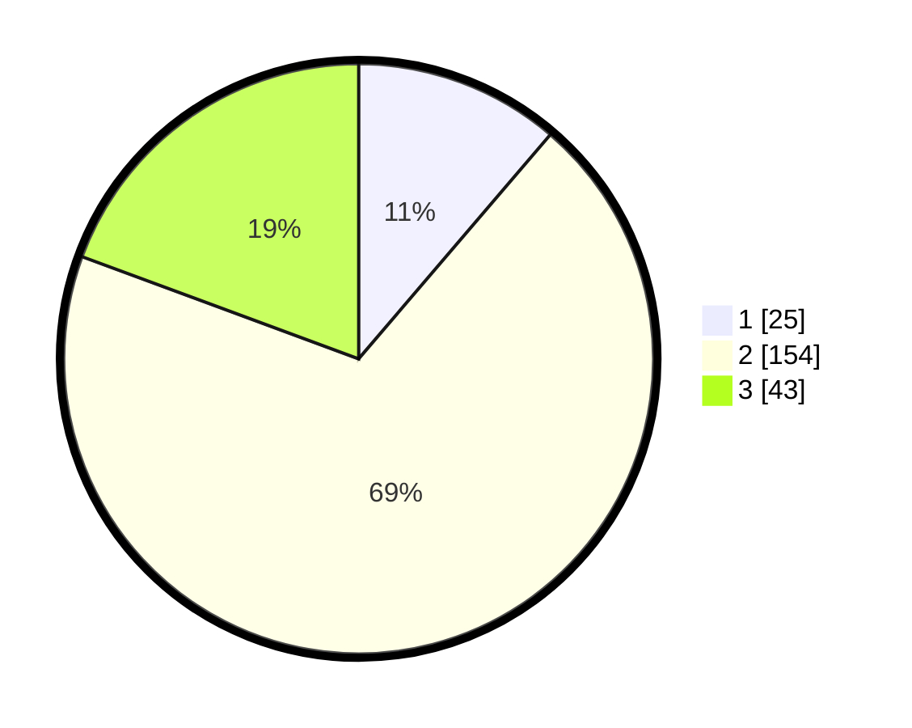

# Hasil

## Grafik

## Tabel

| No. | Nama Paslon    | Suara | Suara (raw) | Persentase |
|:--- |:-------------- | -----:| -----------:| ----------:|
| 1   | ANIES MUHAIMIN | 25    | [25][p-1]   | 11,26      |
| 2   | PRABOWO GIBRAN | 154   | [154][p-2]  | 69,37      |
| 3   | GANJAR MAHFUD  | 43    | [43][p-3]   | 19,37      |

[p-1]: https://github.com/gigit-pemilu/pemilu-2024-51-bali/blob/main/pilpres/hitung-suara/sub/51-bali/sub/01-jembrana/sub/03-pekutatan/sub/2001-medewi/sub/008-tps/sub/paslon-1.txt
[p-2]: https://github.com/gigit-pemilu/pemilu-2024-51-bali/blob/main/pilpres/hitung-suara/sub/51-bali/sub/01-jembrana/sub/03-pekutatan/sub/2001-medewi/sub/008-tps/sub/paslon-2.txt
[p-3]: https://github.com/gigit-pemilu/pemilu-2024-51-bali/blob/main/pilpres/hitung-suara/sub/51-bali/sub/01-jembrana/sub/03-pekutatan/sub/2001-medewi/sub/008-tps/sub/paslon-3.txt

## Foto C Plano

https://sirekap-obj-formc.kpu.go.id/6f28/pemilu/ppwp/51/01/03/20/01/5101032001008-20240215-114046--4f888e28-4996-46ef-8081-35ec857c57e7.jpg

https://sirekap-obj-formc.kpu.go.id/6f28/pemilu/ppwp/51/01/03/20/01/5101032001008-20240215-114117--15c459ac-b9ce-490b-a22f-b81cb26076e4.jpg

https://sirekap-obj-formc.kpu.go.id/6f28/pemilu/ppwp/51/01/03/20/01/5101032001008-20240215-114124--9e1d6056-100b-4716-90ab-e500a3741f5b.jpg

## Metadata

| Key        | Value               |
| ---------- | ------------------- |
| Time Stamp | 2024-02-15 16:00:26 |

## DATA PEMILIH TETAP

Jumlah pemilih dalam DPT: **272**.
 * L: **137**.
 * P: **135**.

## DATA PENGGUNA HAK PILIH

Jumlah pengguna hak pilih dalam DPT: **229**.
 * L: **115**.
 * P: **114**.

Jumlah pengguna hak pilih dalam DPTb: **0**.
 * L: **0**.
 * P: **0**.

Jumlah pengguna hak pilih dalam DPK: **1**.
 * L: **0**.
 * P: **1**.

Jumlah pengguna hak pilih: **230**.
 * L: **115**.
 * P: **115**.

## JUMLAH SUARA SAH DAN TIDAK SAH

JUMLAH SELURUH SUARA SAH: **222**.

JUMLAH SUARA TIDAK SAH: **8**.

JUMLAH SELURUH SUARA SAH DAN SUARA TIDAK SAH: **230**.

