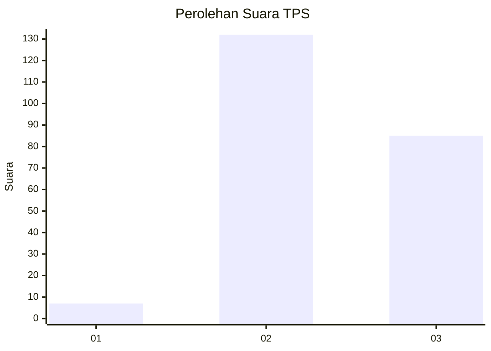
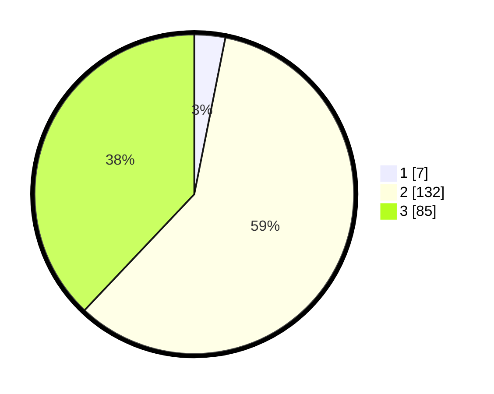

# Hasil

## Grafik

## Tabel

| No. | Nama Paslon    | Suara | Suara (raw) | Persentase |
|:--- |:-------------- | -----:| -----------:| ----------:|
| 1   | ANIES MUHAIMIN | 7     | [7][p-1]    | 3,13       |
| 2   | PRABOWO GIBRAN | 132   | [132][p-2]  | 58,93      |
| 3   | GANJAR MAHFUD  | 85    | [85][p-3]   | 37,95      |

[p-1]: https://github.com/gigit-pemilu/pemilu-2024-51-bali/blob/main/pilpres/hitung-suara/sub/51-bali/sub/01-jembrana/sub/03-pekutatan/sub/2001-medewi/sub/010-tps/sub/paslon-1.txt
[p-2]: https://github.com/gigit-pemilu/pemilu-2024-51-bali/blob/main/pilpres/hitung-suara/sub/51-bali/sub/01-jembrana/sub/03-pekutatan/sub/2001-medewi/sub/010-tps/sub/paslon-2.txt
[p-3]: https://github.com/gigit-pemilu/pemilu-2024-51-bali/blob/main/pilpres/hitung-suara/sub/51-bali/sub/01-jembrana/sub/03-pekutatan/sub/2001-medewi/sub/010-tps/sub/paslon-3.txt

## Foto C Plano

https://sirekap-obj-formc.kpu.go.id/d382/pemilu/ppwp/51/01/03/20/01/5101032001010-20240214-132158--423935ed-20db-464b-a770-fe7d208cec8c.jpg

https://sirekap-obj-formc.kpu.go.id/d382/pemilu/ppwp/51/01/03/20/01/5101032001010-20240214-132542--693cedbd-d076-4800-a9c3-78d8e2e230d9.jpg

https://sirekap-obj-formc.kpu.go.id/d382/pemilu/ppwp/51/01/03/20/01/5101032001010-20240214-132759--db3d0432-c022-4a77-95ac-1225befccc65.jpg

## Metadata

| Key        | Value               |
| ---------- | ------------------- |
| Time Stamp | 2024-02-14 21:46:01 |

## DATA PEMILIH TETAP

Jumlah pemilih dalam DPT: **286**.
 * L: **147**.
 * P: **139**.

## DATA PENGGUNA HAK PILIH

Jumlah pengguna hak pilih dalam DPT: **227**.
 * L: **114**.
 * P: **113**.

Jumlah pengguna hak pilih dalam DPTb: **0**.
 * L: **0**.
 * P: **0**.

Jumlah pengguna hak pilih dalam DPK: **1**.
 * L: **0**.
 * P: **1**.

Jumlah pengguna hak pilih: **228**.
 * L: **114**.
 * P: **114**.

## JUMLAH SUARA SAH DAN TIDAK SAH

JUMLAH SELURUH SUARA SAH: **224**.

JUMLAH SUARA TIDAK SAH: **4**.

JUMLAH SELURUH SUARA SAH DAN SUARA TIDAK SAH: **228**.

