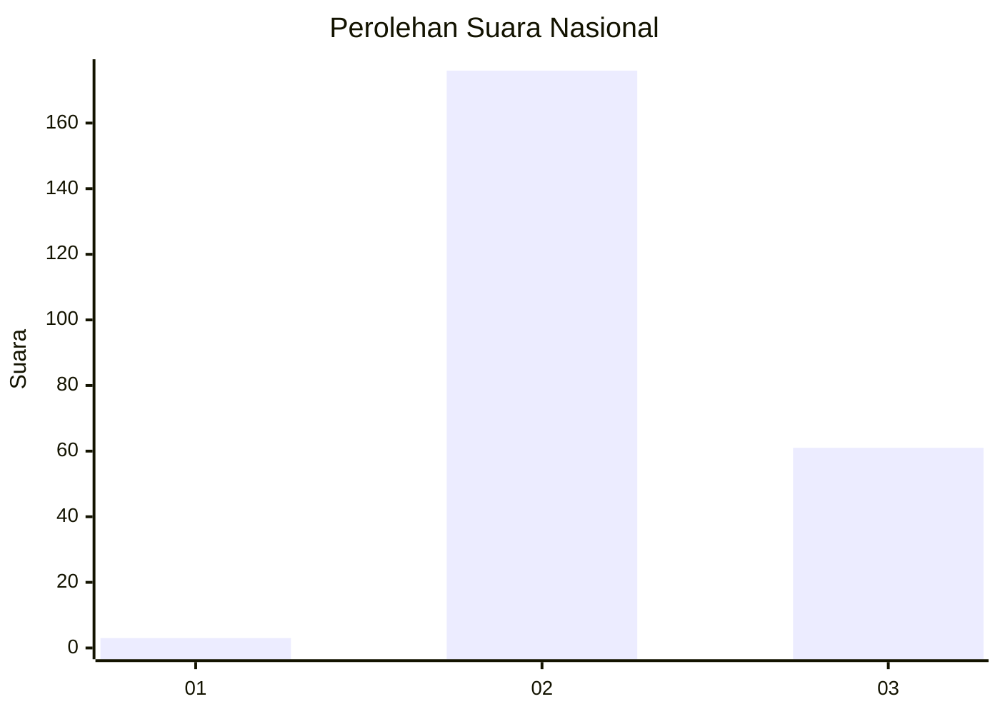
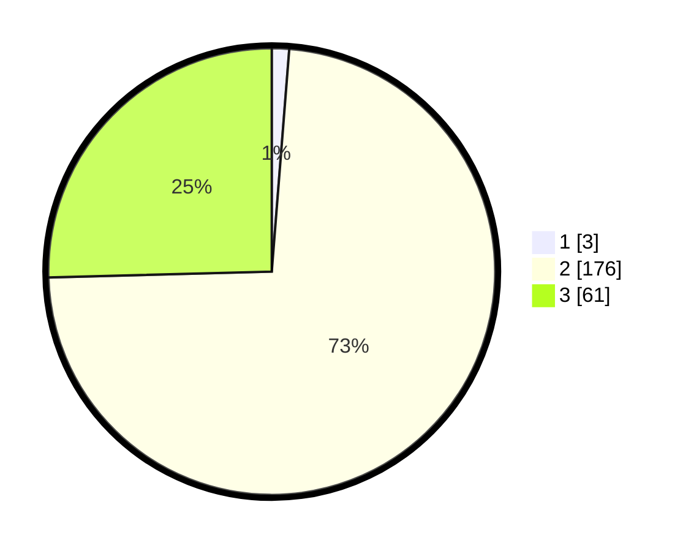

# Hasil

## Grafik

## Tabel

| No. | Nama Paslon    | Suara | Suara (raw) | Persentase |
|:--- |:-------------- | -----:| -----------:| ----------:|
| 1   | ANIES MUHAIMIN | 3     | [3][p-1]    | 1,25       |
| 2   | PRABOWO GIBRAN | 176   | [176][p-2]  | 73,33      |
| 3   | GANJAR MAHFUD  | 61    | [61][p-3]   | 25,42      |

[p-1]: https://github.com/gigit-pemilu/pemilu-2024/blob/main/pilpres/hitung-suara/sub/51-bali/sub/01-jembrana/sub/03-pekutatan/sub/2001-medewi/sub/012-tps/sub/paslon-1.txt
[p-2]: https://github.com/gigit-pemilu/pemilu-2024/blob/main/pilpres/hitung-suara/sub/51-bali/sub/01-jembrana/sub/03-pekutatan/sub/2001-medewi/sub/012-tps/sub/paslon-2.txt
[p-3]: https://github.com/gigit-pemilu/pemilu-2024/blob/main/pilpres/hitung-suara/sub/51-bali/sub/01-jembrana/sub/03-pekutatan/sub/2001-medewi/sub/012-tps/sub/paslon-3.txt

## Foto C Plano

https://sirekap-obj-formc.kpu.go.id/f664/pemilu/ppwp/51/01/03/20/01/5101032001012-20240215-103453--95ae6aaf-8e6c-4cb9-95cb-983b27f5db48.jpg

https://sirekap-obj-formc.kpu.go.id/f664/pemilu/ppwp/51/01/03/20/01/5101032001012-20240215-103531--a05e93a2-41ba-4549-9a2a-c7b8b176a69d.jpg

https://sirekap-obj-formc.kpu.go.id/f664/pemilu/ppwp/51/01/03/20/01/5101032001012-20240215-103545--7f5f5275-00c2-496b-bef5-137608569c3b.jpg

## Metadata

| Key        | Value               |
| ---------- | ------------------- |
| Time Stamp | 2024-02-16 08:00:28 |

## DATA PEMILIH TETAP

Jumlah pemilih dalam DPT: **292**.
 * L: **136**.
 * P: **156**.

## DATA PENGGUNA HAK PILIH

Jumlah pengguna hak pilih dalam DPT: **245**.
 * L: **117**.
 * P: **128**.

Jumlah pengguna hak pilih dalam DPTb: **0**.
 * L: **0**.
 * P: **0**.

Jumlah pengguna hak pilih dalam DPK: **1**.
 * L: **0**.
 * P: **1**.

Jumlah pengguna hak pilih: **246**.
 * L: **117**.
 * P: **129**.

## JUMLAH SUARA SAH DAN TIDAK SAH

JUMLAH SELURUH SUARA SAH: **240**.

JUMLAH SUARA TIDAK SAH: **6**.

JUMLAH SELURUH SUARA SAH DAN SUARA TIDAK SAH: **246**.

