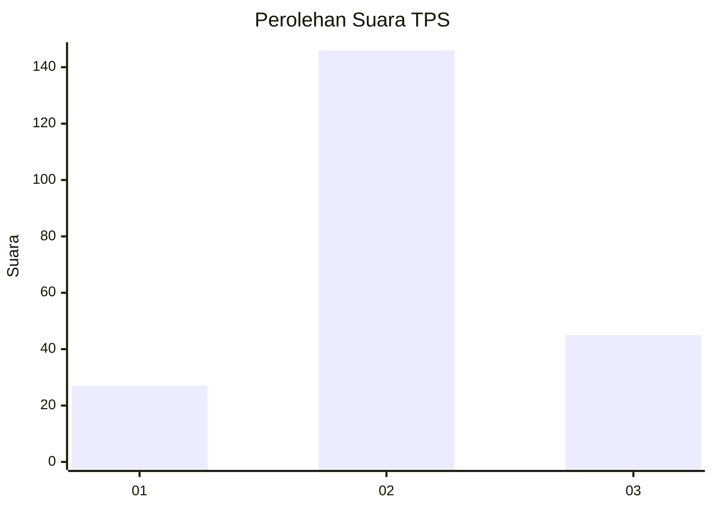
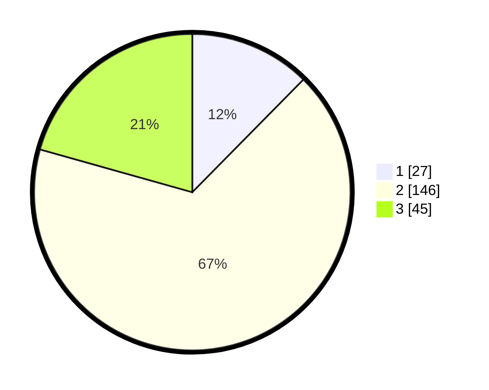

# Hasil

## Grafik

## Tabel

| No. | Nama Paslon    | Suara | Suara (raw) | Persentase |
|:--- |:-------------- | -----:| -----------:| ----------:|
| 1   | ANIES MUHAIMIN | 27    | [27][p-1]   | 12,39      |
| 2   | PRABOWO GIBRAN | 146   | [146][p-2]  | 66,97      |
| 3   | GANJAR MAHFUD  | 45    | [45][p-3]   | 20,64      |

[p-1]: https://github.com/gigit-pemilu/pemilu-2024-51-bali/blob/main/pilpres/hitung-suara/sub/51-bali/sub/01-jembrana/sub/03-pekutatan/sub/2001-medewi/sub/015-tps/sub/paslon-1.txt
[p-2]: https://github.com/gigit-pemilu/pemilu-2024-51-bali/blob/main/pilpres/hitung-suara/sub/51-bali/sub/01-jembrana/sub/03-pekutatan/sub/2001-medewi/sub/015-tps/sub/paslon-2.txt
[p-3]: https://github.com/gigit-pemilu/pemilu-2024-51-bali/blob/main/pilpres/hitung-suara/sub/51-bali/sub/01-jembrana/sub/03-pekutatan/sub/2001-medewi/sub/015-tps/sub/paslon-3.txt

## Foto C Plano

https://sirekap-obj-formc.kpu.go.id/140f/pemilu/ppwp/51/01/03/20/01/5101032001015-20240214-132813--a06197c6-47ee-4b13-95bc-85b2f3a3c5dd.jpg

https://sirekap-obj-formc.kpu.go.id/140f/pemilu/ppwp/51/01/03/20/01/5101032001015-20240214-133001--7d434317-c24d-4235-a750-1322da847a1e.jpg

https://sirekap-obj-formc.kpu.go.id/140f/pemilu/ppwp/51/01/03/20/01/5101032001015-20240214-185944--cdd66acd-0b93-464b-9839-52395a2881db.jpg

## Metadata

| Key        | Value               |
| ---------- | ------------------- |
| Time Stamp | 2024-02-14 21:46:01 |

## DATA PEMILIH TETAP

Jumlah pemilih dalam DPT: **247**.
 * L: **125**.
 * P: **122**.

## DATA PENGGUNA HAK PILIH

Jumlah pengguna hak pilih dalam DPT: **221**.
 * L: **118**.
 * P: **103**.

Jumlah pengguna hak pilih dalam DPTb: **0**.
 * L: **0**.
 * P: **0**.

Jumlah pengguna hak pilih dalam DPK: **0**.
 * L: **0**.
 * P: **0**.

Jumlah pengguna hak pilih: **221**.
 * L: **118**.
 * P: **103**.

## JUMLAH SUARA SAH DAN TIDAK SAH

JUMLAH SELURUH SUARA SAH: **218**.

JUMLAH SUARA TIDAK SAH: **3**.

JUMLAH SELURUH SUARA SAH DAN SUARA TIDAK SAH: **221**.

