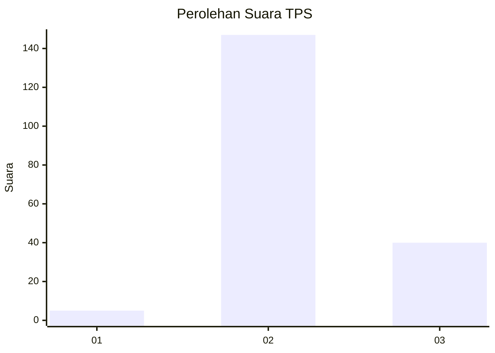

# Hasil

## Grafik

## Tabel

| No. | Nama Paslon    | Suara | Suara (raw) | Persentase |
|:--- |:-------------- | -----:| -----------:| ----------:|
| 1   | ANIES MUHAIMIN | 5     | [5][p-1]    | 2,60       |
| 2   | PRABOWO GIBRAN | 147   | [147][p-2]  | 76,56      |
| 3   | GANJAR MAHFUD  | 40    | [40][p-3]   | 20,83      |

[p-1]: https://github.com/gigit-pemilu/pemilu-2024-51-bali/blob/main/pilpres/hitung-suara/sub/51-bali/sub/01-jembrana/sub/03-pekutatan/sub/2002-pulukan/sub/009-tps/sub/paslon-1.txt
[p-2]: https://github.com/gigit-pemilu/pemilu-2024-51-bali/blob/main/pilpres/hitung-suara/sub/51-bali/sub/01-jembrana/sub/03-pekutatan/sub/2002-pulukan/sub/009-tps/sub/paslon-2.txt
[p-3]: https://github.com/gigit-pemilu/pemilu-2024-51-bali/blob/main/pilpres/hitung-suara/sub/51-bali/sub/01-jembrana/sub/03-pekutatan/sub/2002-pulukan/sub/009-tps/sub/paslon-3.txt

## Foto C Plano

https://sirekap-obj-formc.kpu.go.id/2daf/pemilu/ppwp/51/01/03/20/02/5101032002009-20240214-131139--ac28bb2c-b3bb-4392-8642-dd5ec03379c7.jpg

https://sirekap-obj-formc.kpu.go.id/2daf/pemilu/ppwp/51/01/03/20/02/5101032002009-20240214-131330--52b3bec7-34df-4333-acac-9e8eabfa6921.jpg

https://sirekap-obj-formc.kpu.go.id/2daf/pemilu/ppwp/51/01/03/20/02/5101032002009-20240214-132210--852209ec-72fc-4e75-8b43-183339993191.jpg

## Metadata

| Key        | Value               |
| ---------- | ------------------- |
| Time Stamp | 2024-02-14 21:46:01 |

## DATA PEMILIH TETAP

Jumlah pemilih dalam DPT: **240**.
 * L: **122**.
 * P: **118**.

## DATA PENGGUNA HAK PILIH

Jumlah pengguna hak pilih dalam DPT: **186**.
 * L: **95**.
 * P: **91**.

Jumlah pengguna hak pilih dalam DPTb: **9**.
 * L: **4**.
 * P: **5**.

Jumlah pengguna hak pilih dalam DPK: **0**.
 * L: **0**.
 * P: **0**.

Jumlah pengguna hak pilih: **195**.
 * L: **99**.
 * P: **96**.

## JUMLAH SUARA SAH DAN TIDAK SAH

JUMLAH SELURUH SUARA SAH: **192**.

JUMLAH SUARA TIDAK SAH: **3**.

JUMLAH SELURUH SUARA SAH DAN SUARA TIDAK SAH: **195**.

