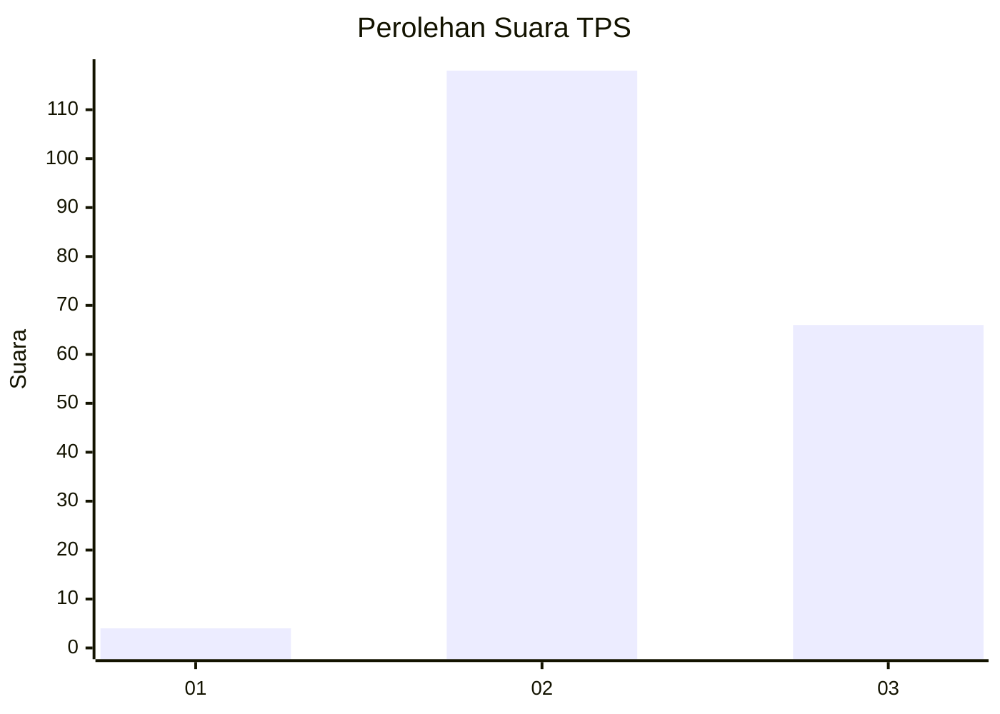
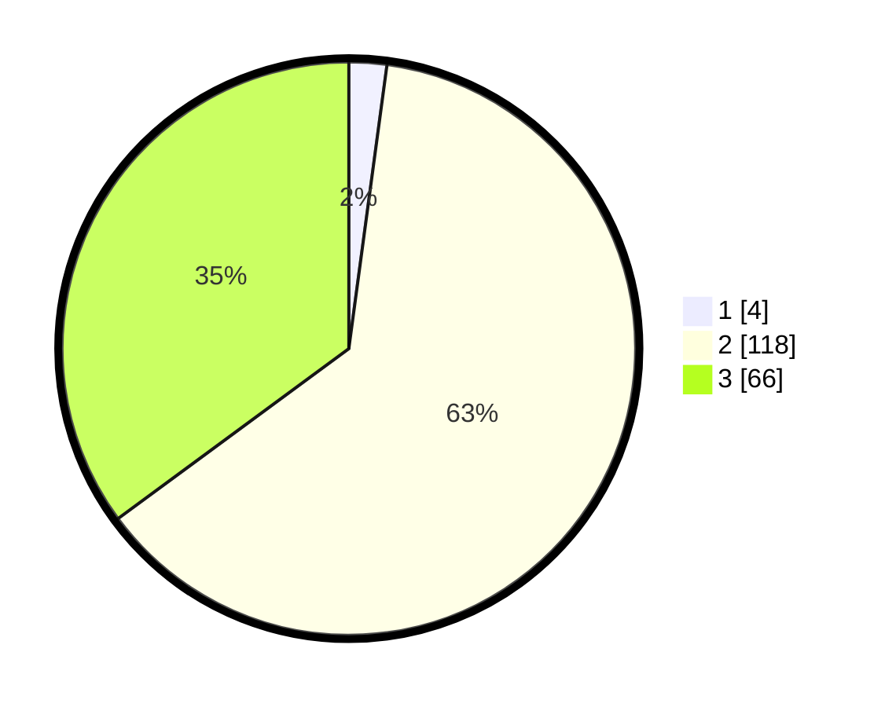

# Hasil

## Grafik

## Tabel

| No. | Nama Paslon    | Suara | Suara (raw) | Persentase |
|:--- |:-------------- | -----:| -----------:| ----------:|
| 1   | ANIES MUHAIMIN | 4     | [4][p-1]    | 2,13       |
| 2   | PRABOWO GIBRAN | 118   | [118][p-2]  | 62,77      |
| 3   | GANJAR MAHFUD  | 66    | [66][p-3]   | 35,11      |

[p-1]: https://github.com/gigit-pemilu/pemilu-2024-51-bali/blob/main/pilpres/hitung-suara/sub/51-bali/sub/01-jembrana/sub/03-pekutatan/sub/2004-pekutatan/sub/004-tps/sub/paslon-1.txt
[p-2]: https://github.com/gigit-pemilu/pemilu-2024-51-bali/blob/main/pilpres/hitung-suara/sub/51-bali/sub/01-jembrana/sub/03-pekutatan/sub/2004-pekutatan/sub/004-tps/sub/paslon-2.txt
[p-3]: https://github.com/gigit-pemilu/pemilu-2024-51-bali/blob/main/pilpres/hitung-suara/sub/51-bali/sub/01-jembrana/sub/03-pekutatan/sub/2004-pekutatan/sub/004-tps/sub/paslon-3.txt

## Foto C Plano

https://sirekap-obj-formc.kpu.go.id/9b46/pemilu/ppwp/51/01/03/20/04/5101032004004-20240214-141029--aa50abf5-ea29-438d-ac2a-ac6a8ef7c313.jpg

https://sirekap-obj-formc.kpu.go.id/9b46/pemilu/ppwp/51/01/03/20/04/5101032004004-20240214-141131--96fbd83f-9873-4bb0-8ecb-275958e96a27.jpg

https://sirekap-obj-formc.kpu.go.id/9b46/pemilu/ppwp/51/01/03/20/04/5101032004004-20240214-141754--878730c2-b00c-430d-a622-1455bb0cfc7d.jpg

## Metadata

| Key        | Value               |
| ---------- | ------------------- |
| Time Stamp | 2024-02-16 08:00:28 |

## DATA PEMILIH TETAP

Jumlah pemilih dalam DPT: **259**.
 * L: **131**.
 * P: **128**.

## DATA PENGGUNA HAK PILIH

Jumlah pengguna hak pilih dalam DPT: **191**.
 * L: **101**.
 * P: **90**.

Jumlah pengguna hak pilih dalam DPTb: **1**.
 * L: **0**.
 * P: **1**.

Jumlah pengguna hak pilih dalam DPK: **1**.
 * L: **0**.
 * P: **1**.

Jumlah pengguna hak pilih: **193**.
 * L: **101**.
 * P: **92**.

## JUMLAH SUARA SAH DAN TIDAK SAH

JUMLAH SELURUH SUARA SAH: **188**.

JUMLAH SUARA TIDAK SAH: **5**.

JUMLAH SELURUH SUARA SAH DAN SUARA TIDAK SAH: **193**.

