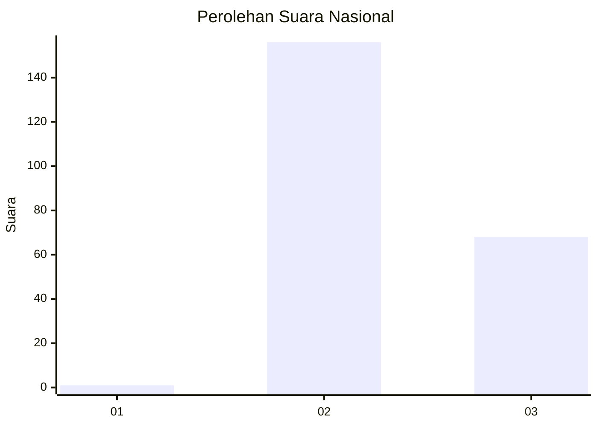
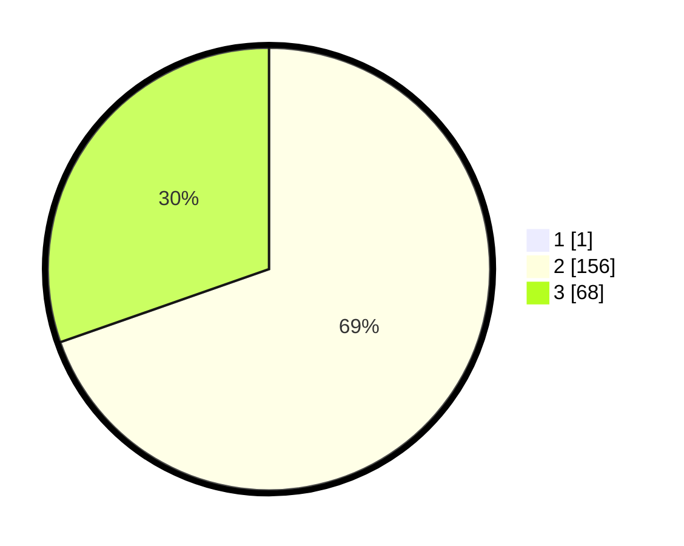

# Hasil

## Grafik

## Tabel

| No. | Nama Paslon    | Suara | Suara (raw) | Persentase |
|:--- |:-------------- | -----:| -----------:| ----------:|
| 1   | ANIES MUHAIMIN | 1     | [1][p-1]    | 0,44       |
| 2   | PRABOWO GIBRAN | 156   | [156][p-2]  | 69,33      |
| 3   | GANJAR MAHFUD  | 68    | [68][p-3]   | 30,22      |

[p-1]: https://github.com/gigit-pemilu/pemilu-2024/blob/main/pilpres/hitung-suara/sub/51-bali/sub/01-jembrana/sub/03-pekutatan/sub/2004-pekutatan/sub/008-tps/sub/paslon-1.txt
[p-2]: https://github.com/gigit-pemilu/pemilu-2024/blob/main/pilpres/hitung-suara/sub/51-bali/sub/01-jembrana/sub/03-pekutatan/sub/2004-pekutatan/sub/008-tps/sub/paslon-2.txt
[p-3]: https://github.com/gigit-pemilu/pemilu-2024/blob/main/pilpres/hitung-suara/sub/51-bali/sub/01-jembrana/sub/03-pekutatan/sub/2004-pekutatan/sub/008-tps/sub/paslon-3.txt

## Foto C Plano

https://sirekap-obj-formc.kpu.go.id/e1fd/pemilu/ppwp/51/01/03/20/04/5101032004008-20240214-141114--3f121d83-19c8-4b5c-8db5-874553f4a967.jpg

https://sirekap-obj-formc.kpu.go.id/e1fd/pemilu/ppwp/51/01/03/20/04/5101032004008-20240214-141152--86b777bd-bc5c-4087-b92f-8856b2d67f65.jpg

https://sirekap-obj-formc.kpu.go.id/e1fd/pemilu/ppwp/51/01/03/20/04/5101032004008-20240214-141850--6842c1b3-04d0-4dcd-b480-4d0bf0cfe26f.jpg

## Metadata

| Key        | Value               |
| ---------- | ------------------- |
| Time Stamp | 2024-02-16 08:00:28 |

## DATA PEMILIH TETAP

Jumlah pemilih dalam DPT: **297**.
 * L: **145**.
 * P: **152**.

## DATA PENGGUNA HAK PILIH

Jumlah pengguna hak pilih dalam DPT: **231**.
 * L: **117**.
 * P: **114**.

Jumlah pengguna hak pilih dalam DPTb: **0**.
 * L: **0**.
 * P: **0**.

Jumlah pengguna hak pilih dalam DPK: **0**.
 * L: **0**.
 * P: **0**.

Jumlah pengguna hak pilih: **231**.
 * L: **117**.
 * P: **114**.

## JUMLAH SUARA SAH DAN TIDAK SAH

JUMLAH SELURUH SUARA SAH: **225**.

JUMLAH SUARA TIDAK SAH: **6**.

JUMLAH SELURUH SUARA SAH DAN SUARA TIDAK SAH: **231**.

