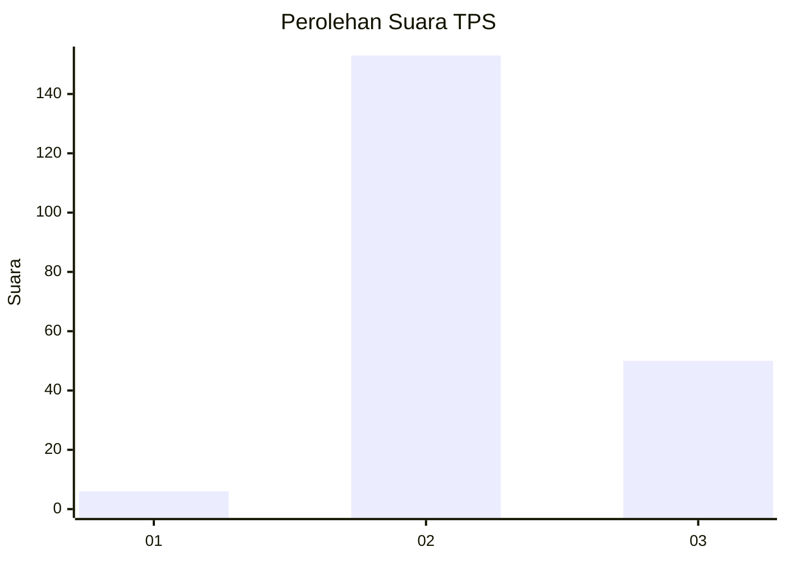
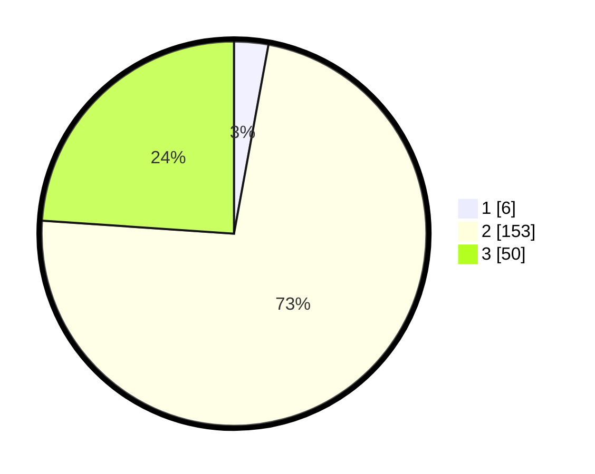

# Hasil

## Grafik

## Tabel

| No. | Nama Paslon    | Suara | Suara (raw) | Persentase |
|:--- |:-------------- | -----:| -----------:| ----------:|
| 1   | ANIES MUHAIMIN | 6     | [6][p-1]    | 2,87       |
| 2   | PRABOWO GIBRAN | 153   | [153][p-2]  | 73,21      |
| 3   | GANJAR MAHFUD  | 50    | [50][p-3]   | 23,92      |

[p-1]: https://github.com/gigit-pemilu/pemilu-2024-51-bali/blob/main/pilpres/hitung-suara/sub/51-bali/sub/01-jembrana/sub/03-pekutatan/sub/2004-pekutatan/sub/011-tps/sub/paslon-1.txt
[p-2]: https://github.com/gigit-pemilu/pemilu-2024-51-bali/blob/main/pilpres/hitung-suara/sub/51-bali/sub/01-jembrana/sub/03-pekutatan/sub/2004-pekutatan/sub/011-tps/sub/paslon-2.txt
[p-3]: https://github.com/gigit-pemilu/pemilu-2024-51-bali/blob/main/pilpres/hitung-suara/sub/51-bali/sub/01-jembrana/sub/03-pekutatan/sub/2004-pekutatan/sub/011-tps/sub/paslon-3.txt

## Foto C Plano

https://sirekap-obj-formc.kpu.go.id/f95d/pemilu/ppwp/51/01/03/20/04/5101032004011-20240214-141659--ce7429b5-3d74-449a-8d06-02e765bfd892.jpg

https://sirekap-obj-formc.kpu.go.id/f95d/pemilu/ppwp/51/01/03/20/04/5101032004011-20240214-141042--4e3e60c3-7ba2-4211-a365-406f13b04b3e.jpg

https://sirekap-obj-formc.kpu.go.id/f95d/pemilu/ppwp/51/01/03/20/04/5101032004011-20240214-141200--02efa6dd-d72e-4fb2-9237-20f8462fb491.jpg

## Metadata

| Key        | Value               |
| ---------- | ------------------- |
| Time Stamp | 2024-02-16 08:00:28 |

