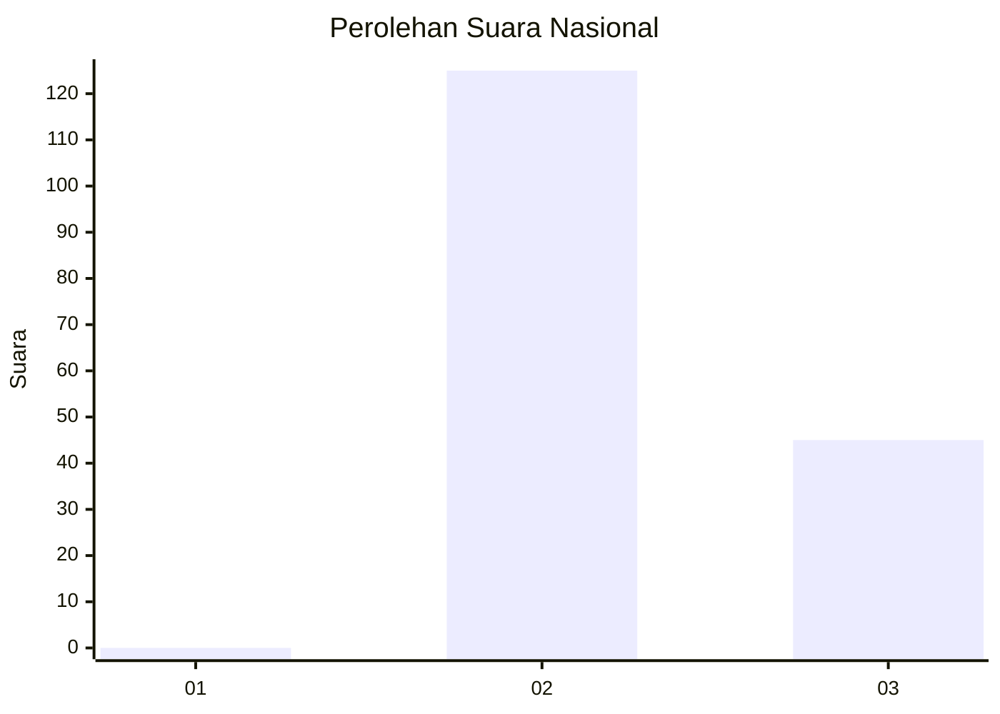
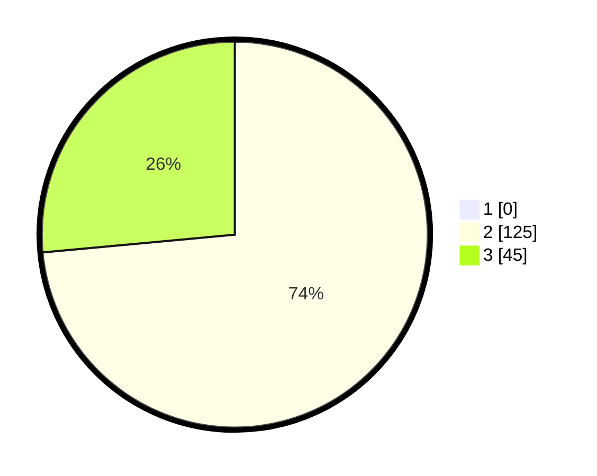

# Hasil

## Grafik

## Tabel

| No. | Nama Paslon    | Suara | Suara (raw) | Persentase |
|:--- |:-------------- | -----:| -----------:| ----------:|
| 1   | ANIES MUHAIMIN | 0     | [0][p-1]    | 0,00       |
| 2   | PRABOWO GIBRAN | 125   | [125][p-2]  | 73,53      |
| 3   | GANJAR MAHFUD  | 45    | [45][p-3]   | 26,47      |

[p-1]: https://github.com/gigit-pemilu/pemilu-2024/blob/main/pilpres/hitung-suara/sub/51-bali/sub/01-jembrana/sub/03-pekutatan/sub/2004-pekutatan/sub/012-tps/sub/paslon-1.txt
[p-2]: https://github.com/gigit-pemilu/pemilu-2024/blob/main/pilpres/hitung-suara/sub/51-bali/sub/01-jembrana/sub/03-pekutatan/sub/2004-pekutatan/sub/012-tps/sub/paslon-2.txt
[p-3]: https://github.com/gigit-pemilu/pemilu-2024/blob/main/pilpres/hitung-suara/sub/51-bali/sub/01-jembrana/sub/03-pekutatan/sub/2004-pekutatan/sub/012-tps/sub/paslon-3.txt

## Foto C Plano

https://sirekap-obj-formc.kpu.go.id/fd2e/pemilu/ppwp/51/01/03/20/04/5101032004012-20240214-141712--af50c6b7-19fa-4b1d-b14e-1992e5df74e4.jpg

https://sirekap-obj-formc.kpu.go.id/fd2e/pemilu/ppwp/51/01/03/20/04/5101032004012-20240214-141744--0a635869-670d-47f3-af2e-d8b58dad1ffc.jpg

https://sirekap-obj-formc.kpu.go.id/fd2e/pemilu/ppwp/51/01/03/20/04/5101032004012-20240214-141815--6916c9d1-91d4-4fd3-a7c9-51c9bd05c08c.jpg

## Metadata

| Key        | Value               |
| ---------- | ------------------- |
| Time Stamp | 2024-02-14 21:46:01 |

## DATA PEMILIH TETAP

Jumlah pemilih dalam DPT: **233**.
 * L: **119**.
 * P: **114**.

## DATA PENGGUNA HAK PILIH

Jumlah pengguna hak pilih dalam DPT: **168**.
 * L: **85**.
 * P: **83**.

Jumlah pengguna hak pilih dalam DPTb: **0**.
 * L: **0**.
 * P: **0**.

Jumlah pengguna hak pilih dalam DPK: **5**.
 * L: **1**.
 * P: **4**.

Jumlah pengguna hak pilih: **173**.
 * L: **86**.
 * P: **87**.

## JUMLAH SUARA SAH DAN TIDAK SAH

JUMLAH SELURUH SUARA SAH: **170**.

JUMLAH SUARA TIDAK SAH: **3**.

JUMLAH SELURUH SUARA SAH DAN SUARA TIDAK SAH: **173**.

