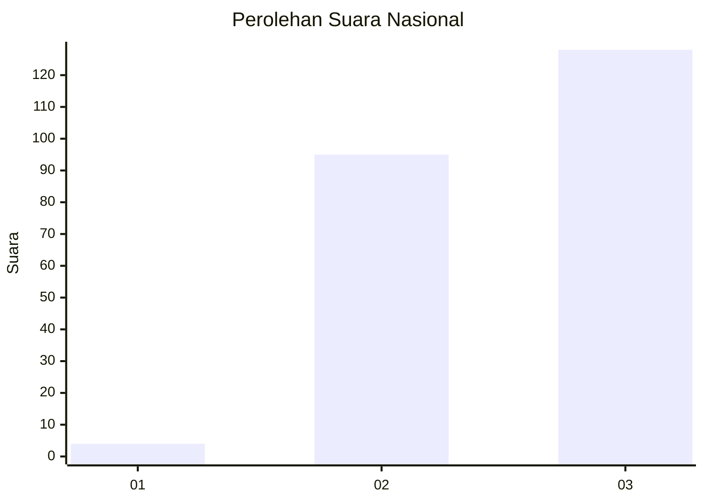
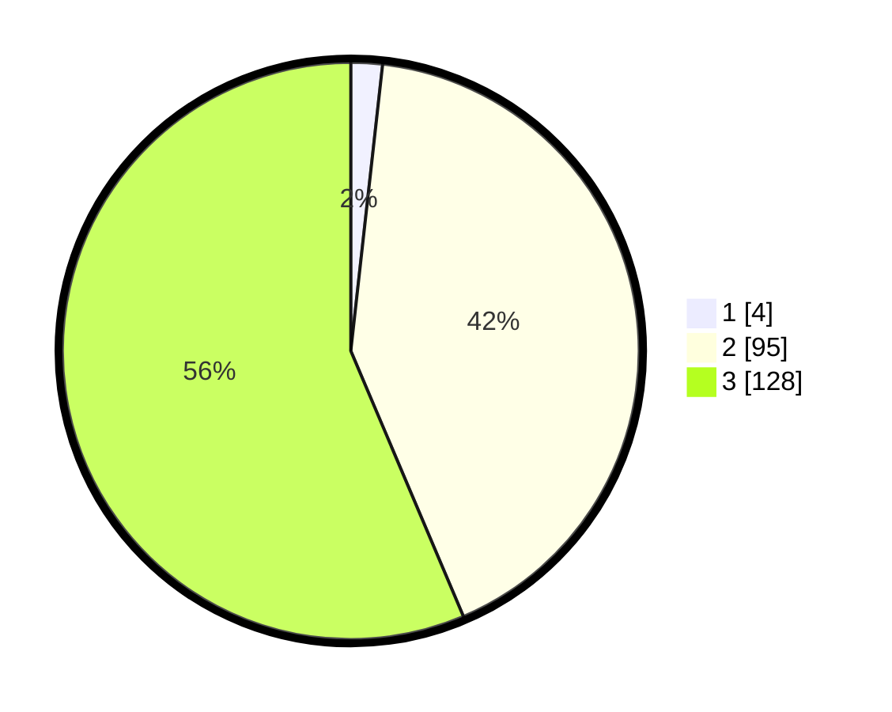

# Hasil

## Grafik

## Tabel

| No. | Nama Paslon    | Suara | Suara (raw) | Persentase |
|:--- |:-------------- | -----:| -----------:| ----------:|
| 1   | ANIES MUHAIMIN | 4     | [4][p-1]    | 1,76       |
| 2   | PRABOWO GIBRAN | 95    | [95][p-2]   | 41,85      |
| 3   | GANJAR MAHFUD  | 128   | [128][p-3]  | 56,39      |

[p-1]: https://github.com/gigit-pemilu/pemilu-2024/blob/main/pilpres/hitung-suara/sub/51-bali/sub/01-jembrana/sub/03-pekutatan/sub/2005-pangyangan/sub/002-tps/sub/paslon-1.txt
[p-2]: https://github.com/gigit-pemilu/pemilu-2024/blob/main/pilpres/hitung-suara/sub/51-bali/sub/01-jembrana/sub/03-pekutatan/sub/2005-pangyangan/sub/002-tps/sub/paslon-2.txt
[p-3]: https://github.com/gigit-pemilu/pemilu-2024/blob/main/pilpres/hitung-suara/sub/51-bali/sub/01-jembrana/sub/03-pekutatan/sub/2005-pangyangan/sub/002-tps/sub/paslon-3.txt

## Foto C Plano

https://sirekap-obj-formc.kpu.go.id/29a9/pemilu/ppwp/51/01/03/20/05/5101032005002-20240214-132249--e02f2b19-6efa-4392-8b4f-77d114accf7c.jpg

https://sirekap-obj-formc.kpu.go.id/29a9/pemilu/ppwp/51/01/03/20/05/5101032005002-20240214-132535--af9c588b-0d8f-49a6-bdf9-868325f13b8d.jpg

https://sirekap-obj-formc.kpu.go.id/29a9/pemilu/ppwp/51/01/03/20/05/5101032005002-20240214-132659--7b0a0a23-f599-4ad7-8901-97a76c873887.jpg

## Metadata

| Key        | Value               |
| ---------- | ------------------- |
| Time Stamp | 2024-02-14 21:46:01 |

## DATA PEMILIH TETAP

Jumlah pemilih dalam DPT: **289**.
 * L: **143**.
 * P: **146**.

## DATA PENGGUNA HAK PILIH

Jumlah pengguna hak pilih dalam DPT: **230**.
 * L: **114**.
 * P: **116**.

Jumlah pengguna hak pilih dalam DPTb: **1**.
 * L: **0**.
 * P: **1**.

Jumlah pengguna hak pilih dalam DPK: **1**.
 * L: **0**.
 * P: **1**.

Jumlah pengguna hak pilih: **232**.
 * L: **114**.
 * P: **118**.

## JUMLAH SUARA SAH DAN TIDAK SAH

JUMLAH SELURUH SUARA SAH: **227**.

JUMLAH SUARA TIDAK SAH: **5**.

JUMLAH SELURUH SUARA SAH DAN SUARA TIDAK SAH: **232**.

