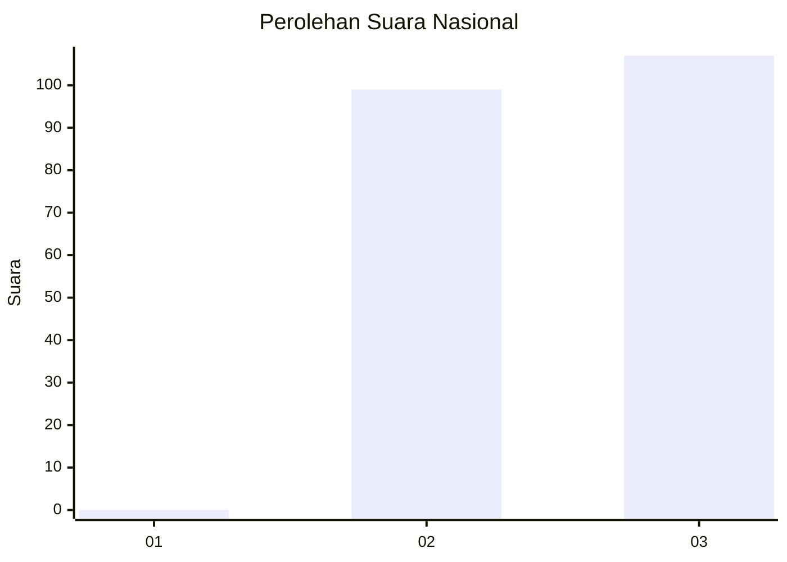
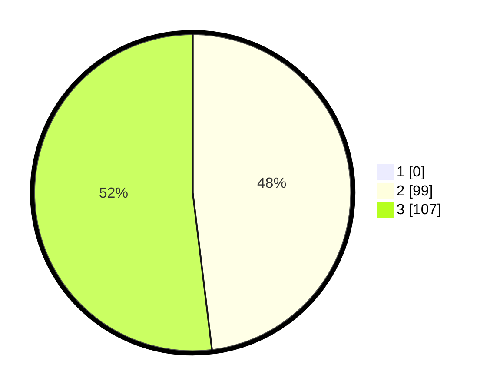

# Hasil

## Grafik

## Tabel

| No. | Nama Paslon    | Suara | Suara (raw) | Persentase |
|:--- |:-------------- | -----:| -----------:| ----------:|
| 1   | ANIES MUHAIMIN | 0     | [0][p-1]    | 0,00       |
| 2   | PRABOWO GIBRAN | 99    | [99][p-2]   | 48,06      |
| 3   | GANJAR MAHFUD  | 107   | [107][p-3]  | 51,94      |

[p-1]: https://github.com/gigit-pemilu/pemilu-2024/blob/main/pilpres/hitung-suara/sub/51-bali/sub/01-jembrana/sub/03-pekutatan/sub/2006-gumbrih/sub/001-tps/sub/paslon-1.txt
[p-2]: https://github.com/gigit-pemilu/pemilu-2024/blob/main/pilpres/hitung-suara/sub/51-bali/sub/01-jembrana/sub/03-pekutatan/sub/2006-gumbrih/sub/001-tps/sub/paslon-2.txt
[p-3]: https://github.com/gigit-pemilu/pemilu-2024/blob/main/pilpres/hitung-suara/sub/51-bali/sub/01-jembrana/sub/03-pekutatan/sub/2006-gumbrih/sub/001-tps/sub/paslon-3.txt

## Foto C Plano

https://sirekap-obj-formc.kpu.go.id/89d6/pemilu/ppwp/51/01/03/20/06/5101032006001-20240214-131233--408c88ab-a601-4be1-91de-7389520b1591.jpg

https://sirekap-obj-formc.kpu.go.id/89d6/pemilu/ppwp/51/01/03/20/06/5101032006001-20240214-132831--659544ab-39e9-41cc-9650-f734ba432b90.jpg

https://sirekap-obj-formc.kpu.go.id/89d6/pemilu/ppwp/51/01/03/20/06/5101032006001-20240214-131507--d5481f52-230a-4aa2-b2a1-7a8dbdafec18.jpg

## Metadata

| Key        | Value               |
| ---------- | ------------------- |
| Time Stamp | 2024-02-14 21:46:01 |

## DATA PEMILIH TETAP

Jumlah pemilih dalam DPT: **239**.
 * L: **120**.
 * P: **119**.

## DATA PENGGUNA HAK PILIH

Jumlah pengguna hak pilih dalam DPT: **209**.
 * L: **104**.
 * P: **105**.

Jumlah pengguna hak pilih dalam DPTb: **0**.
 * L: **0**.
 * P: **0**.

Jumlah pengguna hak pilih dalam DPK: **1**.
 * L: **1**.
 * P: **0**.

Jumlah pengguna hak pilih: **210**.
 * L: **105**.
 * P: **105**.

## JUMLAH SUARA SAH DAN TIDAK SAH

JUMLAH SELURUH SUARA SAH: **206**.

JUMLAH SUARA TIDAK SAH: **4**.

JUMLAH SELURUH SUARA SAH DAN SUARA TIDAK SAH: **210**.

