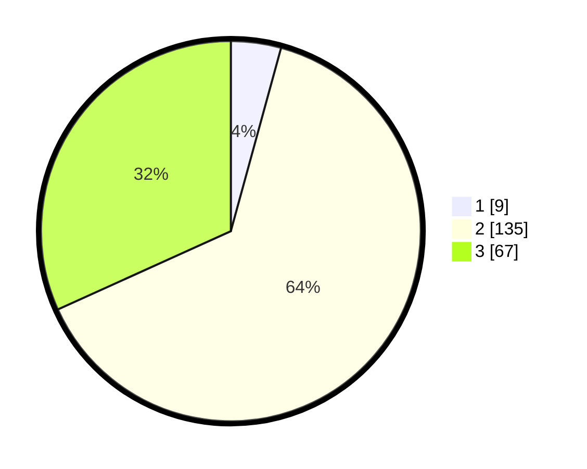

# Hasil

## Grafik

## Tabel

| No. | Nama Paslon    | Suara | Suara (raw) | Persentase |
|:--- |:-------------- | -----:| -----------:| ----------:|
| 1   | ANIES MUHAIMIN | 9     | [9][p-1]    | 4,27       |
| 2   | PRABOWO GIBRAN | 135   | [135][p-2]  | 63,98      |
| 3   | GANJAR MAHFUD  | 67    | [67][p-3]   | 31,75      |

[p-1]: https://github.com/gigit-pemilu/pemilu-2024-51-bali/blob/main/pilpres/hitung-suara/sub/51-bali/sub/01-jembrana/sub/03-pekutatan/sub/2006-gumbrih/sub/006-tps/sub/paslon-1.txt
[p-2]: https://github.com/gigit-pemilu/pemilu-2024-51-bali/blob/main/pilpres/hitung-suara/sub/51-bali/sub/01-jembrana/sub/03-pekutatan/sub/2006-gumbrih/sub/006-tps/sub/paslon-2.txt
[p-3]: https://github.com/gigit-pemilu/pemilu-2024-51-bali/blob/main/pilpres/hitung-suara/sub/51-bali/sub/01-jembrana/sub/03-pekutatan/sub/2006-gumbrih/sub/006-tps/sub/paslon-3.txt

## Foto C Plano

https://sirekap-obj-formc.kpu.go.id/1d11/pemilu/ppwp/51/01/03/20/06/5101032006006-20240214-132248--56ec655c-3ecd-4896-a124-659f1f19adf7.jpg

https://sirekap-obj-formc.kpu.go.id/1d11/pemilu/ppwp/51/01/03/20/06/5101032006006-20240214-132257--99717b7a-8151-4633-9f6e-7ba44932befa.jpg

https://sirekap-obj-formc.kpu.go.id/1d11/pemilu/ppwp/51/01/03/20/06/5101032006006-20240214-132305--ec412c96-e743-435b-97f7-cfa543874c9a.jpg

## Metadata

| Key        | Value               |
| ---------- | ------------------- |
| Time Stamp | 2024-02-14 21:46:01 |

## DATA PEMILIH TETAP

Jumlah pemilih dalam DPT: **252**.
 * L: **115**.
 * P: **137**.

## DATA PENGGUNA HAK PILIH

Jumlah pengguna hak pilih dalam DPT: **219**.
 * L: **102**.
 * P: **117**.

Jumlah pengguna hak pilih dalam DPTb: **0**.
 * L: **0**.
 * P: **0**.

Jumlah pengguna hak pilih dalam DPK: **1**.
 * L: **0**.
 * P: **1**.

Jumlah pengguna hak pilih: **220**.
 * L: **102**.
 * P: **118**.

## JUMLAH SUARA SAH DAN TIDAK SAH

JUMLAH SELURUH SUARA SAH: **211**.

JUMLAH SUARA TIDAK SAH: **9**.

JUMLAH SELURUH SUARA SAH DAN SUARA TIDAK SAH: **220**.

